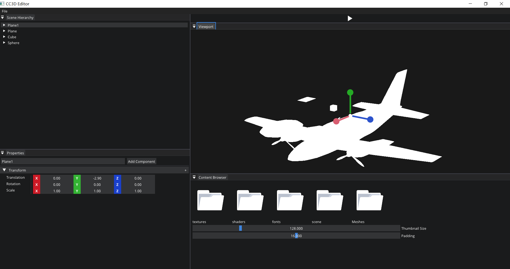
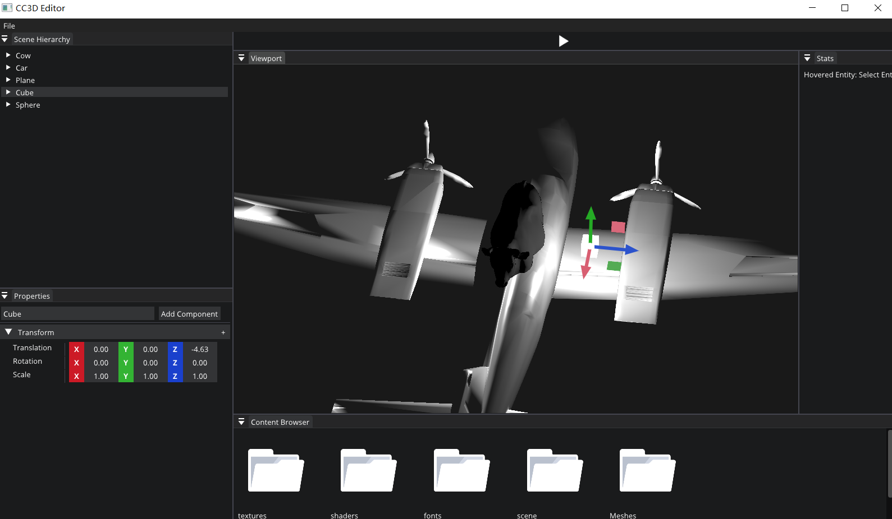
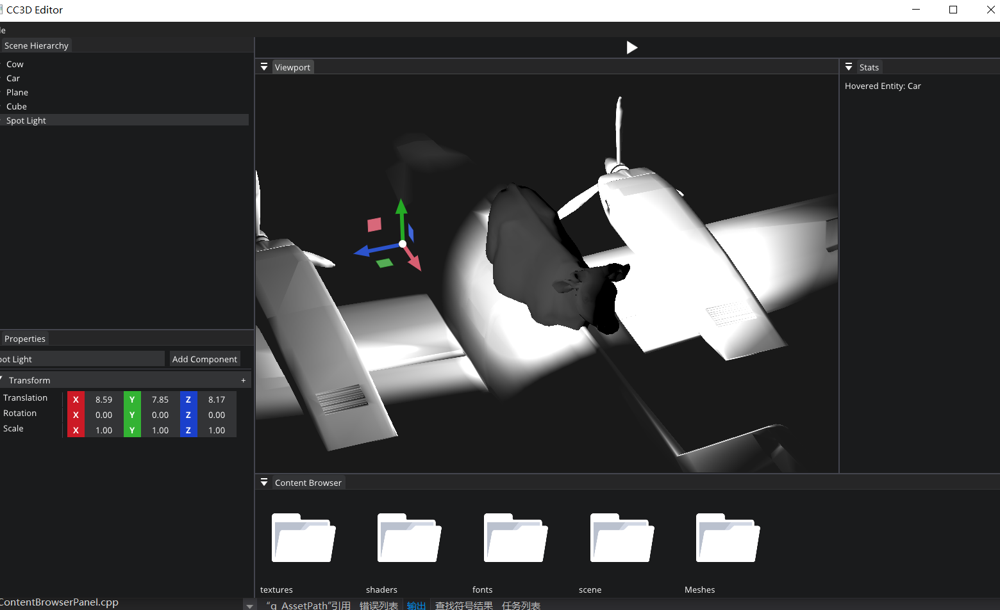
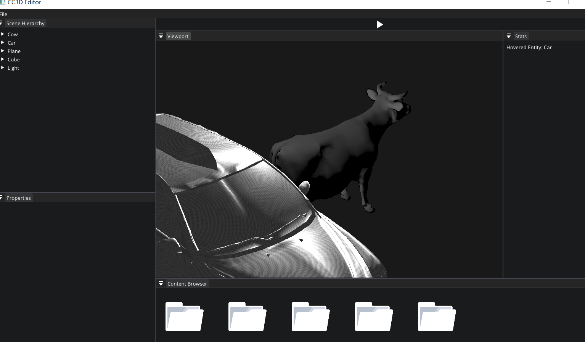
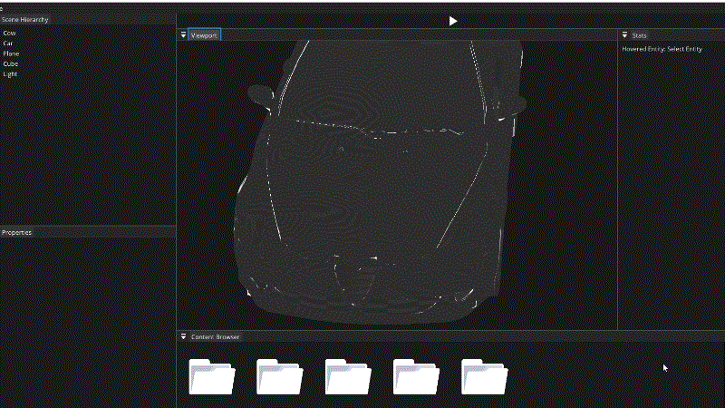

# Dev 11-30

## TODO

solve Select Entity Problem

Test Material Light Mesh Texture Shader Component to see if it works well

If have enough time ,  draw a component ui

## Progress

### Model Loading

Model load good use this function

```c++
void EditorLayer::EntityTest2()
{
    auto square4 = m_ActiveScene->CreateEntity("Car");
    std::string str = "assets/Meshes/cessna.obj";
    Ref<TriMesh> m_Mesh = CreateRef<TriMesh>(str);
    square4.AddComponent<MeshComponent>(m_Mesh);
}
```

This method can't load model

```c++
void EditorLayer::EntityTest2()
{
    auto square4 = m_ActiveScene->CreateEntity("Car");
    std::string str = "assets/Meshes/cessna.obj";
    Ref<TriMesh> m_Mesh = CreateRef<TriMesh>();
    m_Mesh->Create(str);
    square4.AddComponent<MeshComponent>(m_Mesh);
}
```



You need to use follow instead:

```c++
m_SquareEntity = m_ActiveScene->CreateEntity("Car2");
str = "assets/Meshes/cow-nonormals.obj";
Ref<TriMesh> m_Mesh2 = CreateRef<TriMesh>();
m_Mesh2 = m_Mesh2->Create(str);
m_SquareEntity.AddComponent<MeshComponent>(m_Mesh2);
m_SquareEntity.AddComponent<MaterialComponent>();
```

**m_Mesh2->Create** is a static function: 

```c++
static Ref<TriMesh> Create(const std::string& path) { return CreateRef<TriMesh>(path); }
```

### Fix Selection Entity Bug

Review these chapter : [**Lec72 Multiple Render Targets and Frame**](https://github.com/Graphic-researcher/Crosa-Conty-3D/tree/HTC_RenderDev/HTC/Learn/Lec72%20Multiple%20Render%20Targets%20and%20Frame)

 [**Lec74 Clearing Framebuffer Texture Attachment**](https://github.com/Graphic-researcher/Crosa-Conty-3D/tree/HTC_RenderDev/HTC/Learn/Lec74%20Clearing%20Framebuffer%20Texture%20Attachment)

[**Lec75 Mouse Picking**](https://github.com/Graphic-researcher/Crosa-Conty-3D/tree/HTC_RenderDev/HTC/Learn/Lec75%20Mouse%20Picking) [**Lec76 Clicking to Select**](https://github.com/Graphic-researcher/Crosa-Conty-3D/tree/HTC_RenderDev/HTC/Learn/Lec76%20Clicking%20to%20Select)

The most important chapter is [Lec 75 Mouse Picking](https://github.com/Graphic-researcher/Crosa-Conty-3D/tree/HTC_RenderDev/HTC/Learn/Lec75%20Mouse%20Picking)

Add entity color to shader (For framebuffer to read pixel and figure out the entity)

See changes in shaders/material/default.glsl :

```glsl
#type vertex
#version 450 

layout(location = 0) in vec3 a_Position;
layout(location = 1) in vec2 a_TexCoord;
layout(location = 2) in vec3 a_Normal;

uniform mat4 u_ViewProjection;
uniform mat4 u_Transform;
uniform int a_EntityID;

out flat int v_EntityID;
void main()
{
	v_EntityID = a_EntityID;
	gl_Position = u_ViewProjection * u_Transform * vec4(a_Position, 1.0);
}

#type fragment
#version 450

layout(location = 0) out vec4 FragColor;
layout(location = 1) out int color1;

in flat int v_EntityID;

void main()
{
	FragColor=vec4(1.0);
	color1 = v_EntityID;
}
```

In Scene Scope Render Object Function:

```c++
void Scene::RenderObject(EditorCamera& camera, const Ref<Cubemap>& envMap)
{
    RenderLight(camera);
    auto group = m_Registry.view<TransformComponent>();
    //auto group = m_Registry.group<TagComponent, TransformComponent>(entt::get<>);

    for (auto entity : group)
    {
        auto transform = group.get<TransformComponent>(entity);
        if (m_Registry.any_of<MaterialComponent>(entity) && !m_LineMode)
        {
            m_Registry.get<MaterialComponent>(entity).Bind();
            auto& material = m_Registry.get<MaterialComponent>(entity);
            material.Bind(envMap);
            material.Set(camera, transform.GetTransform());
        }
        else
        {
            m_DefaultShader->Bind();
            m_DefaultShader->SetMat4("u_ViewProjection", camera.GetViewProjection());
            m_DefaultShader->SetMat4("u_Transform", transform.GetTransform());
            m_DefaultShader->SetInt("a_EntityID",(int)entity);
        }

        if (m_Registry.any_of<MeshComponent>(entity))
        {
            auto& mesh = m_Registry.get<MeshComponent>(entity);
            mesh.Mesh->Draw(m_LineMode);
        }
    }
}
```

Add this uniform variable:

```glsl
m_DefaultShader->SetInt("a_EntityID",(int)entity);
```

### Material Test

code version : [here](https://github.com/Graphic-researcher/Crosa-Conty-3D/commit/082e8fb289ab5c86e9b394dd5c099c5573e79253)

```c++
void EditorLayer::EntityTest2()
{
    auto square = m_ActiveScene->CreateEntity("Sphere");
    //square.AddComponent<SpriteRendererComponent>(glm::vec4{ 0.0f, 1.0f, 0.0f, 1.0f });
    square.AddComponent<MeshComponent>();
    square.AddComponent<MaterialComponent>(MaterialType::Material_Emission);
    //square.RemoveComponent<MeshComponent>();
    auto square2 = m_ActiveScene->CreateEntity("Cube");
    square2.AddComponent<MeshComponent>(MeshType::Cube);
    square2.AddComponent<LightComponent>();

    auto square3 = m_ActiveScene->CreateEntity("Plane");
    square3.AddComponent<MeshComponent>(MeshType::Plane);

    auto square4 = m_ActiveScene->CreateEntity("Car");
    std::string str = "assets/Meshes/cessna.obj";
    Ref<TriMesh> m_Mesh = CreateRef<TriMesh>(str);
    square4.AddComponent<MeshComponent>(m_Mesh);
    square4.AddComponent<MaterialComponent>(MaterialType::Material_Phong);

    m_SquareEntity = m_ActiveScene->CreateEntity("Cow");
    str = "assets/Meshes/cow-nonormals.obj";
    Ref<TriMesh> m_Mesh2 = CreateRef<TriMesh>();
    m_Mesh2 = m_Mesh2->Create(str);
    m_SquareEntity.AddComponent<MeshComponent>(m_Mesh2);
    m_SquareEntity.AddComponent<MaterialComponent>(MaterialType::Material_Cook_Torrance);
}
```




### Light Test

code version : [here](https://github.com/Graphic-researcher/Crosa-Conty-3D/commit/d5d699ecab53ff39044241b773e58eefe1108346)

```c++
void EditorLayer::EntityTest2()
{
    auto square = m_ActiveScene->CreateEntity("Light");
    //square.AddComponent<SpriteRendererComponent>(glm::vec4{ 0.0f, 1.0f, 0.0f, 1.0f });
    square.AddComponent<MeshComponent>();
    square.AddComponent<MaterialComponent>(MaterialType::Material_Emission);
    auto& lightType = square.AddComponent<LightComponent>();
    lightType.SetType(LightType::LightType_SpotLight);
    //square.RemoveComponent<MeshComponent>();
    auto square2 = m_ActiveScene->CreateEntity("Cube");
    square2.AddComponent<MeshComponent>(MeshType::Cube);
    square2.AddComponent<LightComponent>();

	//...
}
```



### Texture Loading

code version : [here](https://github.com/Graphic-researcher/Crosa-Conty-3D/commit/553b553a2d5a28841bdd7909c5062ae62b8297af)

```c++
void EditorLayer::EntityTest2()
{
	//...

    auto square4 = m_ActiveScene->CreateEntity("Car");
    std::string str = "assets/Meshes/alfa147_combine.obj";
    Ref<TriMesh> m_Mesh = CreateRef<TriMesh>(str);
    square4.AddComponent<MeshComponent>(m_Mesh);
    auto mat = square4.AddComponent<MaterialComponent>(MaterialType::Material_Phong);
    m_CheckerboardTexture = Texture2D::Create("assets/textures/Checkerboard.png");
    auto phongMaterial = CastRef<PhongMaterial>(mat.MaterialSrc);
    phongMaterial->DiffuseTexture = m_CheckerboardTexture;

    m_SquareEntity = m_ActiveScene->CreateEntity("Cow");
    str = "assets/Meshes/cow-nonormals.obj";
    Ref<TriMesh> m_Mesh2 = CreateRef<TriMesh>();
    m_Mesh2 = m_Mesh2->Create(str);
    m_SquareEntity.AddComponent<MeshComponent>(m_Mesh2);
    m_SquareEntity.AddComponent<MaterialComponent>(MaterialType::Material_Cook_Torrance);
}
```



### New Editor Camera Structure

code version : [here](https://github.com/Graphic-researcher/Crosa-Conty-3D/commit/04de0101538fbd74c609b01c00f6a9e1d3485558)

```c++
class EditorCamera : public Camera
{
    public:

    void OnUpdate(Timestep ts);
    void OnEvent(Event& e);
    //...
    glm::vec3 m_Position = { 0.0f, 0.0f, 0.0f };
    //New Paras:
    glm::vec3 m_Position_Offset = { 0.0f, 0.0f, 0.0f };
    float m_Speed = 10.0f;
};
void EditorCamera::OnUpdate(Timestep ts)
{
    if (Input::IsKeyPressed(Key::LeftAlt))
    {
        const glm::vec2& mouse{ Input::GetMouseX(), Input::GetMouseY() };
        glm::vec2 delta = (mouse - m_InitialMousePosition) * 0.003f;
        m_InitialMousePosition = mouse;

        if (Input::IsMouseButtonPressed(Mouse::ButtonMiddle))
            MousePan(delta);
        else if (Input::IsMouseButtonPressed(Mouse::ButtonLeft))
            MouseRotate(delta);
        else if (Input::IsMouseButtonPressed(Mouse::ButtonRight))
            MouseZoom(delta.y);

        //new paras:
        glm::vec3 Position = m_Position_Offset;
        if (Input::IsKeyPressed(KeyCode::Right))
            Position -= m_Speed * ts * GetRightDirection();
        if (Input::IsKeyPressed(KeyCode::Left))
            Position += m_Speed * ts * GetRightDirection();
        if (Input::IsKeyPressed(KeyCode::Up))
            Position += m_Speed * ts * GetForwardDirection();
        if (Input::IsKeyPressed(KeyCode::Down))
            Position -= m_Speed * ts * GetForwardDirection();
        if (Input::IsKeyPressed(KeyCode::N))
            Position += m_Speed * ts * GetUpDirection();
        if (Input::IsKeyPressed(KeyCode::M))
            Position -= m_Speed * ts * GetUpDirection();
        m_Position_Offset = Position;
    }

    UpdateView();
}
void EditorCamera::UpdateView()
{
    // m_Yaw = m_Pitch = 0.0f; // Lock the camera's rotation
    m_Position = CalculatePosition();

    glm::quat orientation = GetOrientation();
    //Add the offset
    m_ViewMatrix = glm::translate(glm::mat4(1.0f), m_Position + m_Position_Offset) * glm::toMat4(orientation);
    m_ViewMatrix = glm::inverse(m_ViewMatrix);
}
```




