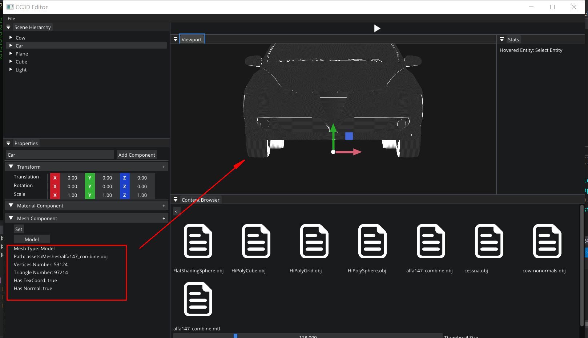

# Dev12-02

TODO : draw each component ui

## Mesh Componet

code version: [here](https://github.com/Graphic-researcher/Crosa-Conty-3D/commit/8dbf32d7af394b1d2c0476c457e783b5adc4b295)

```c++
DrawComponent<MeshComponent>("Mesh Component", entity, [](auto& component)
{
	std::unordered_map<MeshType, std::string> KeyMap =
	{
		{MeshType::None, "None"},
		{MeshType::Plane, "Plane"},
		{MeshType::Cube, "Cube"},
		{MeshType::Sphere, "Sphere"},
		{MeshType::Model, "Model"},
	};

	if (ImGui::Button("Set"))
	{
		ImGui::OpenPopup("Set");
	}
	if (ImGui::BeginPopup("Set"))
	{
		for (auto item : KeyMap)
		{
			if (ImGui::BeginMenu(item.second.c_str()))
			{
				if (item.first != MeshType::None && item.first != MeshType::Model)
				{
					static int sample = 1;
					ImGui::SliderInt("sample", &sample, 1, 30);
					if (ImGui::Button("OK"))
					{
						component.Reload(item.first, sample);
					}
				}
				ImGui::EndMenu();//if BeginMenu(item.second.c_str())
			}
		}
		ImGui::EndPopup();//if BeginPopup("Set")
	}
});
```


code version : [here](https://github.com/Graphic-researcher/Crosa-Conty-3D/commit/80177e2df01968152a2b5d123e08065c6194cd63)

```c++
DrawComponent<MeshComponent>("Mesh Component", entity, [](auto& component)
{
	std::unordered_map<MeshType, std::string> KeyMap =
	{
		{MeshType::None, "Empty"},
		{MeshType::Plane, "Plane"},
		{MeshType::Cube, "Cube"},
		{MeshType::Sphere, "Sphere"},
		{MeshType::Model, "Model"},
	};

	if (ImGui::Button("Set"))
	{
		ImGui::OpenPopup("Set");
	}
	if (ImGui::BeginPopup("Set"))
	{
		for (auto item : KeyMap)
		{
			if (ImGui::BeginMenu(item.second.c_str()))
			{
				if (item.first != MeshType::None && item.first != MeshType::Model)
				{
					static int sample = 1;
					ImGui::SliderInt("sample", &sample, 1, 30);
					if (ImGui::Button("OK"))
					{
						component.Reload(item.first, sample);
						component.isShowModel = false;
					}
				}
				if (item.first == MeshType::None)
				{
					if (ImGui::MenuItem("Reset"))
					{
						component.Reset();
						component.isShowModel = false;
					}
				}
				if (item.first == MeshType::Model)
				{
					if (ImGui::MenuItem("Load"))
					{
						component.isShowModel = true;
					}
				}
				ImGui::EndMenu();//if BeginMenu(item.second.c_str())
			}
		}
		ImGui::EndPopup();//if BeginPopup("Set")
	}

	if (component.isShowModel)
	{
		ImGui::Button("Model", ImVec2(100.0f, 0.0f));
		if (ImGui::BeginDragDropTarget())
		{
			if (const ImGuiPayload* payload = ImGui::AcceptDragDropPayload("CONTENT_BROWSER_ITEM"))
			{
				const wchar_t* path = (const wchar_t*)payload->Data;
				std::filesystem::path ModelPath = std::filesystem::path(g_AssetPath) / path;
				std::string str = ModelPath.string();
				std::string suffix = str.substr(str.find_last_of('.') + 1);
				if (suffix != "obj")
				{
					CC3D_ERROR("Can't load file");
				}
				else
				{
					component.Reload(str);
				}
			}
			ImGui::EndDragDropTarget();
		}
	}
});
```


Show Mesh information :

```c++
///Mesh Information:
ImGui::Text(("Mesh Type: " + KeyMap[component.Mesh->GetMeshType()]).c_str());
ImGui::Text(("Path: " + component.Mesh->GetPathName()).c_str());
ImGui::Text(("Vertices Number: " + std::to_string(component.Mesh->GetVerticesNum())).c_str());
ImGui::Text(("Triangle Number: " + std::to_string(component.Mesh->GetTriangleNum())).c_str());
ImGui::Text(("Has TexCoord: " + BoolString(component.Mesh->HasTexCoord())).c_str());
ImGui::Text(("Has Normal: " + BoolString(component.Mesh->HasNormal())).c_str());
```



## Material Component


## Light Component