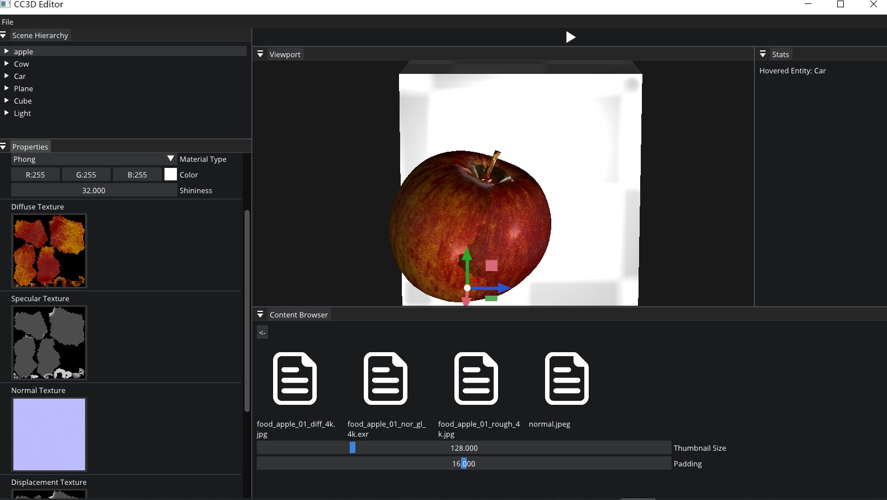
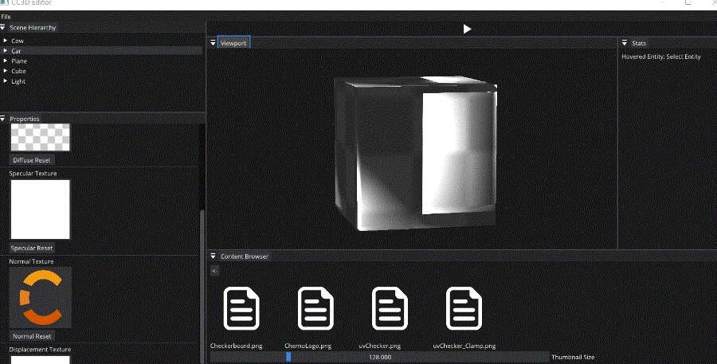
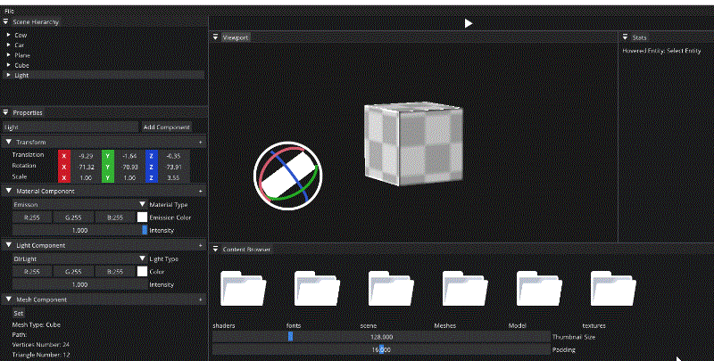

# Dev12-02

TODO : draw each component ui

## Mesh Componet

code version: [here](https://github.com/Graphic-researcher/Crosa-Conty-3D/commit/8dbf32d7af394b1d2c0476c457e783b5adc4b295)

```c++
DrawComponent<MeshComponent>("Mesh Component", entity, [](auto& component)
{
	std::unordered_map<MeshType, std::string> KeyMap =
	{
		{MeshType::None, "None"},
		{MeshType::Plane, "Plane"},
		{MeshType::Cube, "Cube"},
		{MeshType::Sphere, "Sphere"},
		{MeshType::Model, "Model"},
	};

	if (ImGui::Button("Set"))
	{
		ImGui::OpenPopup("Set");
	}
	if (ImGui::BeginPopup("Set"))
	{
		for (auto item : KeyMap)
		{
			if (ImGui::BeginMenu(item.second.c_str()))
			{
				if (item.first != MeshType::None && item.first != MeshType::Model)
				{
					static int sample = 1;
					ImGui::SliderInt("sample", &sample, 1, 30);
					if (ImGui::Button("OK"))
					{
						component.Reload(item.first, sample);
					}
				}
				ImGui::EndMenu();//if BeginMenu(item.second.c_str())
			}
		}
		ImGui::EndPopup();//if BeginPopup("Set")
	}
});
```


code version : [here](https://github.com/Graphic-researcher/Crosa-Conty-3D/commit/80177e2df01968152a2b5d123e08065c6194cd63)

```c++
DrawComponent<MeshComponent>("Mesh Component", entity, [](auto& component)
{
	std::unordered_map<MeshType, std::string> KeyMap =
	{
		{MeshType::None, "Empty"},
		{MeshType::Plane, "Plane"},
		{MeshType::Cube, "Cube"},
		{MeshType::Sphere, "Sphere"},
		{MeshType::Model, "Model"},
	};

	if (ImGui::Button("Set"))
	{
		ImGui::OpenPopup("Set");
	}
	if (ImGui::BeginPopup("Set"))
	{
		for (auto item : KeyMap)
		{
			if (ImGui::BeginMenu(item.second.c_str()))
			{
				if (item.first != MeshType::None && item.first != MeshType::Model)
				{
					static int sample = 1;
					ImGui::SliderInt("sample", &sample, 1, 30);
					if (ImGui::Button("OK"))
					{
						component.Reload(item.first, sample);
						component.isShowModel = false;
					}
				}
				if (item.first == MeshType::None)
				{
					if (ImGui::MenuItem("Reset"))
					{
						component.Reset();
						component.isShowModel = false;
					}
				}
				if (item.first == MeshType::Model)
				{
					if (ImGui::MenuItem("Load"))
					{
						component.isShowModel = true;
					}
				}
				ImGui::EndMenu();//if BeginMenu(item.second.c_str())
			}
		}
		ImGui::EndPopup();//if BeginPopup("Set")
	}

	if (component.isShowModel)
	{
		ImGui::Button("Model", ImVec2(100.0f, 0.0f));
		if (ImGui::BeginDragDropTarget())
		{
			if (const ImGuiPayload* payload = ImGui::AcceptDragDropPayload("CONTENT_BROWSER_ITEM"))
			{
				const wchar_t* path = (const wchar_t*)payload->Data;
				std::filesystem::path ModelPath = std::filesystem::path(g_AssetPath) / path;
				std::string str = ModelPath.string();
				std::string suffix = str.substr(str.find_last_of('.') + 1);
				if (suffix != "obj")
				{
					CC3D_ERROR("Can't load file");
				}
				else
				{
					component.Reload(str);
				}
			}
			ImGui::EndDragDropTarget();
		}
	}
});
```


Show Mesh information :

```c++
///Mesh Information:
ImGui::Text(("Mesh Type: " + KeyMap[component.Mesh->GetMeshType()]).c_str());
ImGui::Text(("Path: " + component.Mesh->GetPathName()).c_str());
ImGui::Text(("Vertices Number: " + std::to_string(component.Mesh->GetVerticesNum())).c_str());
ImGui::Text(("Triangle Number: " + std::to_string(component.Mesh->GetTriangleNum())).c_str());
ImGui::Text(("Has TexCoord: " + BoolString(component.Mesh->HasTexCoord())).c_str());
ImGui::Text(("Has Normal: " + BoolString(component.Mesh->HasNormal())).c_str());
```


## Material Component

### Emission & Phong

```c++
DrawComponent<MaterialComponent>("Material Component", entity, [](auto& component)
{
	const char* materialItems[] = { "None", "Emisson", "Phong", "Cook Torrance BRDF" };
	auto type = component.Type;
	auto& material = component;
	ImGui::Combo("Material Type", (int*)(&material.Type), materialItems, IM_ARRAYSIZE(materialItems));
	if (type != material.Type)//initialize
		material.ResetType();
	switch (material.Type)
	{
	case MaterialType::Material_Emission:
	{
		ImGui::ColorEdit3("Emission Color", (float*)(&CastRef<EmissionMaterial>(material.MaterialSrc)->EmissionColor));
		ImGui::SliderFloat("Intensity", (float*)(&CastRef<EmissionMaterial>(material.MaterialSrc)->Intensity), 0.0f, 1.0f);
		break;
	}
	case MaterialType::Material_Phong:
	{
		ImGui::ColorEdit3("Color", (float*)(&CastRef<PhongMaterial>(material.MaterialSrc)->Color));
		ImGui::DragFloat("Shininess", (float*)(&CastRef<PhongMaterial>(material.MaterialSrc)->Shininess));
		ImGui::Separator();
		Ref<Texture2D>& DiffuseTexture = CastRef<PhongMaterial>(material.MaterialSrc)->DiffuseTexture;
		ShowSetTexture(DiffuseTexture, "Diffuse");
		ImGui::Separator();
		Ref<Texture2D>& SpecularTexture = CastRef<PhongMaterial>(material.MaterialSrc)->SpecularTexture;
		ShowSetTexture(SpecularTexture, "Specular");
		ImGui::Separator();
		Ref<Texture2D>& NormalTexture = CastRef<PhongMaterial>(material.MaterialSrc)->NormalTexture;
		ShowSetTexture(NormalTexture, "Normal");
		ImGui::Separator();
		Ref<Texture2D>& DisplacementTexture = CastRef<PhongMaterial>(material.MaterialSrc)->DisplacementTexture;
		ShowSetTexture(DisplacementTexture, "Displacement");
		ImGui::DragFloat("Height Scale", &CastRef<PhongMaterial>(material.MaterialSrc)->HeightScale, 0.01f);
	}
	default:
		break;
	}

});
static void ShowSetTexture(CC3D::Ref<CC3D::Texture2D>& Texture, const std::string& textureName)
{
    ImGui::Text((textureName + " Texture").c_str());

    static float thumbnailSize = 128.0f;

    if (nullptr != Texture)
    {
        ImGui::ImageButton((ImTextureID)Texture->GetRendererID(), { thumbnailSize, thumbnailSize }, { 0, 1 }, { 1, 0 });
    }
    else
    {
        ImGui::Button(textureName.c_str(), ImVec2(100.0f, 0.0f));
    }

    if (ImGui::BeginDragDropTarget())
    {
        if (const ImGuiPayload* payload = ImGui::AcceptDragDropPayload("CONTENT_BROWSER_ITEM"))
        {
            const wchar_t* path = (const wchar_t*)payload->Data;
            std::filesystem::path texturePath = std::filesystem::path(g_AssetPath) / path;
            Ref<Texture2D> texture = Texture2D::Create(texturePath.string());
            if (texture->IsLoaded())
                Texture = texture;
            else
                CC3D_WARN("Could not load texture {0}", texturePath.filename().string());
        }
        ImGui::EndDragDropTarget();
    }
    std::string btn = textureName + " Reset";
    if (ImGui::Button(btn.c_str(), ImVec2(100.0f, 0.0f)))
    {
        Texture = Texture2D::Create(1, 1);
        uint32_t data = 0xffffffff;
        Texture->SetData(&data, sizeof(uint32_t));
    }
}
```





### PBR

TODO

## Light Component

```c++
DrawComponent<LightComponent>("Light Component", entity, [&entity](auto& component)
{
	///transform:
	auto transform = entity.GetComponent<TransformComponent>();
	glm::vec3 rotation = glm::degrees(transform.Rotation);

	const char* lightItems[] = { "None", "Basic", "DIrLight", "PointLight", "SpotLight" };
	auto Type = component.Type;
	auto& light = component;
	ImGui::Combo("Light Type", (int*)(&light.Type), lightItems, IM_ARRAYSIZE(lightItems));
	if (Type != light.Type)
	{
		light.ResetType();
	}
	switch (light.Type)
	{
	case LightType::LightType_None:
		break;
	case LightType::LightType_Basic:
		ImGui::ColorEdit3("Color", (float*)(&CastRef<Light>(light.LightSrc)->Color));
		ImGui::DragFloat("Intensity", (float*)(&CastRef<Light>(light.LightSrc)->Intensity), 0.1f);
		break;
	case LightType::LightType_DirLight:
		ImGui::ColorEdit3("Color", (float*)(&CastRef<DirLight>(light.LightSrc)->Color));
		ImGui::DragFloat("Intensity", (float*)(&CastRef<DirLight>(light.LightSrc)->Intensity), 0.1f, 0.0f);
		//ImGui::DragFloat3("Direction", (float*)(&CastRef<DirLight>(light.LightSrc)->Direction), 0.1f);
		CastRef<DirLight>(light.LightSrc)->Direction = rotation;
		break;
	case LightType::LightType_PointLight:
		ImGui::ColorEdit3("Color", (float*)(&CastRef<PointLight>(light.LightSrc)->Color));
		ImGui::DragFloat("Intensity", (float*)(&CastRef<PointLight>(light.LightSrc)->Intensity), 0.1f, 0.0f);
		ImGui::DragFloat("constant", (float*)(&CastRef<PointLight>(light.LightSrc)->Constant), 0.01f, 0.0f);
		ImGui::DragFloat("linear", (float*)(&CastRef<PointLight>(light.LightSrc)->Linear), 0.01f, 0.0f);
		ImGui::DragFloat("quadratic", (float*)(&CastRef<PointLight>(light.LightSrc)->Quadratic), 0.01f, 0.0f);
		break;
	case LightType::LightType_SpotLight:
		ImGui::ColorEdit3("Color", (float*)(&CastRef<SpotLight>(light.LightSrc)->Color));
		ImGui::DragFloat("Intensity", (float*)(&CastRef<SpotLight>(light.LightSrc)->Intensity), 0.1f, 0.0f);
		//ImGui::DragFloat3("Direction", (float*)(&CastRef<SpotLight>(light.LightSrc)->Direction), 0.1f, 0.0f);
		CastRef<SpotLight>(light.LightSrc)->Direction = rotation;
		ImGui::DragFloat("CutOff", (float*)(&CastRef<SpotLight>(light.LightSrc)->CutOff), 0.01f, 0.0f);
		ImGui::DragFloat("OuterCutOff", (float*)(&CastRef<SpotLight>(light.LightSrc)->OuterCutOff), 0.01f, 0.0f);
	default:
		break;c++
	}
});
```

