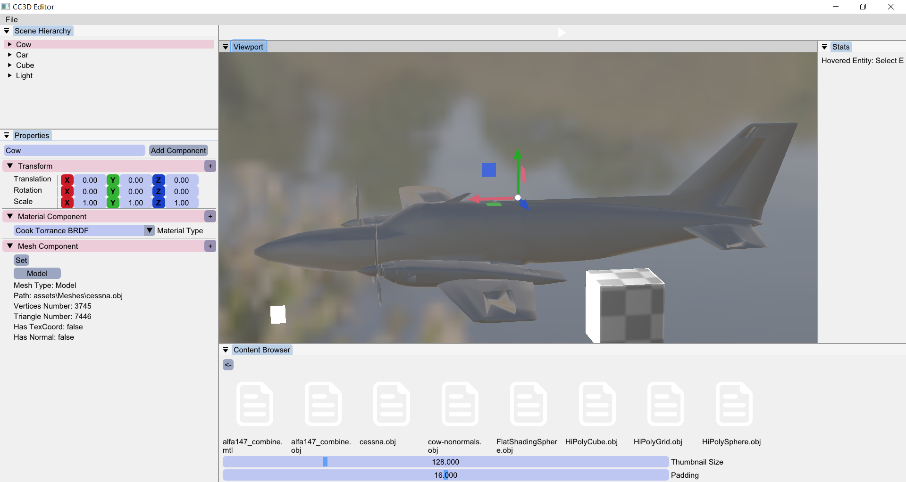

# Annoying trouble -- Draw Cube map environment properly

## Bug

Now I encounter a trouble which is made by MRT (Multiple Render Target)

If I use this frame buffer attachments:

```c++
fbSpec.Attachments = { FramebufferTextureFormat::RGBA8, FramebufferTextureFormat::RED_INTEGER, FramebufferTextureFormat::Depth };//can't load hdr
```

 The Environment Cube Map can't render properly :


Firstly I thought the problem is in view matrix :

```c++
void OpenGLCubemap::BindCubeMap(EditorCamera& camera, uint32_t slot) const
{
    m_BackgroundShader->Bind();
    m_BackgroundShader->SetMat4("projection", camera.GetProjectionMatrix());
    m_BackgroundShader->SetMat4("view", camera.GetViewMatrix());
    glBindTextureUnit(slot, m_CubemapID);
    RenderCube();
}
```

But when I delete the Depth attachment :

```c++
fbSpec.Attachments = { FramebufferTextureFormat::RGBA8, FramebufferTextureFormat::RED_INTEGER, FramebufferTextureFormat::Depth };//cant load hdr
```

The Cube Map could render good relatively

```c++
fbSpec.Attachments = { FramebufferTextureFormat::RGBA8, FramebufferTextureFormat::RED_INTEGER};//could load hdr
```


But the entity object disappeared (I guess that because the lost of depth)

## Solution

refer : [here](https://learnopengl.com/Advanced-OpenGL/Cubemaps)

code version : [here](https://github.com/Graphic-researcher/Crosa-Conty-3D/commit/5e2709e19ae2926cd0086a23c678a2de0bc96b26)

**learnopengl start** Quote

Rendering the skybox is easy now that we have a cubemap texture, we simply bind the cubemap texture and the skybox sampler is automatically filled with the skybox cubemap. To draw the skybox we're going to draw it as the first object in the scene and disable depth writing. This way the skybox will always be drawn at the background of all the other objects since the unit cube is most likely smaller than the rest of the scene.

```c++
glDepthMask(GL_FALSE);
skyboxShader.use();
// ... set view and projection matrix
glBindVertexArray(skyboxVAO);
glBindTexture(GL_TEXTURE_CUBE_MAP, cubemapTexture);
glDrawArrays(GL_TRIANGLES, 0, 36);
glDepthMask(GL_TRUE);
// ... draw rest of the scene
```

**learnopengl end **Quote

But I didn't resolve it by disable depth write just like learn Opengl does(it doesn't work for me),instead,I disable depth test and enable it after render the sky box

```c++
void OpenGLCubemap::BindCubeMap(EditorCamera& camera, uint32_t slot) const
{
    //glClear(GL_DEPTH_BUFFER_BIT);
    glDisable(GL_DEPTH_TEST);
    //glDepthMask(GL_FALSE);
    m_BackgroundShader->Bind();
    m_BackgroundShader->SetMat4("projection", camera.GetProjectionMatrix());
    m_BackgroundShader->SetMat4("view", camera.GetViewMatrix());
    glBindTextureUnit(slot, m_CubemapID);
    RenderCube();
    glEnable(GL_DEPTH_TEST);
    //glDepthMask(GL_TRUE);
}
```




