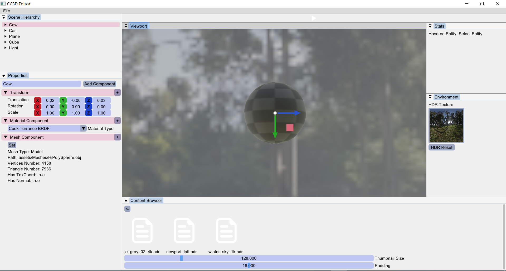
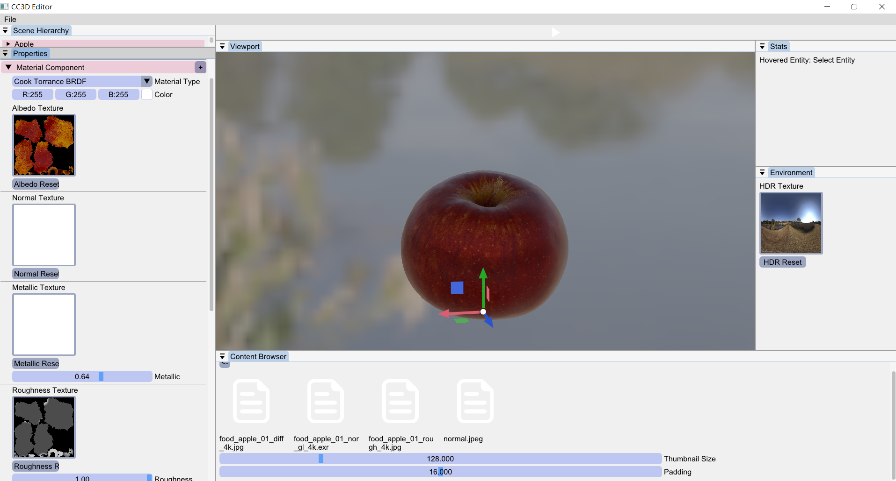
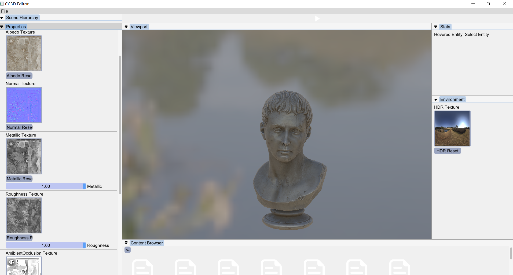
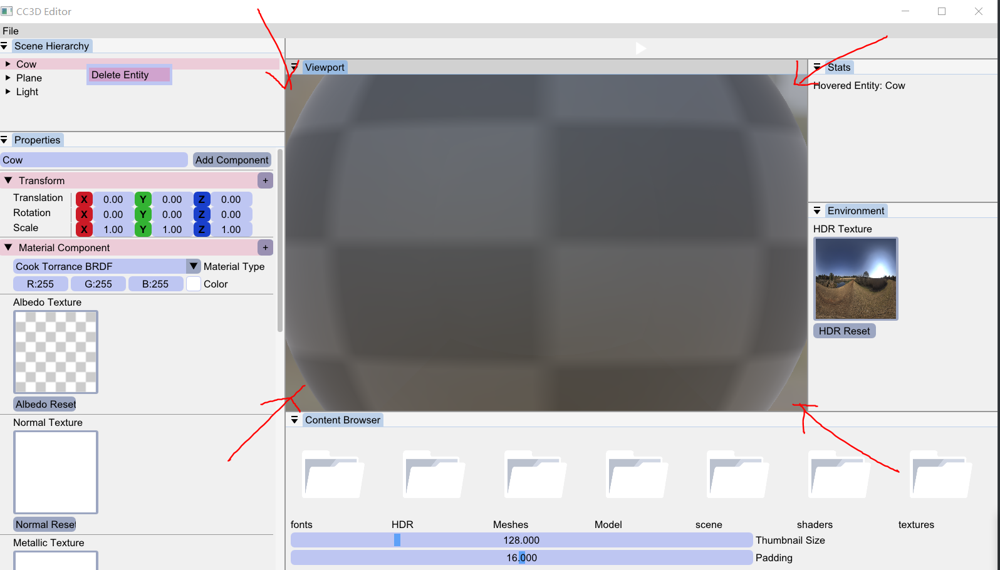
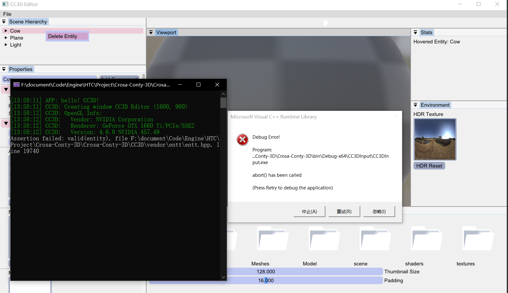
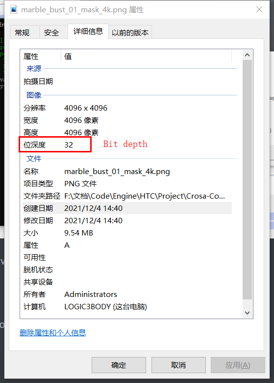
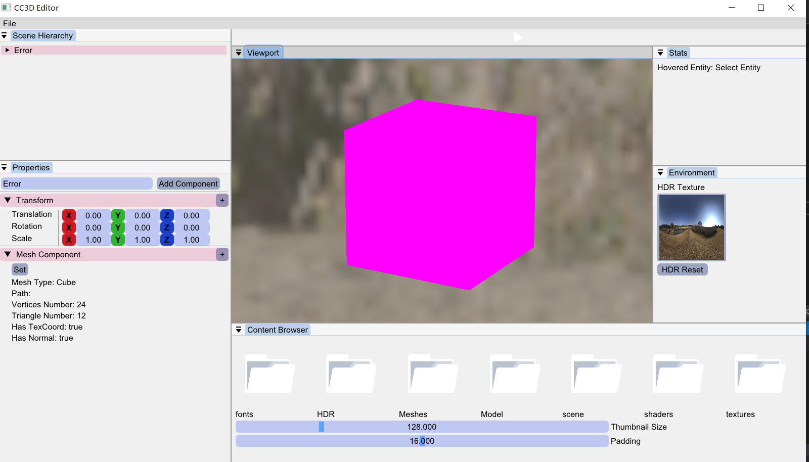

# Road to PBR!

## Environment Loading

```c++
struct FlagWithPath
{
    bool flag;//is drag a new texture
    std::string path;//texture path
    bool resetFlag = false;//is reset texture
};
void EditorLayer::EnvironmentLoad()
{
    static float thumbnailSize = 128.0f;
    ImGui::Begin("Environment");
    Ref<Texture2D> HDRTexture;
    if (m_ActiveScene->m_Cubemap != nullptr)
    {
        HDRTexture = m_ActiveScene->m_Cubemap->GetTexture();
    }
    FlagWithPath f = ShowSetTexture(HDRTexture, "HDR");
    if (f.flag)
    {
        m_ActiveScene->m_Cubemap = Cubemap::Create(f.path);
    }
    else if (f.resetFlag)
    {
        m_ActiveScene->m_Cubemap = Cubemap::Create();
    }
    ImGui::End();//Environment
}
static FlagWithPath ShowSetTexture(Ref<Texture2D>& Texture, const std::string& textureName)
{
    ImGui::Text((textureName + " Texture").c_str());

    static float thumbnailSize = 128.0f;
    FlagWithPath flagWithPath = {false,""};
    if (nullptr != Texture)
    {
        ImGui::ImageButton((ImTextureID)Texture->GetRendererID(), { thumbnailSize, thumbnailSize }, { 0, 1 }, { 1, 0 });
    }
    else
    {
        ImGui::Button(textureName.c_str(), ImVec2(100.0f, 0.0f));
    }

    if (ImGui::BeginDragDropTarget())
    {
        if (const ImGuiPayload* payload = ImGui::AcceptDragDropPayload("CONTENT_BROWSER_ITEM"))
        {
            const wchar_t* path = (const wchar_t*)payload->Data;
            std::filesystem::path texturePath = std::filesystem::path(g_AssetPath) / path;
            Ref<Texture2D> texture = Texture2D::Create(texturePath.string());
            if (texture->IsLoaded())
            {
                Texture = texture;
                flagWithPath.flag = true;
                flagWithPath.path = texturePath.string();
            }
            else
                CC3D_WARN("Could not load texture {0}", texturePath.filename().string());
        }
        ImGui::EndDragDropTarget();
    }
    std::string btn = textureName + " Reset";
    if (ImGui::Button(btn.c_str(), ImVec2(100.0f, 0.0f)))
    {
        Texture = Texture2D::Create(1, 1);
        uint32_t data = 0xffffffff;
        Texture->SetData(&data, sizeof(uint32_t));
        flagWithPath.resetFlag = true;
    }
    return flagWithPath;
}
```




## PBR Material UI

code version : [here](https://github.com/Graphic-researcher/Crosa-Conty-3D/commit/3190c9a38aa80849d559c32d190dde78f16dd112)

```c++
case MaterialType::Material_Cook_Torrance:
{
    ImGui::ColorEdit3("Color", (float*)(&CastRef<CookTorranceBRDF>(material.MaterialSrc)->Color));
    ImGui::Separator();
    Ref<Texture2D>& AlbedoTexture = CastRef<CookTorranceBRDF>(material.MaterialSrc)->AlbedoTexture;
    ShowSetTexture(AlbedoTexture, "Albedo");
    ImGui::Separator();
    Ref<Texture2D>& NormalTexture = CastRef<CookTorranceBRDF>(material.MaterialSrc)->NormalTexture;
    ShowSetTexture(NormalTexture, "Normal");
    ImGui::Separator();
    Ref<Texture2D>& MetallicTexture = CastRef<CookTorranceBRDF>(material.MaterialSrc)->MetallicTexture;
    ShowSetTexture(MetallicTexture, "Metallic");
    ImGui::SliderFloat("Metallic", &CastRef<CookTorranceBRDF>(material.MaterialSrc)->Metallic, 0.0f, 1.0f, "%.2f");
    ImGui::Separator();
    Ref<Texture2D>& RoughnessTexture = CastRef<CookTorranceBRDF>(material.MaterialSrc)->RoughnessTexture;
    ShowSetTexture(RoughnessTexture, "Roughness");
    ImGui::SliderFloat("Roughness", &CastRef<CookTorranceBRDF>(material.MaterialSrc)->Roughness, 0.0f, 1.0f, "%.2f");
    ImGui::Separator();
    Ref<Texture2D>& AOTexture = CastRef<CookTorranceBRDF>(material.MaterialSrc)->AOTexture;
    ShowSetTexture(AOTexture, "AmibientOcclusion");
    ImGui::Separator();
    Ref<Texture2D>& DisplacementTexture = CastRef<CookTorranceBRDF>(material.MaterialSrc)->DisplacementTexture;
    ShowSetTexture(DisplacementTexture, "Displacement");
    ImGui::DragFloat("Height Scale", &CastRef<CookTorranceBRDF>(material.MaterialSrc)->HeightScale, 0.01f);
    ImGui::Separator();
    break;
}
```





<video src="PBR2.webm"></video>

## A bug Report

Because of the selection of entity mode is using OpenGL RED_INTEGER draw mode. We recognize the entity through the integer value pass through the shader . 

```glsl
#type vertex
#version 450 
//...
uniform int a_EntityID;
out flat int v_EntityID;
void main()
{
	v_EntityID = a_EntityID;
	gl_Position = u_ViewProjection * u_Transform * vec4(a_Position, 1.0);
}
#type fragment
#version 450
layout(location = 0) out vec4 FragColor;
layout(location = 1) out int color1;
in flat int v_EntityID;
void main()
{
	FragColor=vec4(1.0);
	color1 = v_EntityID;
}
```

So there has a safety problem:

If our view port didn't cover whole object like this



That means we only select a part of object not the whole object and then we delete it , we can't delete the whole entity but a part of it (sounds strange but I guess that is the problem).And it would cause the following entt invalid entity assert:



I would try to solve it if I assure that is problem and find method.  

## Attention

The texture we load must be internal format



```c++
///channel check
GLenum internalFormat = 0, dataFormat = 0;
if (channels == 4)
{
    internalFormat = GL_RGBA8;
    dataFormat = GL_RGBA;
}
else if (channels == 3)
{
    internalFormat = GL_RGB8;
    dataFormat = GL_RGB;
}
m_InternalFormat = internalFormat;
m_DataFormat = dataFormat;
CC3D_CORE_ASSERT(internalFormat & dataFormat, "Format not supported!");
```

## Default Color

Just like Unity Pink color error

