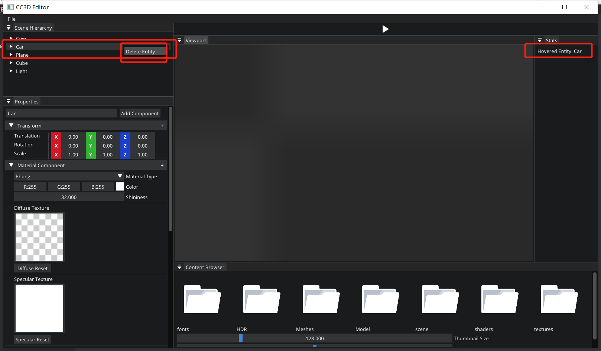
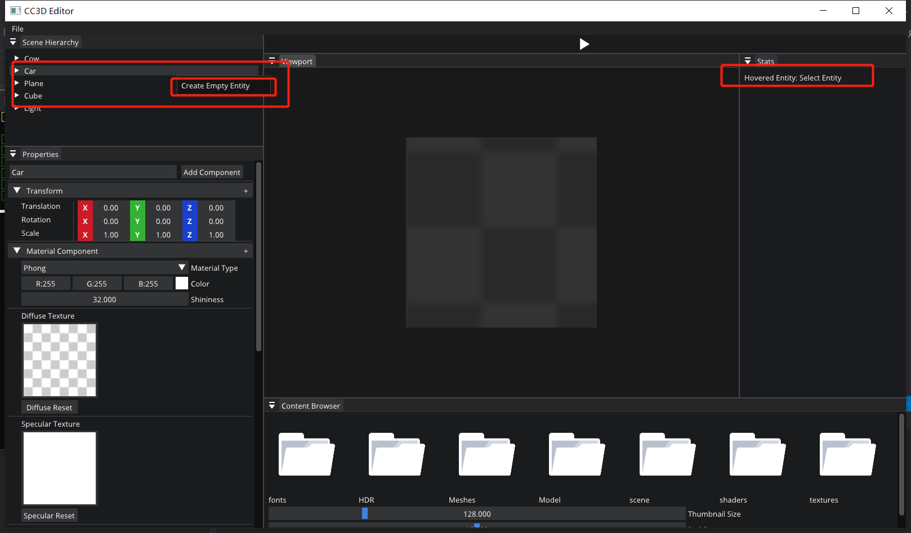

# Bug Fix Report

code version : [here](https://github.com/Graphic-researcher/Crosa-Conty-3D/commit/a7b004914355fd8e5c6723f3ba004f05518510cb)

Thanks to my bro [Darkmon](https://github.com/darkwuta), we find the problem and fix the bug .

When we delete an entity , we delete it in Scene Scope but not Editor Layer Scope

So if we delete an entity but we  still refer it in Editor Scope , the program would be crashed.

The program crash happen in this time :



When we try to delete it , the editor still refer to the entity , then program crashes

The program works well in this time :



When we try to delete it , the editor no longer refer to it , then we delete it good

The solution is check the valid of entity , if the entity was deleted in Scene scope , the editor wouldn't refer to it

```c++
bool Scene::HasEntity(Entity entity)
{
    return m_Registry.valid(entity);
}
```

```c++
std::string name = "Select Entity";
if (m_ActiveScene->HasEntity(m_HoveredEntity))
    name = m_HoveredEntity.GetComponent<TagComponent>().Tag;
ImGui::Text("Hovered Entity: %s", name.c_str());
```

