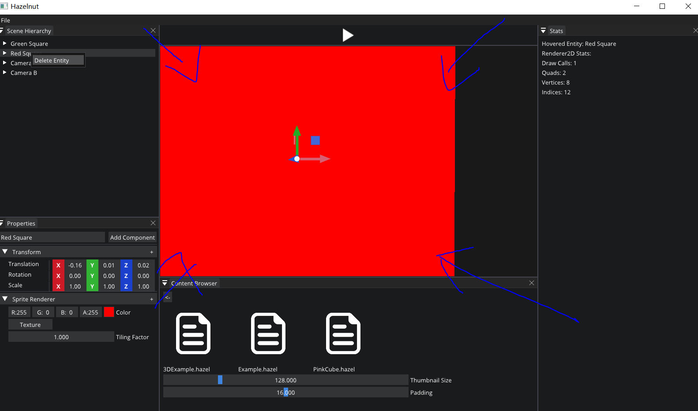
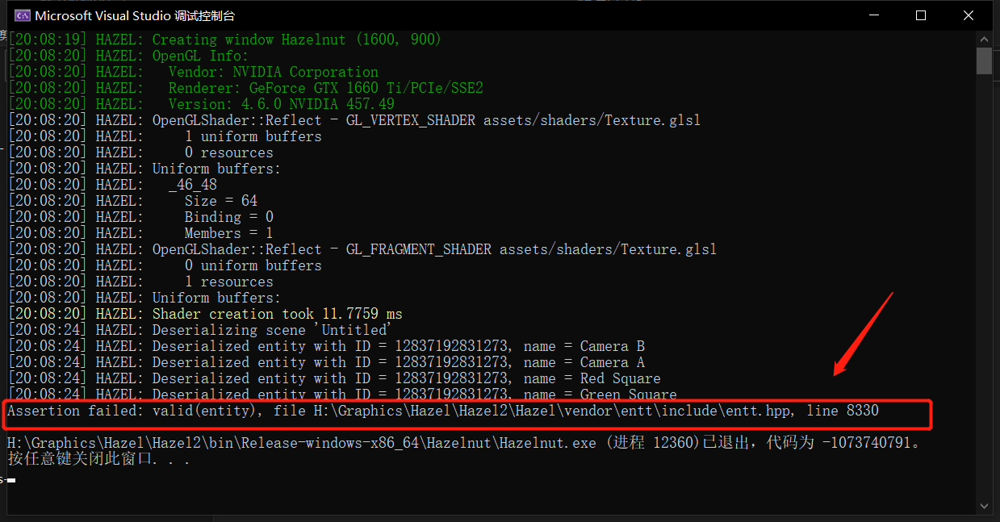

# Entity Selection Failure If the viewport didn't cover whole entity


Because of the selection of entity mode is using OpenGL RED_INTEGER draw mode. I think the entity selection is through the integer value pass through the shader . 

```glsl
// Basic Texture Shader

#type vertex
#version 450 core

//...
layout (location = 4) out flat int v_EntityID;

void main()
{
	//...
    v_EntityID = a_EntityID;

    gl_Position = u_ViewProjection * vec4(a_Position, 1.0);
}

#type fragment
#version 450 core

layout(location = 0) out vec4 color;
layout(location = 1) out int color2;

struct VertexOutput
{
    vec4 Color;
    vec2 TexCoord;
    float TilingFactor;
};

layout (location = 0) in VertexOutput Input;
layout (location = 3) in flat float v_TexIndex;
layout (location = 4) in flat int v_EntityID;

layout (binding = 0) uniform sampler2D u_Textures[32];

void main()
{
    vec4 texColor = Input.Color;
	//...
    color = texColor;

    color2 = v_EntityID;
}
```

So there has a safety problem:

If our view port didn't cover whole object like this



That means we only select a part of object not the whole object and then we delete it , we can't delete a part of entity but whole of it (sounds strange but I guess that is the problem).And it would cause the following entt invalid entity assert:




