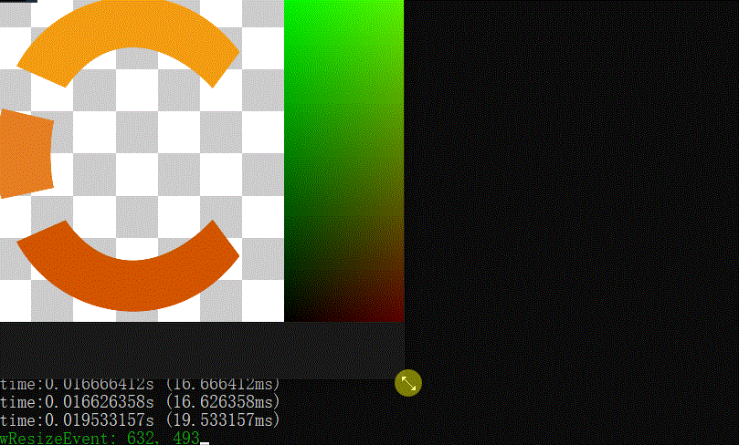

# Lec35 Resizing

tutorial : [here](https://www.youtube.com/watch?v=7LswjvgRqbw&list=PLlrATfBNZ98dC-V-N3m0Go4deliWHPFwT&index=48)

code version :  [here](https://github.com/Graphic-researcher/Crosa-Conty-3D/tree/1814d6e1e0d21016319004017bd1f234d56f4bbd/HTC/Project/Crosa-Conty-3D/Crosa-Conty-3D)

## Render Scope

### RenderAPI

```c++
virtual void SetViewport(uint32_t x, uint32_t y, uint32_t width, uint32_t height) = 0;
```

### RenderCommand

```c++
inline static void SetViewport(uint32_t x, uint32_t y, uint32_t width, uint32_t height)
{
	s_RendererAPI->SetViewport(x, y, width, height);
}
```

### Renderer

```c++
void Renderer::OnWindowResize(uint32_t width, uint32_t height)
{
	RenderCommand::SetViewport(0, 0, width, height);
}
```

### OpenGLRenderAPI

```c++
void OpenGLRendererAPI::SetViewport(uint32_t x, uint32_t y, uint32_t width, uint32_t height)
{
	glViewport(x, y, width, height);
}
```

## Camera Scope

```c++
float GetZoomLevel() const { return m_ZoomLevel; }
void SetZoomLevel(float level) { m_ZoomLevel = level; }
```

## Application Scope

```c++
//Run()
if (!m_Minimized)
{
    for (Layer* layer : m_LayerStack)
  	  layer->OnUpdate(timestep);
}
//OnEvent()
dispatcher.Dispatch<WindowResizeEvent>(BIND_EVENT_FN(OnWindowResize));
bool Application::OnWindowResize(WindowResizeEvent& e)
{
    if (e.GetWidth() == 0 || e.GetHeight() == 0)
    {
        m_Minimized = true;
        return false;
    }

    m_Minimized = false;
    Renderer::OnWindowResize(e.GetWidth(), e.GetHeight());

    return false;
}
```

## Build and Result

