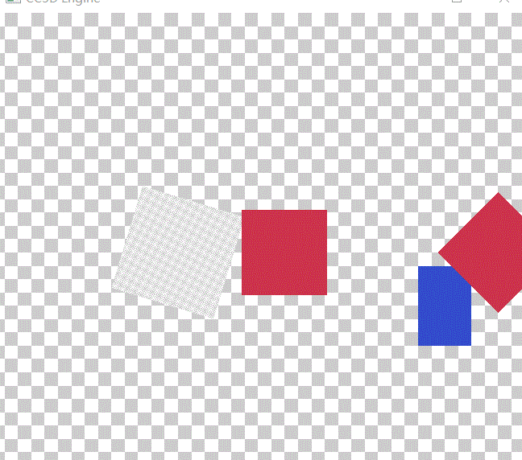

# Lec46 Draw Rotated Quads

tutorial : [here](https://www.youtube.com/watch?v=-SQ8TlFZHbY&list=PLlrATfBNZ98dC-V-N3m0Go4deliWHPFwT&index=63)

code version : [here](https://github.com/Graphic-researcher/Crosa-Conty-3D/tree/2d510d009e717a8ab2e3ce5c9b4a458225f4234b/HTC/Project/Crosa-Conty-3D/Crosa-Conty-3D)

## Render 2D Scope

```c++
struct Renderer2DData
{
    //...code...

    glm::vec4 QuadVertexPositions[4];
};
void Renderer2D::Init()
{
    //...code
    s_Data.QuadVertexPositions[0] = { -0.5f, -0.5f, 0.0f, 1.0f };
    s_Data.QuadVertexPositions[1] = { 0.5f, -0.5f, 0.0f, 1.0f };
    s_Data.QuadVertexPositions[2] = { 0.5f,  0.5f, 0.0f, 1.0f };
    s_Data.QuadVertexPositions[3] = { -0.5f,  0.5f, 0.0f, 1.0f };
}
void Renderer2D::DrawQuad(const glm::vec3& position, const glm::vec2& size, const glm::vec4& color)
{
    //...code

    glm::mat4 transform = glm::translate(glm::mat4(1.0f), position)
        * glm::scale(glm::mat4(1.0f), { size.x, size.y, 1.0f });
    s_Data.QuadVertexBufferPtr->Position = transform * s_Data.QuadVertexPositions[0];
    //...code

    s_Data.QuadVertexBufferPtr->Position = transform * s_Data.QuadVertexPositions[1];
    //...code

    s_Data.QuadVertexBufferPtr->Position = transform * s_Data.QuadVertexPositions[2];
    //...code

    s_Data.QuadVertexBufferPtr->Position = transform * s_Data.QuadVertexPositions[3];
    //...code

    s_Data.QuadIndexCount += 6;
}
void Renderer2D::DrawQuad(const glm::vec3& position, const glm::vec2& size, const Ref<Texture2D>& texture, float tilingFactor, const glm::vec4& tintColor)
{
    //...code


    glm::mat4 transform = glm::translate(glm::mat4(1.0f), position)
        * glm::scale(glm::mat4(1.0f), { size.x, size.y, 1.0f });

    s_Data.QuadVertexBufferPtr->Position = transform * s_Data.QuadVertexPositions[0];
    //...code

    s_Data.QuadVertexBufferPtr->Position = transform * s_Data.QuadVertexPositions[1];;
    //...code

    s_Data.QuadVertexBufferPtr->Position = transform * s_Data.QuadVertexPositions[2];
    //...code

    s_Data.QuadVertexBufferPtr->Position = transform * s_Data.QuadVertexPositions[3];
    //...code

    //...code
}
void Renderer2D::DrawRotatedQuad(const glm::vec3& position, const glm::vec2& size, float rotation, const glm::vec4& color)
{
    CC3D_PROFILE_FUNCTION();

    const float textureIndex = 0.0f; // White Texture
    const float tilingFactor = 1.0f;

    glm::mat4 transform = glm::translate(glm::mat4(1.0f), position)
        * glm::rotate(glm::mat4(1.0f), glm::radians(rotation), { 0.0f, 0.0f, 1.0f })
        * glm::scale(glm::mat4(1.0f), { size.x, size.y, 1.0f });

    s_Data.QuadVertexBufferPtr->Position = transform * s_Data.QuadVertexPositions[0];
    s_Data.QuadVertexBufferPtr->Color = color;
    s_Data.QuadVertexBufferPtr->TexCoord = { 0.0f, 0.0f };
    s_Data.QuadVertexBufferPtr->TexIndex = textureIndex;
    s_Data.QuadVertexBufferPtr->TilingFactor = tilingFactor;
    s_Data.QuadVertexBufferPtr++;

    s_Data.QuadVertexBufferPtr->Position = transform * s_Data.QuadVertexPositions[1];
    s_Data.QuadVertexBufferPtr->Color = color;
    s_Data.QuadVertexBufferPtr->TexCoord = { 1.0f, 0.0f };
    s_Data.QuadVertexBufferPtr->TexIndex = textureIndex;
    s_Data.QuadVertexBufferPtr->TilingFactor = tilingFactor;
    s_Data.QuadVertexBufferPtr++;

    s_Data.QuadVertexBufferPtr->Position = transform * s_Data.QuadVertexPositions[2];
    s_Data.QuadVertexBufferPtr->Color = color;
    s_Data.QuadVertexBufferPtr->TexCoord = { 1.0f, 1.0f };
    s_Data.QuadVertexBufferPtr->TexIndex = textureIndex;
    s_Data.QuadVertexBufferPtr->TilingFactor = tilingFactor;
    s_Data.QuadVertexBufferPtr++;

    s_Data.QuadVertexBufferPtr->Position = transform * s_Data.QuadVertexPositions[3];
    s_Data.QuadVertexBufferPtr->Color = color;
    s_Data.QuadVertexBufferPtr->TexCoord = { 0.0f, 1.0f };
    s_Data.QuadVertexBufferPtr->TexIndex = textureIndex;
    s_Data.QuadVertexBufferPtr->TilingFactor = tilingFactor;
    s_Data.QuadVertexBufferPtr++;

    s_Data.QuadIndexCount += 6;
}
void Renderer2D::DrawRotatedQuad(const glm::vec3& position, const glm::vec2& size, float rotation, const Ref<Texture2D>& texture, float tilingFactor, const glm::vec4& tintColor)
{
    CC3D_PROFILE_FUNCTION();

    constexpr glm::vec4 color = { 1.0f, 1.0f, 1.0f, 1.0f };

    float textureIndex = 0.0f;
    for (uint32_t i = 1; i < s_Data.TextureSlotIndex; i++)
    {
        if (*s_Data.TextureSlots[i].get() == *texture.get())
        {
            textureIndex = (float)i;
            break;
        }
    }

    if (textureIndex == 0.0f)
    {
        textureIndex = (float)s_Data.TextureSlotIndex;
        s_Data.TextureSlots[s_Data.TextureSlotIndex] = texture;
        s_Data.TextureSlotIndex++;
    }

    glm::mat4 transform = glm::translate(glm::mat4(1.0f), position)
        * glm::rotate(glm::mat4(1.0f), glm::radians(rotation), { 0.0f, 0.0f, 1.0f })
        * glm::scale(glm::mat4(1.0f), { size.x, size.y, 1.0f });

    s_Data.QuadVertexBufferPtr->Position = transform * s_Data.QuadVertexPositions[0];
    s_Data.QuadVertexBufferPtr->Color = color;
    s_Data.QuadVertexBufferPtr->TexCoord = { 0.0f, 0.0f };
    s_Data.QuadVertexBufferPtr->TexIndex = textureIndex;
    s_Data.QuadVertexBufferPtr->TilingFactor = tilingFactor;
    s_Data.QuadVertexBufferPtr++;

    s_Data.QuadVertexBufferPtr->Position = transform * s_Data.QuadVertexPositions[1];
    s_Data.QuadVertexBufferPtr->Color = color;
    s_Data.QuadVertexBufferPtr->TexCoord = { 1.0f, 0.0f };
    s_Data.QuadVertexBufferPtr->TexIndex = textureIndex;
    s_Data.QuadVertexBufferPtr->TilingFactor = tilingFactor;
    s_Data.QuadVertexBufferPtr++;

    s_Data.QuadVertexBufferPtr->Position = transform * s_Data.QuadVertexPositions[2];
    s_Data.QuadVertexBufferPtr->Color = color;
    s_Data.QuadVertexBufferPtr->TexCoord = { 1.0f, 1.0f };
    s_Data.QuadVertexBufferPtr->TexIndex = textureIndex;
    s_Data.QuadVertexBufferPtr->TilingFactor = tilingFactor;
    s_Data.QuadVertexBufferPtr++;

    s_Data.QuadVertexBufferPtr->Position = transform * s_Data.QuadVertexPositions[3];
    s_Data.QuadVertexBufferPtr->Color = color;
    s_Data.QuadVertexBufferPtr->TexCoord = { 0.0f, 1.0f };
    s_Data.QuadVertexBufferPtr->TexIndex = textureIndex;
    s_Data.QuadVertexBufferPtr->TilingFactor = tilingFactor;
    s_Data.QuadVertexBufferPtr++;

    s_Data.QuadIndexCount += 6;
}
```

## Sandbox Scope

```c++
static float rotation = 0.0f;
rotation += ts * 50.0f;
CC3D::Renderer2D::DrawRotatedQuad({ 1.0f, 0.0f }, { 0.8f, 0.8f }, -45.0f, { 0.8f, 0.2f, 0.3f, 1.0f });
CC3D::Renderer2D::DrawQuad({ -1.0f, 0.0f }, { 0.8f, 0.8f }, { 0.8f, 0.2f, 0.3f, 1.0f });
CC3D::Renderer2D::DrawQuad({ 0.5f, -0.5f }, { 0.5f, 0.75f }, { 0.2f, 0.3f, 0.8f, 1.0f });
CC3D::Renderer2D::DrawQuad({ 0.0f, 0.0f, -0.1f }, { 10.0f, 10.0f }, m_CheckerboardTexture, 10.0f);
CC3D::Renderer2D::DrawRotatedQuad({ -2.0f, 0.0f, 0.0f }, { 1.0f, 1.0f }, rotation, m_CheckerboardTexture, 20.0f);
```

## Build and Run

