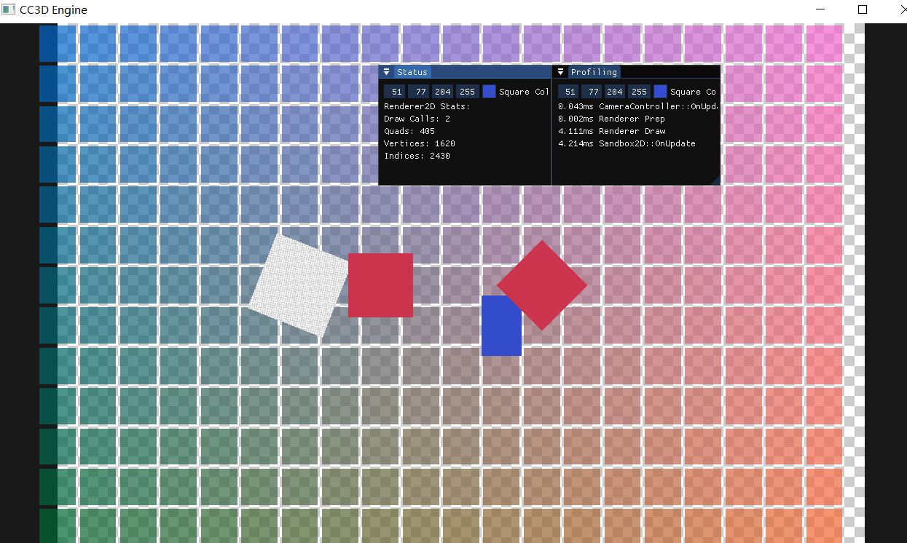

# Lec47 Render Status

tutorial : [here](https://www.youtube.com/watch?v=KKv_pZvn2rM&list=PLlrATfBNZ98dC-V-N3m0Go4deliWHPFwT&index=64)

code version : [here](https://github.com/Graphic-researcher/Crosa-Conty-3D/tree/e6dcc931500b0667350a78cc5247f33bd96b9dae/HTC/Project/Crosa-Conty-3D/Crosa-Conty-3D)

## Render 2D Scope

```c++
// Stats
struct Statistics
{
    uint32_t DrawCalls = 0;
    uint32_t QuadCount = 0;

    uint32_t GetTotalVertexCount() { return QuadCount * 4; }
    uint32_t GetTotalIndexCount() { return QuadCount * 6; }
};
struct Renderer2DData
{
    static const uint32_t MaxQuads = 20000;
    static const uint32_t MaxVertices = MaxQuads * 4;
    static const uint32_t MaxIndices = MaxQuads * 6;
    static const uint32_t MaxTextureSlots = 32; // TODO: RenderCaps

    //...code

    Renderer2D::Statistics Stats;
};

void Renderer2D::Flush()
{
    //...code
    s_Data.Stats.DrawCalls++;
}
void Renderer2D::FlushAndReset()
{
    EndScene();

    s_Data.QuadIndexCount = 0;
    s_Data.QuadVertexBufferPtr = s_Data.QuadVertexBufferBase;

    s_Data.TextureSlotIndex = 1;
}
void Renderer2D::ResetStats()
{
    memset(&s_Data.Stats, 0, sizeof(Statistics));
}

Renderer2D::Statistics Renderer2D::GetStats()
{
    return s_Data.Stats;
}
void Renderer2D::DrawQuad(const glm::vec3& position, const glm::vec2& size, const glm::vec4& color)
{
    CC3D_PROFILE_FUNCTION();

    if (s_Data.QuadIndexCount >= Renderer2DData::MaxIndices)
        FlushAndReset();

    //...code

    s_Data.Stats.QuadCount++;
}
void Renderer2D::DrawQuad(const glm::vec3& position, const glm::vec2& size, const Ref<Texture2D>& texture, float tilingFactor, const glm::vec4& tintColor)
{
    CC3D_PROFILE_FUNCTION();

    if (s_Data.QuadIndexCount >= Renderer2DData::MaxIndices)
        FlushAndReset();

    //...code

    s_Data.Stats.QuadCount++;
}
void Renderer2D::DrawRotatedQuad(const glm::vec3& position, const glm::vec2& size, float rotation, const glm::vec4& color)
{
    CC3D_PROFILE_FUNCTION();

    if (s_Data.QuadIndexCount >= Renderer2DData::MaxIndices)
        FlushAndReset();

    //...code

    s_Data.Stats.QuadCount++;
}
void Renderer2D::DrawRotatedQuad(const glm::vec3& position, const glm::vec2& size, float rotation, const Ref<Texture2D>& texture, float tilingFactor, const glm::vec4& tintColor)
{
    CC3D_PROFILE_FUNCTION();

    if (s_Data.QuadIndexCount >= Renderer2DData::MaxIndices)
        FlushAndReset();

    //...code

    s_Data.Stats.QuadCount++;
}
```

## Sandbox 2D Scope

```c++
void Sandbox2D::OnUpdate(CC3D::Timestep ts)
{
    CC3D_PROFILE_FUNCTION();

    PROFILE_SCOPE("Sandbox2D::OnUpdate");
    // Update

    //...code

    // Render
    CC3D::Renderer2D::ResetStats();
    {
        //...code
    }

    {
        CC3D_PROFILE_SCOPE("Renderer Draw");

        PROFILE_SCOPE("Renderer Draw");
        CC3D::Renderer2D::BeginScene(m_CameraController.GetCamera());///set view matrix
        TestDraw46(ts);
        CC3D::Renderer2D::EndScene();

        CC3D::Renderer2D::BeginScene(m_CameraController.GetCamera());
        TestDraw47();
        CC3D::Renderer2D::EndScene();
    }
}
void Sandbox2D::OnImGuiRender()
{
	CC3D_PROFILE_FUNCTION();
	///profiling information visualization
	ProfileVisual();

	///render status visualization
	RenderStatusVisual();
}
void Sandbox2D::RenderStatusVisual()
{
	ImGui::Begin("Status");
	ImGui::ColorEdit4("Square Color", glm::value_ptr(m_SquareColor));
	auto stats = CC3D::Renderer2D::GetStats();
	ImGui::Text("Renderer2D Stats:");
	ImGui::Text("Draw Calls: %d", stats.DrawCalls);
	ImGui::Text("Quads: %d", stats.QuadCount);
	ImGui::Text("Vertices: %d", stats.GetTotalVertexCount());
	ImGui::Text("Indices: %d", stats.GetTotalIndexCount());
	ImGui::End();
}
void Sandbox2D::ProfileVisual()
{
	ImGui::Begin("Profiling");
	ImGui::ColorEdit4("Square Color", glm::value_ptr(m_SquareColor));

	for (auto& result : m_ProfileResults)
	{
		char label[50];
		strcpy(label, "%.3fms ");
		strcat(label, result.Name);
		ImGui::Text(label, result.Time);
	}
	m_ProfileResults.clear();

	ImGui::End();
}
void Sandbox2D::TestDraw46(CC3D::Timestep ts)
{
    static float rotation = 0.0f;
    rotation += ts * 50.0f;
    CC3D::Renderer2D::DrawRotatedQuad({ 1.0f, 0.0f }, { 0.8f, 0.8f }, -45.0f, { 0.8f, 0.2f, 0.3f, 1.0f });
    CC3D::Renderer2D::DrawQuad({ -1.0f, 0.0f }, { 0.8f, 0.8f }, { 0.8f, 0.2f, 0.3f, 1.0f });
    CC3D::Renderer2D::DrawQuad({ 0.5f, -0.5f }, { 0.5f, 0.75f }, { 0.2f, 0.3f, 0.8f, 1.0f });
    CC3D::Renderer2D::DrawQuad({ 0.0f, 0.0f, -0.1f }, { 10.0f, 10.0f }, m_CheckerboardTexture, 10.0f);
    CC3D::Renderer2D::DrawRotatedQuad({ -2.0f, 0.0f, 0.0f }, { 1.0f, 1.0f }, rotation, m_CheckerboardTexture, 20.0f);
}
void Sandbox2D::TestDraw47()
{
	for (float y = -5.0f; y < 5.0f; y += 0.5f)
	{
		for (float x = -5.0f; x < 5.0f; x += 0.5f)
		{
			glm::vec4 color = { (x + 5.0f) / 10.0f, 0.4f, (y + 5.0f) / 10.0f, 0.7f };
			CC3D::Renderer2D::DrawQuad({ x, y }, { 0.45f, 0.45f }, color);
		}
	}
}
```

## Build and Result

