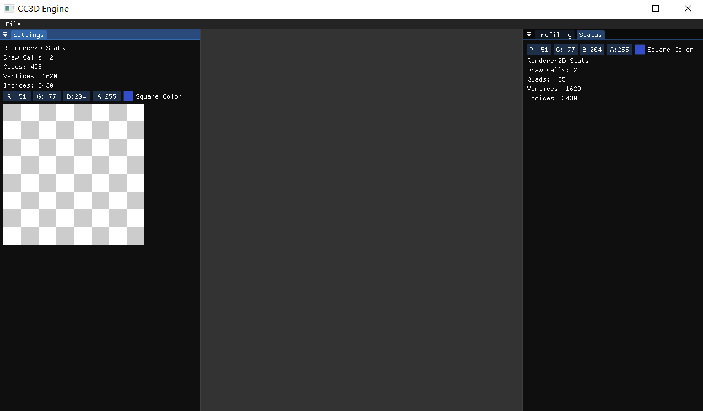

# Lec53 Intro to dockspace

tutorial : [here](https://www.youtube.com/watch?v=UljMVrQ_zYY&list=PLlrATfBNZ98dC-V-N3m0Go4deliWHPFwT&index=71)

code version : [here](https://github.com/Graphic-researcher/Crosa-Conty-3D/tree/d4f1a46d7a221e4402d8df87db2f1fc16309e632/HTC/Project/Crosa-Conty-3D/Crosa-Conty-3D)

**Imgui Dockspace is the base of engine editor.**

## Application Scope

```c++
void Application::Close()
{
    m_Running = false;
}
```

Used in dockspace scope:

```c++
if (ImGui::MenuItem("Exit")) CC3D::Application::Get().Close();
```

## Texture Scope

### Texture Class

```c++
virtual uint32_t GetRendererID() const = 0;
```

### OpenGL Texture Class

```c++
virtual uint32_t GetRendererID() const override { return m_RendererID; }
```

## Sandbox 2D Scope (imgui dockspace)

```c++
void Sandbox2D::OnImGuiRender()
{
    CC3D_PROFILE_FUNCTION();

    // Note: Switch this to true to enable dockspace
    DockSpaceDemo();

    ///profiling information visualization
    ProfileVisual();

    ///render status visualization
    RenderStatusVisual();
}
void Sandbox2D::DockSpaceDemo()
{
    static bool dockingEnabled = true;
    if (dockingEnabled)
    {
        static bool dockspaceOpen = true;
        static bool opt_fullscreen_persistant = true;
        bool opt_fullscreen = opt_fullscreen_persistant;
        static ImGuiDockNodeFlags dockspace_flags = ImGuiDockNodeFlags_None;

        // We are using the ImGuiWindowFlags_NoDocking flag to make the parent window not dockable into,
        // because it would be confusing to have two docking targets within each others.
        ImGuiWindowFlags window_flags = ImGuiWindowFlags_MenuBar | ImGuiWindowFlags_NoDocking;
        if (opt_fullscreen)
        {
            ImGuiViewport* viewport = ImGui::GetMainViewport();
            ImGui::SetNextWindowPos(viewport->Pos);
            ImGui::SetNextWindowSize(viewport->Size);
            ImGui::SetNextWindowViewport(viewport->ID);
            ImGui::PushStyleVar(ImGuiStyleVar_WindowRounding, 0.0f);
            ImGui::PushStyleVar(ImGuiStyleVar_WindowBorderSize, 0.0f);
            window_flags |= ImGuiWindowFlags_NoTitleBar | ImGuiWindowFlags_NoCollapse | ImGuiWindowFlags_NoResize | ImGuiWindowFlags_NoMove;
            window_flags |= ImGuiWindowFlags_NoBringToFrontOnFocus | ImGuiWindowFlags_NoNavFocus;
        }

        // When using ImGuiDockNodeFlags_PassthruCentralNode, DockSpace() will render our background and handle the pass-thru hole, so we ask Begin() to not render a background.
        if (dockspace_flags & ImGuiDockNodeFlags_PassthruCentralNode)
            window_flags |= ImGuiWindowFlags_NoBackground;

        // Important: note that we proceed even if Begin() returns false (aka window is collapsed).
        // This is because we want to keep our DockSpace() active. If a DockSpace() is inactive, 
        // all active windows docked into it will lose their parent and become undocked.
        // We cannot preserve the docking relationship between an active window and an inactive docking, otherwise 
        // any change of dockspace/settings would lead to windows being stuck in limbo and never being visible.
        ImGui::PushStyleVar(ImGuiStyleVar_WindowPadding, ImVec2(0.0f, 0.0f));
        ImGui::Begin("DockSpace Demo", &dockspaceOpen, window_flags);
        ImGui::PopStyleVar();

        if (opt_fullscreen)
            ImGui::PopStyleVar(2);

        // DockSpace
        ImGuiIO& io = ImGui::GetIO();
        if (io.ConfigFlags & ImGuiConfigFlags_DockingEnable)
        {
            ImGuiID dockspace_id = ImGui::GetID("MyDockSpace");
            ImGui::DockSpace(dockspace_id, ImVec2(0.0f, 0.0f), dockspace_flags);
        }

        if (ImGui::BeginMenuBar())
        {
            if (ImGui::BeginMenu("File"))
            {
                // Disabling fullscreen would allow the window to be moved to the front of other windows, 
                // which we can't undo at the moment without finer window depth/z control.
                //ImGui::MenuItem("Fullscreen", NULL, &opt_fullscreen_persistant);

                if (ImGui::MenuItem("Exit")) CC3D::Application::Get().Close();
                ImGui::EndMenu();
            }

            ImGui::EndMenuBar();
        }

        ImGui::Begin("Settings");

        auto stats = CC3D::Renderer2D::GetStats();
        ImGui::Text("Renderer2D Stats:");
        ImGui::Text("Draw Calls: %d", stats.DrawCalls);
        ImGui::Text("Quads: %d", stats.QuadCount);
        ImGui::Text("Vertices: %d", stats.GetTotalVertexCount());
        ImGui::Text("Indices: %d", stats.GetTotalIndexCount());

        ImGui::ColorEdit4("Square Color", glm::value_ptr(m_SquareColor));

        uint32_t textureID = m_CheckerboardTexture->GetRendererID();
        ImGui::Image((void*)textureID, ImVec2{ 256.0f, 256.0f });
        ImGui::End();

        ImGui::End();
    }
    else
    {
        ImGui::Begin("Settings");

        auto stats = CC3D::Renderer2D::GetStats();
        ImGui::Text("Renderer2D Stats:");
        ImGui::Text("Draw Calls: %d", stats.DrawCalls);
        ImGui::Text("Quads: %d", stats.QuadCount);
        ImGui::Text("Vertices: %d", stats.GetTotalVertexCount());
        ImGui::Text("Indices: %d", stats.GetTotalIndexCount());

        ImGui::ColorEdit4("Square Color", glm::value_ptr(m_SquareColor));

        uint32_t textureID = m_CheckerboardTexture->GetRendererID();
        ImGui::Image((void*)textureID, ImVec2{ 256.0f, 256.0f });
        ImGui::End();
    }
}
```

## Build and Result

