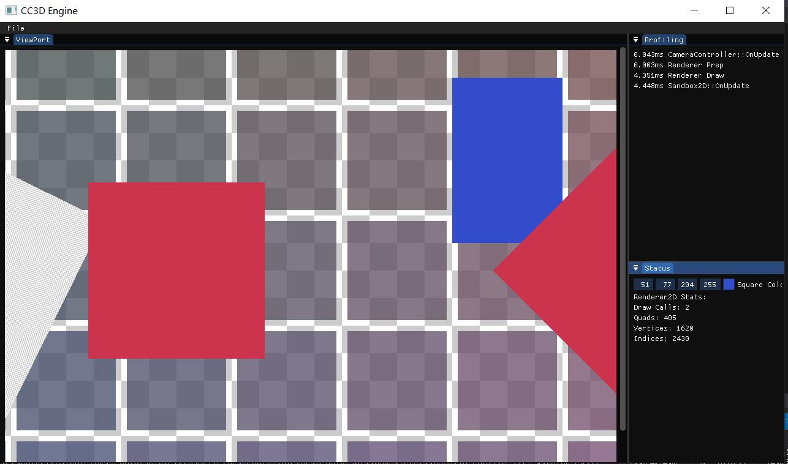

# Lec54 FrameBuffer

tutorial : [here](https://www.youtube.com/watch?v=93bavRgVcwA&list=PLlrATfBNZ98dC-V-N3m0Go4deliWHPFwT&index=71)

code version :  [here](https://github.com/Graphic-researcher/Crosa-Conty-3D/tree/f7eeeb7d74ade644ae5f935d6f428da359203deb/HTC/Project/Crosa-Conty-3D/Crosa-Conty-3D)

We draw our scene to frame buffer and then send it into imgui Image to show it on view port.

## Frame Buffer Scope

### Frame Buffer Class

```c++
struct FramebufferSpecification
{
    uint32_t Width, Height;
    // FramebufferFormat Format = 
    uint32_t Samples = 1;

    bool SwapChainTarget = false;
};

class Framebuffer
{
    public:
    virtual void Bind() = 0;
    virtual void Unbind() = 0;

    virtual uint32_t GetColorAttachmentRendererID() const = 0;

    virtual const FramebufferSpecification& GetSpecification() const = 0;

    static Ref<Framebuffer> Create(const FramebufferSpecification& spec);
};
Ref<Framebuffer> Framebuffer::Create(const FramebufferSpecification& spec)
{
    switch (Renderer::GetAPI())
    {
        case RendererAPI::API::None:    CC3D_CORE_ASSERT(false, "RendererAPI::None is currently not supported!"); return nullptr;
        case RendererAPI::API::OpenGL:  return CreateRef<OpenGLFramebuffer>(spec);
    }

    CC3D_CORE_ASSERT(false, "Unknown RendererAPI!");
    return nullptr;
}

```

### OpenGL Frame Buffer Class

```c++
class OpenGLFramebuffer : public Framebuffer
{
    public:
    OpenGLFramebuffer(const FramebufferSpecification& spec);
    virtual ~OpenGLFramebuffer();

    void Invalidate();

    virtual void Bind() override;
    virtual void Unbind() override;

    virtual uint32_t GetColorAttachmentRendererID() const override { return m_ColorAttachment; }

    virtual const FramebufferSpecification& GetSpecification() const override { return m_Specification; }
    private:
    uint32_t m_RendererID;
    uint32_t m_ColorAttachment, m_DepthAttachment;
    FramebufferSpecification m_Specification;
};
OpenGLFramebuffer::OpenGLFramebuffer(const FramebufferSpecification& spec)
    : m_Specification(spec)
    {
        Invalidate();
    }

OpenGLFramebuffer::~OpenGLFramebuffer()
{
    glDeleteFramebuffers(1, &m_RendererID);
}

void OpenGLFramebuffer::Invalidate()
{
    glCreateFramebuffers(1, &m_RendererID);
    glBindFramebuffer(GL_FRAMEBUFFER, m_RendererID);

    glCreateTextures(GL_TEXTURE_2D, 1, &m_ColorAttachment);
    glBindTexture(GL_TEXTURE_2D, m_ColorAttachment);
    glTexImage2D(GL_TEXTURE_2D, 0, GL_RGBA8, m_Specification.Width, m_Specification.Height, 0, GL_RGBA, GL_UNSIGNED_BYTE, nullptr);
    glTexParameteri(GL_TEXTURE_2D, GL_TEXTURE_MIN_FILTER, GL_LINEAR);
    glTexParameteri(GL_TEXTURE_2D, GL_TEXTURE_MAG_FILTER, GL_LINEAR);

    glFramebufferTexture2D(GL_FRAMEBUFFER, GL_COLOR_ATTACHMENT0, GL_TEXTURE_2D, m_ColorAttachment, 0);

    glCreateTextures(GL_TEXTURE_2D, 1, &m_DepthAttachment);
    glBindTexture(GL_TEXTURE_2D, m_DepthAttachment);
    glTexStorage2D(GL_TEXTURE_2D, 1, GL_DEPTH24_STENCIL8, m_Specification.Width, m_Specification.Height);
    // glTexImage2D(GL_TEXTURE_2D, 0, GL_DEPTH24_STENCIL8, m_Specification.Width, m_Specification.Height, 0,
    // 	GL_DEPTH_STENCIL, GL_UNSIGNED_INT_24_8, NULL);
    glFramebufferTexture2D(GL_FRAMEBUFFER, GL_DEPTH_STENCIL_ATTACHMENT, GL_TEXTURE_2D, m_DepthAttachment, 0);

    CC3D_CORE_ASSERT(glCheckFramebufferStatus(GL_FRAMEBUFFER) == GL_FRAMEBUFFER_COMPLETE, "Framebuffer is incomplete!");

    glBindFramebuffer(GL_FRAMEBUFFER, 0);
}

void OpenGLFramebuffer::Bind()
{
    glBindFramebuffer(GL_FRAMEBUFFER, m_RendererID);
}

void OpenGLFramebuffer::Unbind()
{
    glBindFramebuffer(GL_FRAMEBUFFER, 0);
}
```

## Sandbox 2D Scope

```c++
//...code
CC3D::Ref<CC3D::Framebuffer> m_Framebuffer;
//...code

void Sandbox2D::OnAttach()
{
	//...code
	CC3D::FramebufferSpecification fbSpec;
	fbSpec.Width = 1280;
	fbSpec.Height = 720;
	m_Framebuffer = CC3D::Framebuffer::Create(fbSpec);
}
void Sandbox2D::OnUpdate(CC3D::Timestep ts)
{
	//...code
    
	// Update

	//...code

	// Render
	CC3D::Renderer2D::ResetStats();
	{
		//...code
		m_Framebuffer->Bind();
		//...code
	}

	{
		//...code
		m_Framebuffer->Unbind();
	}
}
void Sandbox2D::DockSpaceDemo()
{
	static bool dockingEnabled = true;
	if (dockingEnabled)
	{
		//...code

		ImGui::Begin("ViewPort");

		//...code

		uint32_t textureID = m_Framebuffer->GetColorAttachmentRendererID();
		ImGui::Image((void*)textureID, ImVec2{ 1280, 720 });
		ImGui::End();

		ImGui::End();
	}
	else
	{
		//...code
		uint32_t textureID = m_CheckerboardTexture->GetRendererID();
		ImGui::Image((void*)textureID, ImVec2{ 256.0f, 256.0f });
		ImGui::End();
	}
}
```

## Build and Result

