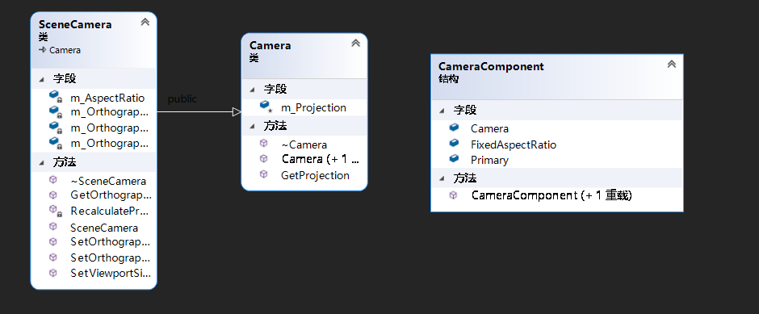
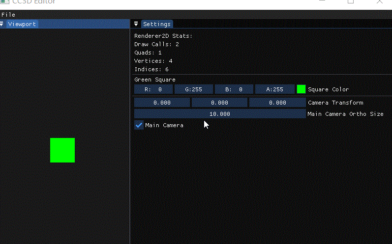

# Lec59 Scene Camera

tutorial : [here](https://www.youtube.com/watch?v=UKVFRRufKzo&list=PLlrATfBNZ98dC-V-N3m0Go4deliWHPFwT&index=81)

code version : [here](https://github.com/Graphic-researcher/Crosa-Conty-3D/tree/3df978b8bd02b26c66bf416932213e029f5cda87/HTC/Project/Crosa-Conty-3D/Crosa-Conty-3D)

## Camera Scope



## Camera Class

```c++
class Camera
{
    public:
    Camera() = default;
    Camera(const glm::mat4& projection)
        : m_Projection(projection) {}

    virtual ~Camera() = default;

    const glm::mat4& GetProjection() const { return m_Projection; }
    protected:
    glm::mat4 m_Projection = glm::mat4(1.0f);
};
```

## Scene Camera Class

```c++
class SceneCamera : public Camera
{
    public:
    SceneCamera();
    virtual ~SceneCamera() = default;

    void SetOrthographic(float size, float nearClip, float farClip);

    void SetViewportSize(uint32_t width, uint32_t height);

    float GetOrthographicSize() const { return m_OrthographicSize; }
    void SetOrthographicSize(float size) { m_OrthographicSize = size; RecalculateProjection(); }
    private:
    void RecalculateProjection();
    private:
    float m_OrthographicSize = 10.0f;
    float m_OrthographicNear = -1.0f, m_OrthographicFar = 1.0f;

    float m_AspectRatio = 0.0f;
};
SceneCamera::SceneCamera()
{
    RecalculateProjection();
}

void SceneCamera::SetOrthographic(float size, float nearClip, float farClip)
{
    m_OrthographicSize = size;
    m_OrthographicNear = nearClip;
    m_OrthographicFar = farClip;
    RecalculateProjection();
}

void SceneCamera::SetViewportSize(uint32_t width, uint32_t height)
{
    m_AspectRatio = (float)width / (float)height;
    RecalculateProjection();
}

void SceneCamera::RecalculateProjection()
{
    float orthoLeft = -m_OrthographicSize * m_AspectRatio * 0.5f;
    float orthoRight = m_OrthographicSize * m_AspectRatio * 0.5f;
    float orthoBottom = -m_OrthographicSize * 0.5f;
    float orthoTop = m_OrthographicSize * 0.5f;

    m_Projection = glm::ortho(orthoLeft, orthoRight,
                              orthoBottom, orthoTop, m_OrthographicNear, m_OrthographicFar);
}
```

## Scene Scope

```c++
class Scene
{
    public:
    Scene();
    ~Scene();

    Entity CreateEntity(const std::string& name = std::string());
    void OnUpdate(Timestep ts);
    void OnViewportResize(uint32_t width, uint32_t height);

    private:
    entt::registry m_Registry;
    uint32_t m_ViewportWidth = 0, m_ViewportHeight = 0;
    friend class Entity;
};
void Scene::OnUpdate(Timestep ts)
{
    // Render 2D
    Camera* mainCamera = nullptr;
    glm::mat4* cameraTransform = nullptr;
    {
        auto view = m_Registry.view<TransformComponent, CameraComponent>();
        for (auto entity : view)
        {
            auto [transform, camera] = view.get<TransformComponent, CameraComponent>(entity);

            if (camera.Primary)
            {
                mainCamera = &camera.Camera;
                cameraTransform = &transform.Transform;
                break;
            }
        }
    }///cameraTransform 

	///...main camera...
}

void Scene::OnViewportResize(uint32_t width, uint32_t height)
{
    m_ViewportWidth = width;
    m_ViewportHeight = height;

    // Resize our non-FixedAspectRatio cameras
    auto view = m_Registry.view<CameraComponent>();
    for (auto entity : view)
    {
        auto& cameraComponent = view.get<CameraComponent>(entity);
        if (!cameraComponent.FixedAspectRatio)
            cameraComponent.Camera.SetViewportSize(width, height);
    }

}
```

## Component Scope

```c++
struct CameraComponent
{
    SceneCamera Camera;

    bool FixedAspectRatio = false;

    /// <summary>
    /// "Primary" decide which camera is main camera that should render to viewport
    /// </summary>
    bool Primary = true; // TODO: think about moving to Scene

    CameraComponent() = default;
    CameraComponent(const CameraComponent&) = default;
};
```

## CC3D Input Scope

```c++
//in EditorLayer.cpp
void EditorLayer::OnAttach()
{
    //...code...

    m_CameraEntity = m_ActiveScene->CreateEntity("Camera Entity");
    m_CameraEntity.AddComponent<CameraComponent>();

    m_SecondCamera = m_ActiveScene->CreateEntity("Clip-Space Entity");
    auto& cc = m_SecondCamera.AddComponent<CameraComponent>();
    cc.Primary = false;
}


void EditorLayer::OnUpdate(Timestep ts)
{
     //...code...
    
    m_ActiveScene->OnViewportResize((uint32_t)m_ViewportSize.x, (uint32_t)m_ViewportSize.y);

    //...code...

    if (m_CameraEntity.GetComponent<CameraComponent>().Primary)
    {
        ImGui::DragFloat3("Camera Transform",
                          glm::value_ptr(m_CameraEntity.GetComponent<TransformComponent>().Transform[3]));

        auto& camera = m_CameraEntity.GetComponent<CameraComponent>().Camera;
        float orthoSize = camera.GetOrthographicSize();
        if (ImGui::DragFloat("Main Camera Ortho Size", &orthoSize))
            camera.SetOrthographicSize(orthoSize);
    }
    if (m_SecondCamera.GetComponent<CameraComponent>().Primary)
    {
        ImGui::DragFloat3("Second Camera Transform",
                          glm::value_ptr(m_SecondCamera.GetComponent<TransformComponent>().Transform[3]));

        auto& camera = m_SecondCamera.GetComponent<CameraComponent>().Camera;
        float orthoSize = camera.GetOrthographicSize();
        if (ImGui::DragFloat("Second Camera Ortho Size", &orthoSize))
            camera.SetOrthographicSize(orthoSize);
    }
}
```

## Build and Result

Support Camera Resizing

