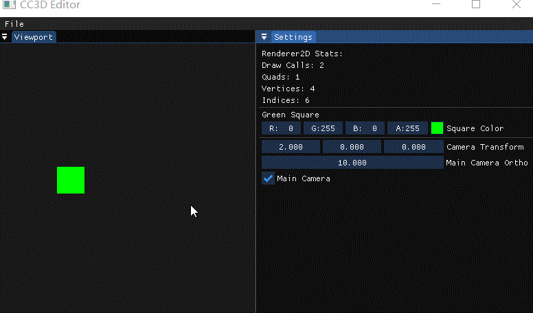

#  Lec60 Native Scripting

课程 : [1](https://www.youtube.com/watch?v=iIUhg88MK5M&list=PLlrATfBNZ98dC-V-N3m0Go4deliWHPFwT&index=82) 	[2](https://www.youtube.com/watch?v=1cHEcrIn8IQ&list=PLlrATfBNZ98dC-V-N3m0Go4deliWHPFwT&index=83)

代码版本 : [here](https://github.com/Graphic-researcher/Crosa-Conty-3D/tree/02c72700a9cc2553dd1cf707ef6b3ad63ecd48c3/HTC/Project/Crosa-Conty-3D/Crosa-Conty-3D)

Cherno会重构前一集的代码，所以我们的代码以最后版本为主。

## Script Entity 作用域

```c++
class ScriptableEntity
{
    public:
    virtual ~ScriptableEntity() {}

    template<typename T>
    T& GetComponent()
    {
        return m_Entity.GetComponent<T>();
    }
    protected:
    virtual void OnCreate() {}
    virtual void OnDestroy() {}
    virtual void OnUpdate(Timestep ts) {}
    private:
    Entity m_Entity;
    friend class Scene;
};
```

## Component 作用域

```c++
struct NativeScriptComponent
{
    ScriptableEntity* Instance = nullptr;

    ScriptableEntity* (*InstantiateScript)();
    void (*DestroyScript)(NativeScriptComponent*);

    template<typename T>
    void Bind()
    {
        InstantiateScript = []() { return static_cast<ScriptableEntity*>(new T()); };
        DestroyScript = [](NativeScriptComponent* nsc) { delete nsc->Instance; nsc->Instance = nullptr; };
    }
};
```

## Scene 作用域

```c++
void Scene::OnUpdate(Timestep ts)
{
    // Update scripts
    {
        m_Registry.view<NativeScriptComponent>().each([=](auto entity, auto& nsc)
                                                      {
                                                          // TODO: Move to Scene::OnScenePlay
                                                          if (!nsc.Instance)
                                                          {
                                                              nsc.Instance = nsc.InstantiateScript();
                                                              nsc.Instance->m_Entity = Entity{ entity, this };
                                                              nsc.Instance->OnCreate();
                                                          }

                                                          nsc.Instance->OnUpdate(ts);
                                                      });
    }
    // Render 2D
    Camera* mainCamera = nullptr;
    glm::mat4* cameraTransform = nullptr;
    {
        //...code...
    }///cameraTransform 

    if (mainCamera)
    {
        //...code...
    }///if (mainCamera)
}
```

## CC3D Input Editor Layer 作用域

```c++
void EditorLayer::OnAttach()
{
	//...code...

    // Entity
	//...code...

    class CameraController : public ScriptableEntity
    {
        public:
        void OnCreate()
        {
            auto& transform = GetComponent<TransformComponent>().Transform;
            transform[3][0] = rand() % 10 - 5.0f;
        }

        void OnDestroy()
        {
        }

        void OnUpdate(Timestep ts)
        {
            auto& transform = GetComponent<TransformComponent>().Transform;

            float speed = 5.0f;

            if (Input::IsKeyPressed(KeyCode::A))
                transform[3][0] -= speed * ts;
            if (Input::IsKeyPressed(KeyCode::D))
                transform[3][0] += speed * ts;
            if (Input::IsKeyPressed(KeyCode::W))
                transform[3][1] += speed * ts;
            if (Input::IsKeyPressed(KeyCode::S))
                transform[3][1] -= speed * ts;
        }
    };

    m_CameraEntity.AddComponent<NativeScriptComponent>().Bind<CameraController>();
    m_SecondCamera.AddComponent<NativeScriptComponent>().Bind<CameraController>();
}

```

## Build and Result




