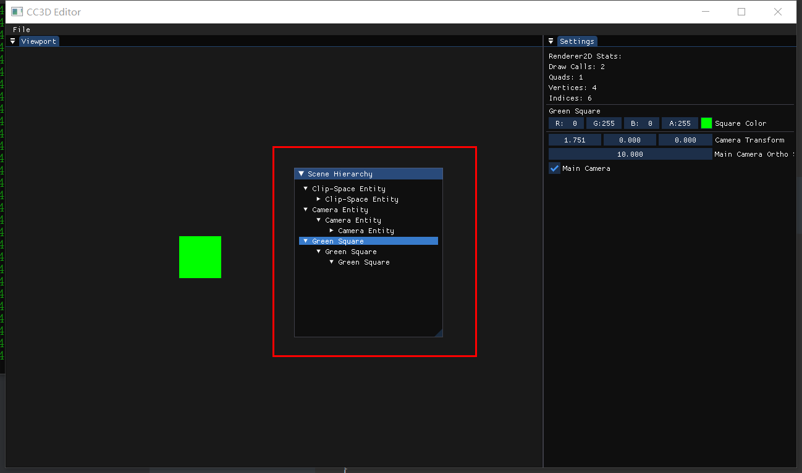

# Lec61 Scene Hierarchy Panel

课程 : [here](https://www.youtube.com/watch?v=wziDnE8guvI&list=PLlrATfBNZ98dC-V-N3m0Go4deliWHPFwT&index=84)

代码版本 : [here](https://github.com/Graphic-researcher/Crosa-Conty-3D/tree/02c72700a9cc2553dd1cf707ef6b3ad63ecd48c3/HTC/Project)

## Entity 作用域

```c++
operator uint32_t() const { return (uint32_t)m_EntityHandle; }

bool operator==(const Entity& other) const
{
    return m_EntityHandle == other.m_EntityHandle && m_Scene == other.m_Scene;
}

bool operator!=(const Entity& other) const
{
    return !(*this == other);
}
```

## Scene 作用域

```c++
class Scene
{
    //...code...
    private:
    entt::registry m_Registry;
    uint32_t m_ViewportWidth = 0, m_ViewportHeight = 0;
    friend class Entity;
    friend class SceneHierarchyPanel;
};
```

## [**IMPORTANT**]CC3D Input  Scene Hierarchy Panel 作用域

```c++
class SceneHierarchyPanel
{
    public:
    SceneHierarchyPanel() = default;
    SceneHierarchyPanel(const Ref<Scene>& scene);

    void SetContext(const Ref<Scene>& scene);

    void OnImGuiRender();
    private:
    void DrawEntityNode(Entity entity);
    private:
    Ref<Scene> m_Context;
    Entity m_SelectionContext;
};
SceneHierarchyPanel::SceneHierarchyPanel(const Ref<Scene>& context)
{
    SetContext(context);
}

void SceneHierarchyPanel::SetContext(const Ref<Scene>& context)
{
    m_Context = context;
}

void SceneHierarchyPanel::OnImGuiRender()
{
    ImGui::Begin("Scene Hierarchy");

    m_Context->m_Registry.each([&](auto entityID)
                               {
                                   Entity entity{ entityID , m_Context.get() };
                                   DrawEntityNode(entity);
                               });

    ImGui::End();
}

void SceneHierarchyPanel::DrawEntityNode(Entity entity)
{
    auto& tag = entity.GetComponent<TagComponent>().Tag;

    ImGuiTreeNodeFlags flags = ((m_SelectionContext == entity) ? ImGuiTreeNodeFlags_Selected : 0) | ImGuiTreeNodeFlags_OpenOnArrow;
    bool opened = ImGui::TreeNodeEx((void*)(uint64_t)(uint32_t)entity, flags, tag.c_str());
    if (ImGui::IsItemClicked())
    {
        m_SelectionContext = entity;
    }
    if (opened)//1 grandfather
    {
        ImGuiTreeNodeFlags flags = ImGuiTreeNodeFlags_OpenOnArrow;
        bool opened = ImGui::TreeNodeEx((void*)9817239, flags, tag.c_str());
        if (opened)//2 father
        {
            ImGuiTreeNodeFlags flags = ImGuiTreeNodeFlags_OpenOnArrow;
            bool opened = ImGui::TreeNodeEx((void*)1234567, flags, tag.c_str());
            if (opened)//3 son
            {
                ImGui::TreePop();//3 son
            }//if son
            ImGui::TreePop();//2 father
        }//if father
        ImGui::TreePop();//1 grandfather
    }//if grandfather

}

```

## CC3D Input Editor Layer 作用域

```c++
// Panels
SceneHierarchyPanel m_SceneHierarchyPanel;
void EditorLayer::OnAttach()
{
    m_SceneHierarchyPanel.SetContext(m_ActiveScene);
}
void EditorLayer::OnImGuiRender()
{
    //...code...
    m_SceneHierarchyPanel.OnImGuiRender();
    //...code...
}
```

## 构建和结果

