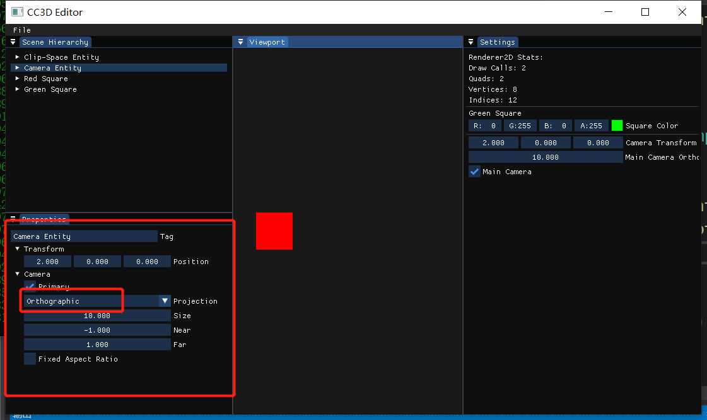
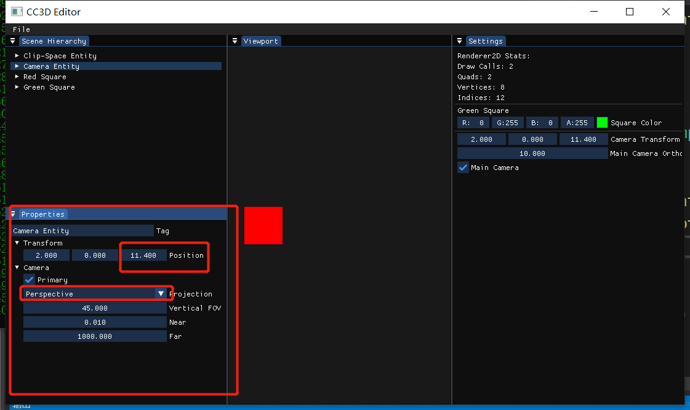

# Lec 63 Camera Component UI

tutorial : [here](https://www.youtube.com/watch?v=ubZn7BlrnTU&list=PLlrATfBNZ98dC-V-N3m0Go4deliWHPFwT&index=80)

code version : [here](https://github.com/Graphic-researcher/Crosa-Conty-3D/commit/7d022087bbcc40bdb76de0433e7b97e26909a08e)

## Scene Camera Scope

```c++
class SceneCamera : public Camera
{
    public:
    enum class ProjectionType { Perspective = 0, Orthographic = 1 };
    public:
    SceneCamera();
    virtual ~SceneCamera() = default;

    void SetOrthographic(float size, float nearClip, float farClip);
    void SetPerspective(float verticalFOV, float nearClip, float farClip);

    void SetViewportSize(uint32_t width, uint32_t height);

    float GetPerspectiveVerticalFOV() const { return m_PerspectiveFOV; }
    void SetPerspectiveVerticalFOV(float verticalFov) { m_PerspectiveFOV = verticalFov; RecalculateProjection(); }
    float GetPerspectiveNearClip() const { return m_PerspectiveNear; }
    void SetPerspectiveNearClip(float nearClip) { m_PerspectiveNear = nearClip; RecalculateProjection(); }
    float GetPerspectiveFarClip() const { return m_PerspectiveFar; }
    void SetPerspectiveFarClip(float farClip) { m_PerspectiveFar = farClip; RecalculateProjection(); }

    float GetOrthographicSize() const { return m_OrthographicSize; }
    void SetOrthographicSize(float size) { m_OrthographicSize = size; RecalculateProjection(); }
    float GetOrthographicNearClip() const { return m_OrthographicNear; }
    void SetOrthographicNearClip(float nearClip) { m_OrthographicNear = nearClip; RecalculateProjection(); }
    float GetOrthographicFarClip() const { return m_OrthographicFar; }
    void SetOrthographicFarClip(float farClip) { m_OrthographicFar = farClip; RecalculateProjection(); }

    ProjectionType GetProjectionType() const { return m_ProjectionType; }
    void SetProjectionType(ProjectionType type) { m_ProjectionType = type; RecalculateProjection(); }
    private:
    void RecalculateProjection();
    private:
    ProjectionType m_ProjectionType = ProjectionType::Orthographic;

    float m_PerspectiveFOV = glm::radians(45.0f);
    float m_PerspectiveNear = 0.01f, m_PerspectiveFar = 1000.0f;

    float m_OrthographicSize = 10.0f;
    float m_OrthographicNear = -1.0f, m_OrthographicFar = 1.0f;

    float m_AspectRatio = 0.0f;
};

void SceneCamera::SetOrthographic(float size, float nearClip, float farClip)
{
    m_ProjectionType = ProjectionType::Orthographic;
    //...code...
}
void SceneCamera::SetPerspective(float verticalFOV, float nearClip, float farClip)
{
    m_ProjectionType = ProjectionType::Perspective;
    m_PerspectiveFOV = verticalFOV;
    m_PerspectiveNear = nearClip;
    m_PerspectiveFar = farClip;
    RecalculateProjection();
}
void SceneCamera::RecalculateProjection()
{
    if (m_ProjectionType == ProjectionType::Perspective)
    {
        m_Projection = glm::perspective(m_PerspectiveFOV, m_AspectRatio, m_PerspectiveNear, m_PerspectiveFar);
    }
    else
    {
		//...
    }

}
```

## CC3D Input Scene Hierarchy Panel Scope

```c++
void SceneHierarchyPanel::DrawComponents(Entity entity)
{
	//...code...
    
    //camera component UI
    if (entity.HasComponent<CameraComponent>())
    {
        if (ImGui::TreeNodeEx((void*)typeid(CameraComponent).hash_code(), ImGuiTreeNodeFlags_DefaultOpen, "Camera"))
        {
            auto& cameraComponent = entity.GetComponent<CameraComponent>();
            auto& camera = cameraComponent.Camera;

            ImGui::Checkbox("Primary", &cameraComponent.Primary);

            const char* projectionTypeStrings[] = { "Perspective", "Orthographic" };
            const char* currentProjectionTypeString = projectionTypeStrings[(int)camera.GetProjectionType()];
            if (ImGui::BeginCombo("Projection", currentProjectionTypeString))
            {
                for (int i = 0; i < 2; i++)
                {
                    bool isSelected = currentProjectionTypeString == projectionTypeStrings[i];
                    if (ImGui::Selectable(projectionTypeStrings[i], isSelected))
                    {
                        currentProjectionTypeString = projectionTypeStrings[i];
                        camera.SetProjectionType((SceneCamera::ProjectionType)i);
                    }

                    if (isSelected)
                        ImGui::SetItemDefaultFocus();
                }

                ImGui::EndCombo();
            }

            if (camera.GetProjectionType() == SceneCamera::ProjectionType::Perspective)
            {
                float verticalFov = glm::degrees(camera.GetPerspectiveVerticalFOV());
                if (ImGui::DragFloat("Vertical FOV", &verticalFov))
                    camera.SetPerspectiveVerticalFOV(glm::radians(verticalFov));

                float orthoNear = camera.GetPerspectiveNearClip();
                if (ImGui::DragFloat("Near", &orthoNear))
                    camera.SetPerspectiveNearClip(orthoNear);

                float orthoFar = camera.GetPerspectiveFarClip();
                if (ImGui::DragFloat("Far", &orthoFar))
                    camera.SetPerspectiveFarClip(orthoFar);
            }

            if (camera.GetProjectionType() == SceneCamera::ProjectionType::Orthographic)
            {
                float orthoSize = camera.GetOrthographicSize();
                if (ImGui::DragFloat("Size", &orthoSize))
                    camera.SetOrthographicSize(orthoSize);

                float orthoNear = camera.GetOrthographicNearClip();
                if (ImGui::DragFloat("Near", &orthoNear))
                    camera.SetOrthographicNearClip(orthoNear);

                float orthoFar = camera.GetOrthographicFarClip();
                if (ImGui::DragFloat("Far", &orthoFar))
                    camera.SetOrthographicFarClip(orthoFar);

                ImGui::Checkbox("Fixed Aspect Ratio", &cameraComponent.FixedAspectRatio);
            }
            ImGui::TreePop();
        }
    }
}

```

## CC3D Input Editor layer Scope

```c++
auto square = m_ActiveScene->CreateEntity("Green Square");
square.AddComponent<SpriteRendererComponent>(glm::vec4{0.0f, 1.0f, 0.0f, 1.0f});

auto redSquare = m_ActiveScene->CreateEntity("Red Square");
redSquare.AddComponent<SpriteRendererComponent>(glm::vec4{ 1.0f, 0.0f, 0.0f, 1.0f });
```

## Build and Result






