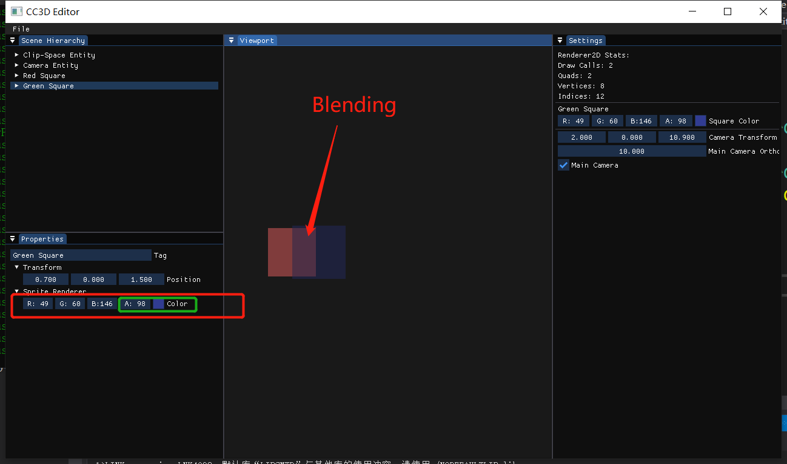
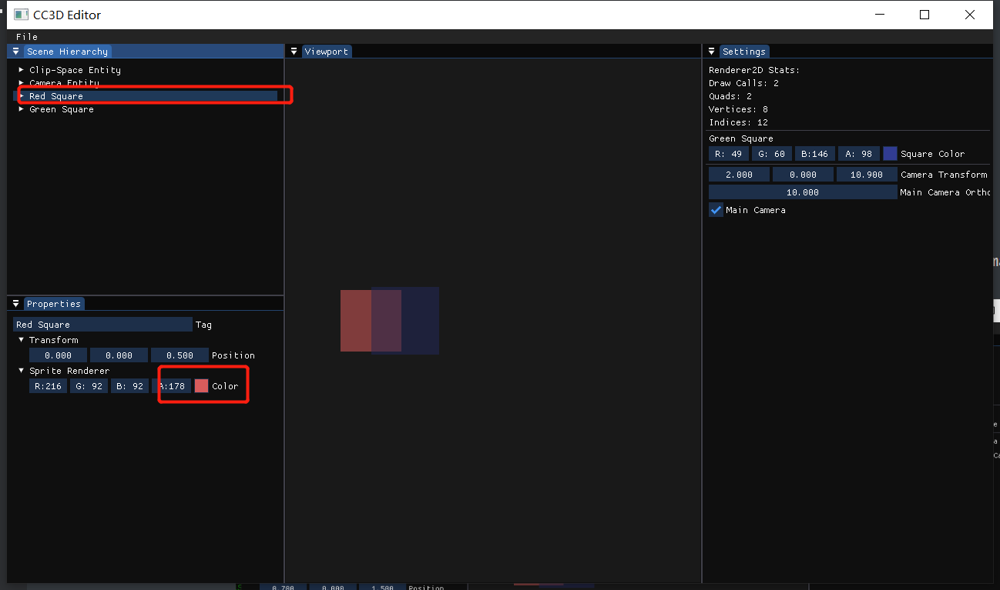

# Lec64 Drawing Component UI

tutorial : [here](https://www.youtube.com/watch?v=u3yq8s3KuSE&list=PLlrATfBNZ98dC-V-N3m0Go4deliWHPFwT&index=87)

code version : 

## CC3D Input Scene Hierarchy Panel Scope

```c++
void SceneHierarchyPanel::DrawComponents(Entity entity)
{
    //...code

    if (entity.HasComponent<SpriteRendererComponent>())
    {
        if (ImGui::TreeNodeEx((void*)typeid(SpriteRendererComponent).hash_code(), ImGuiTreeNodeFlags_DefaultOpen, "Sprite Renderer"))
        {
            auto& src = entity.GetComponent<SpriteRendererComponent>();
            ImGui::ColorEdit4("Color", glm::value_ptr(src.Color));
            ImGui::TreePop();
        }
    }
}
```

## Build and Result



