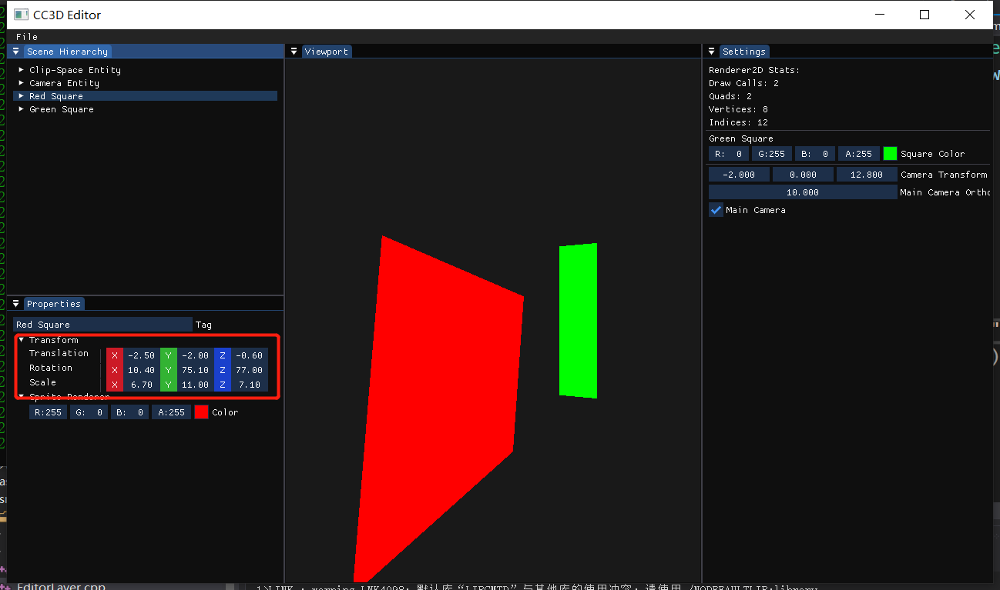
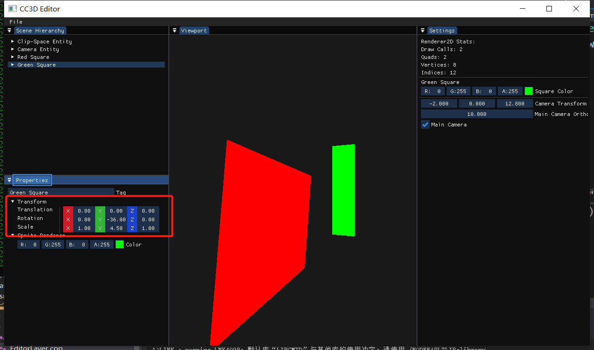

#  Lec65 Transform UI

tutorial : [here](https://www.youtube.com/watch?v=8JqcXYbzPJc&list=PLlrATfBNZ98dC-V-N3m0Go4deliWHPFwT&index=88)

code version : [here](https://github.com/Graphic-researcher/Crosa-Conty-3D/commit/8ea325c18c6b5208e9136a716e234407e8f7739f)

## Component Scope

```c++
struct TransformComponent
{
    glm::vec3 Translation = { 0.0f, 0.0f, 0.0f };
    glm::vec3 Rotation = { 0.0f, 0.0f, 0.0f };
    glm::vec3 Scale = { 1.0f, 1.0f, 1.0f };

    TransformComponent() = default;
    TransformComponent(const TransformComponent&) = default;
    TransformComponent(const glm::vec3& translation)
        : Translation(translation) {}

    glm::mat4 GetTransform() const
    {
        glm::mat4 rotation = 
            glm::rotate(glm::mat4(1.0f), Rotation.x, { 1, 0, 0 })
            * glm::rotate(glm::mat4(1.0f), Rotation.y, { 0, 1, 0 })
            * glm::rotate(glm::mat4(1.0f), Rotation.z, { 0, 0, 1 });

        return glm::translate(glm::mat4(1.0f), Translation)
            * rotation
            * glm::scale(glm::mat4(1.0f), Scale);
    }
};
```

## CC3D Input Scene Hierarchy Panel

```c++
static void DrawVec3Control(const std::string& label, glm::vec3& values, float resetValue = 0.0f, float columnWidth = 100.0f)
{
    ImGui::PushID(label.c_str());

    ImGui::Columns(2);
    ImGui::SetColumnWidth(0, columnWidth);
    ImGui::Text(label.c_str());
    ImGui::NextColumn();

    ImGui::PushMultiItemsWidths(3, ImGui::CalcItemWidth());
    ImGui::PushStyleVar(ImGuiStyleVar_ItemSpacing, ImVec2{ 0, 0 });

    float lineHeight = GImGui->Font->FontSize + GImGui->Style.FramePadding.y * 2.0f;
    ImVec2 buttonSize = { lineHeight + 3.0f, lineHeight };

    ImGui::PushStyleColor(ImGuiCol_Button, ImVec4{ 0.8f, 0.1f, 0.15f, 1.0f });
    ImGui::PushStyleColor(ImGuiCol_ButtonHovered, ImVec4{ 0.9f, 0.2f, 0.2f, 1.0f });
    ImGui::PushStyleColor(ImGuiCol_ButtonActive, ImVec4{ 0.8f, 0.1f, 0.15f, 1.0f });
    if (ImGui::Button("X", buttonSize))
        values.x = resetValue;
    ImGui::PopStyleColor(3);

    ImGui::SameLine();
    ImGui::DragFloat("##X", &values.x, 0.1f, 0.0f, 0.0f, "%.2f");
    ImGui::PopItemWidth();
    ImGui::SameLine();

    ImGui::PushStyleColor(ImGuiCol_Button, ImVec4{ 0.2f, 0.7f, 0.2f, 1.0f });
    ImGui::PushStyleColor(ImGuiCol_ButtonHovered, ImVec4{ 0.3f, 0.8f, 0.3f, 1.0f });
    ImGui::PushStyleColor(ImGuiCol_ButtonActive, ImVec4{ 0.2f, 0.7f, 0.2f, 1.0f });
    if (ImGui::Button("Y", buttonSize))
        values.y = resetValue;
    ImGui::PopStyleColor(3);

    ImGui::SameLine();
    ImGui::DragFloat("##Y", &values.y, 0.1f, 0.0f, 0.0f, "%.2f");
    ImGui::PopItemWidth();
    ImGui::SameLine();

    ImGui::PushStyleColor(ImGuiCol_Button, ImVec4{ 0.1f, 0.25f, 0.8f, 1.0f });
    ImGui::PushStyleColor(ImGuiCol_ButtonHovered, ImVec4{ 0.2f, 0.35f, 0.9f, 1.0f });
    ImGui::PushStyleColor(ImGuiCol_ButtonActive, ImVec4{ 0.1f, 0.25f, 0.8f, 1.0f });
    if (ImGui::Button("Z", buttonSize))
        values.z = resetValue;
    ImGui::PopStyleColor(3);

    ImGui::SameLine();
    ImGui::DragFloat("##Z", &values.z, 0.1f, 0.0f, 0.0f, "%.2f");
    ImGui::PopItemWidth();

    ImGui::PopStyleVar();

    ImGui::Columns(1);

    ImGui::PopID();
}
void SceneHierarchyPanel::DrawComponents(Entity entity)
{
	//...code...

    if (entity.HasComponent<TransformComponent>())
    {
        if (ImGui::TreeNodeEx((void*)typeid(TransformComponent).hash_code(), ImGuiTreeNodeFlags_DefaultOpen, "Transform"))
        {
            auto& tc = entity.GetComponent<TransformComponent>();
            DrawVec3Control("Translation", tc.Translation);
            glm::vec3 rotation = glm::degrees(tc.Rotation);
            DrawVec3Control("Rotation", rotation);
            tc.Rotation = glm::radians(rotation);
            DrawVec3Control("Scale", tc.Scale, 1.0f);

            ImGui::TreePop();
        }
    }

	//...code...
}

```

## Build and Result



