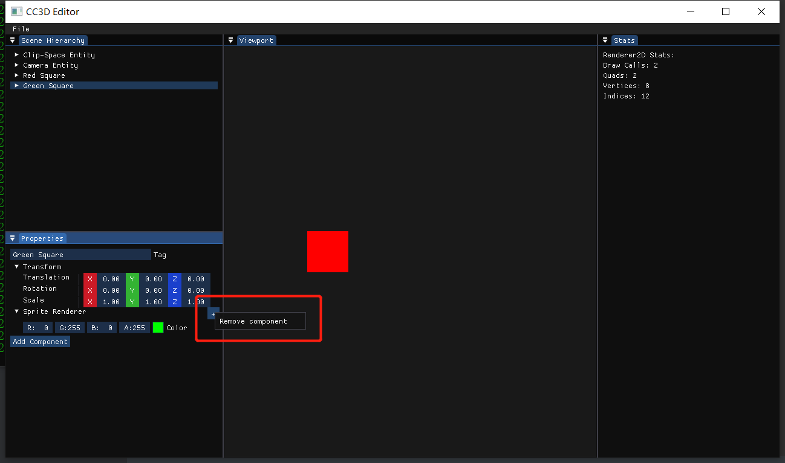

# Lec 66  Adding Removing Entities and Component

tutorial : [here](https://www.youtube.com/watch?v=PsyGmsIgp9M&list=PLlrATfBNZ98dC-V-N3m0Go4deliWHPFwT&index=89)

code version : [here](https://github.com/Graphic-researcher/Crosa-Conty-3D/commit/089583b0a8d42c8f7a93ac75d93ee09649a5c69e)

## Entity Scope

```c++
template<typename T, typename... Args>
T& AddComponent(Args&&... args)
{
    CC3D_CORE_ASSERT(!HasComponent<T>(), "Entity already has component!");
    T& component = m_Scene->m_Registry.emplace<T>(m_EntityHandle, std::forward<Args>(args)...);
    m_Scene->OnComponentAdded<T>(*this, component);
    return component;
}
operator entt::entity() const { return m_EntityHandle; }

```

## Scene Scope

```c++
void DestroyEntity(Entity entity);
template<typename T>
void OnComponentAdded(Entity entity, T& component);
void Scene::DestroyEntity(Entity entity)
{
    m_Registry.destroy(entity);
}

template<typename T>
void Scene::OnComponentAdded(Entity entity, T& component)
{
    static_assert(false);
}

template<>
void Scene::OnComponentAdded<TransformComponent>(Entity entity, TransformComponent& component)
{
}

template<>
void Scene::OnComponentAdded<CameraComponent>(Entity entity, CameraComponent& component)
{
    component.Camera.SetViewportSize(m_ViewportWidth, m_ViewportHeight);
}

template<>
void Scene::OnComponentAdded<SpriteRendererComponent>(Entity entity, SpriteRendererComponent& component)
{
}

template<>
void Scene::OnComponentAdded<TagComponent>(Entity entity, TagComponent& component)
{
}

template<>
void Scene::OnComponentAdded<NativeScriptComponent>(Entity entity, NativeScriptComponent& component)
{
}
```

## CC3D Input  Scene Hierarchy Panel

```c++
void SceneHierarchyPanel::OnImGuiRender()
{
    ImGui::Begin("Scene Hierarchy");

    m_Context->m_Registry.each([&](auto entityID)
                               {
                                   Entity entity{ entityID , m_Context.get() };
                                   DrawEntityNode(entity);
                               });

    /// <summary>
    /// If you don't select anything,select context will be none
    /// </summary>
    if (ImGui::IsMouseDown(0) && ImGui::IsWindowHovered())
        m_SelectionContext = {};

    // Right-click on blank space
    if (ImGui::BeginPopupContextWindow(0, 1, false))
    {
        if (ImGui::MenuItem("Create Empty Entity"))
            m_Context->CreateEntity("Empty Entity");

        ImGui::EndPopup();
    }

    ImGui::End();

    ImGui::Begin("Properties");
    if (m_SelectionContext)
    {
        DrawComponents(m_SelectionContext);
        if (ImGui::Button("Add Component"))
            ImGui::OpenPopup("AddComponent");

        if (ImGui::BeginPopup("AddComponent"))
        {
            if (ImGui::MenuItem("Camera"))
            {
                m_SelectionContext.AddComponent<CameraComponent>();
                ImGui::CloseCurrentPopup();
            }

            if (ImGui::MenuItem("Sprite Renderer"))
            {
                m_SelectionContext.AddComponent<SpriteRendererComponent>();
                ImGui::CloseCurrentPopup();
            }
            ImGui::EndPopup();
        }
    }

    ImGui::End();
}

void SceneHierarchyPanel::DrawEntityNode(Entity entity)
{
    auto& tag = entity.GetComponent<TagComponent>().Tag;

    ImGuiTreeNodeFlags flags = ((m_SelectionContext == entity) ? ImGuiTreeNodeFlags_Selected : 0) | ImGuiTreeNodeFlags_OpenOnArrow;
    bool opened = ImGui::TreeNodeEx((void*)(uint64_t)(uint32_t)entity, flags, tag.c_str());
    if (ImGui::IsItemClicked())
    {
        m_SelectionContext = entity;
    }

    bool entityDeleted = false;
    if (ImGui::BeginPopupContextItem())
    {
        if (ImGui::MenuItem("Delete Entity"))
            entityDeleted = true;

        ImGui::EndPopup();
    }

    if (opened)
    {
        ImGuiTreeNodeFlags flags = ImGuiTreeNodeFlags_OpenOnArrow;
        bool opened = ImGui::TreeNodeEx((void*)9817239, flags, tag.c_str());
        if (opened)
            ImGui::TreePop();
        ImGui::TreePop();
    }

    if (entityDeleted)
    {
        m_Context->DestroyEntity(entity);
        if (m_SelectionContext == entity)
            m_SelectionContext = {};
    }
}

void SceneHierarchyPanel::DrawComponents(Entity entity)
{
	//...code...

    const ImGuiTreeNodeFlags treeNodeFlags = ImGuiTreeNodeFlags_DefaultOpen | ImGuiTreeNodeFlags_AllowItemOverlap;

    if (entity.HasComponent<TransformComponent>())
    {
        bool open = ImGui::TreeNodeEx((void*)typeid(TransformComponent).hash_code(), treeNodeFlags, "Transform");
        if (open)
        {
			//...code...
        }
    }

    if (entity.HasComponent<CameraComponent>())
    {
        if (ImGui::TreeNodeEx((void*)typeid(CameraComponent).hash_code(), treeNodeFlags, "Camera"))
        {
			//...code...
        }
    }

    if (entity.HasComponent<SpriteRendererComponent>())
    {
        ImGui::PushStyleVar(ImGuiStyleVar_FramePadding, ImVec2{ 4, 4 });
        bool open = ImGui::TreeNodeEx((void*)typeid(SpriteRendererComponent).hash_code(), treeNodeFlags, "Sprite Renderer");
        ImGui::SameLine(ImGui::GetWindowWidth() - 25.0f);
        if (ImGui::Button("+", ImVec2{ 20, 20 }))
        {
            ImGui::OpenPopup("ComponentSettings");
        }
        ImGui::PopStyleVar();

        bool removeComponent = false;
        if (ImGui::BeginPopup("ComponentSettings"))
        {
            if (ImGui::MenuItem("Remove component"))
                removeComponent = true;

            ImGui::EndPopup();
        }

        if (open)
        {
            auto& src = entity.GetComponent<SpriteRendererComponent>();
            ImGui::ColorEdit4("Color", glm::value_ptr(src.Color));
            ImGui::TreePop();
        }

        if (removeComponent)
            entity.RemoveComponent<SpriteRendererComponent>();

    }
}
```

## Build and Result





