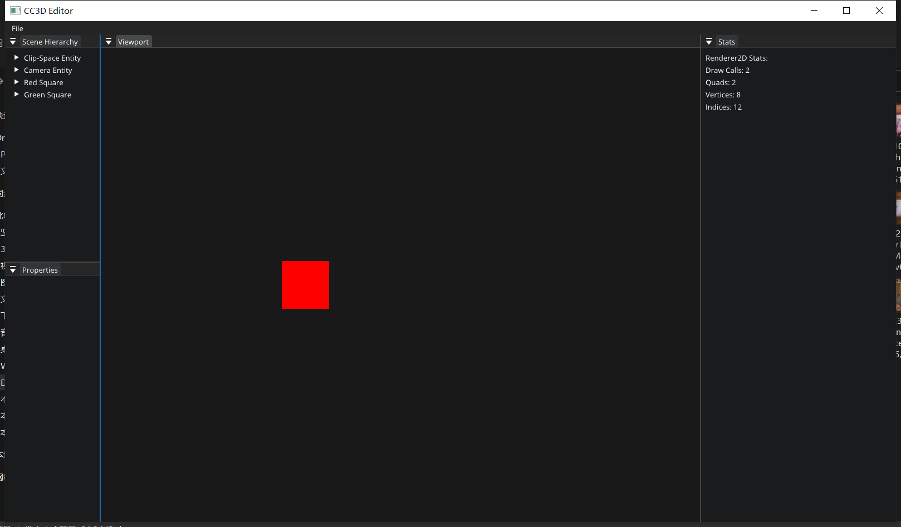

#  Lec 67 Make Editor Looks Good

tutorial : [here](https://www.youtube.com/watch?v=oESRecjuLNY&list=PLlrATfBNZ98dC-V-N3m0Go4deliWHPFwT&index=90)

code version : [here](https://github.com/Graphic-researcher/Crosa-Conty-3D/commit/2899f50d143af6b4ed8e1631ad58fdfad8c901a2)

## ImGui Layer Scope

add fonts and set custom theme

```c++
void ImGuiLayer::OnAttach()
{
    //...code
    io.Fonts->AddFontFromFileTTF("assets/fonts/opensans/OpenSans-Bold.ttf", 18.0f);
    io.FontDefault = io.Fonts->AddFontFromFileTTF("assets/fonts/opensans/OpenSans-Regular.ttf", 18.0f);
    //...code
    SetDarkThemeColors();
}
void ImGuiLayer::SetDarkThemeColors()
{
    auto& colors = ImGui::GetStyle().Colors;
    colors[ImGuiCol_WindowBg] = ImVec4{ 0.1f, 0.105f, 0.11f, 1.0f };

    // Headers
    colors[ImGuiCol_Header] = ImVec4{ 0.2f, 0.205f, 0.21f, 1.0f };
    colors[ImGuiCol_HeaderHovered] = ImVec4{ 0.3f, 0.305f, 0.31f, 1.0f };
    colors[ImGuiCol_HeaderActive] = ImVec4{ 0.15f, 0.1505f, 0.151f, 1.0f };

    // Buttons
    colors[ImGuiCol_Button] = ImVec4{ 0.2f, 0.205f, 0.21f, 1.0f };
    colors[ImGuiCol_ButtonHovered] = ImVec4{ 0.3f, 0.305f, 0.31f, 1.0f };
    colors[ImGuiCol_ButtonActive] = ImVec4{ 0.15f, 0.1505f, 0.151f, 1.0f };

    // Frame BG
    colors[ImGuiCol_FrameBg] = ImVec4{ 0.2f, 0.205f, 0.21f, 1.0f };
    colors[ImGuiCol_FrameBgHovered] = ImVec4{ 0.3f, 0.305f, 0.31f, 1.0f };
    colors[ImGuiCol_FrameBgActive] = ImVec4{ 0.15f, 0.1505f, 0.151f, 1.0f };

    // Tabs
    colors[ImGuiCol_Tab] = ImVec4{ 0.15f, 0.1505f, 0.151f, 1.0f };
    colors[ImGuiCol_TabHovered] = ImVec4{ 0.38f, 0.3805f, 0.381f, 1.0f };
    colors[ImGuiCol_TabActive] = ImVec4{ 0.28f, 0.2805f, 0.281f, 1.0f };
    colors[ImGuiCol_TabUnfocused] = ImVec4{ 0.15f, 0.1505f, 0.151f, 1.0f };
    colors[ImGuiCol_TabUnfocusedActive] = ImVec4{ 0.2f, 0.205f, 0.21f, 1.0f };

    // Title
    colors[ImGuiCol_TitleBg] = ImVec4{ 0.15f, 0.1505f, 0.151f, 1.0f };
    colors[ImGuiCol_TitleBgActive] = ImVec4{ 0.15f, 0.1505f, 0.151f, 1.0f };
    colors[ImGuiCol_TitleBgCollapsed] = ImVec4{ 0.15f, 0.1505f, 0.151f, 1.0f };
}
```

## CC3D Input Scene Hierarchy Panel Scope

use lambda function to wrap UI Function :

```c++
template<typename T, typename UIFunction>
static void DrawComponent(const std::string& name, Entity entity, UIFunction uiFunction)
```

```c++
void SceneHierarchyPanel::OnImGuiRender()
{
    ImGui::Begin("Scene Hierarchy");

    m_Context->m_Registry.each([&](auto entityID)
                               {
                                   Entity entity{ entityID , m_Context.get() };
                                   DrawEntityNode(entity);
                               });

    /// <summary>
    /// If you don't select anything,select context will be none
    /// </summary>
    if (ImGui::IsMouseDown(0) && ImGui::IsWindowHovered())
        m_SelectionContext = {};

    // Right-click on blank space
    if (ImGui::BeginPopupContextWindow(0, 1, false))
    {
        if (ImGui::MenuItem("Create Empty Entity"))
            m_Context->CreateEntity("Empty Entity");

        ImGui::EndPopup();
    }

    ImGui::End();

    ImGui::Begin("Properties");
    if (m_SelectionContext)
    {
        DrawComponents(m_SelectionContext);
    }
    ImGui::End();

}

void SceneHierarchyPanel::DrawEntityNode(Entity entity)
{
    auto& tag = entity.GetComponent<TagComponent>().Tag;

    ImGuiTreeNodeFlags flags = ((m_SelectionContext == entity) ? ImGuiTreeNodeFlags_Selected : 0) | ImGuiTreeNodeFlags_OpenOnArrow;
    flags |= ImGuiTreeNodeFlags_SpanAvailWidth;
    bool opened = ImGui::TreeNodeEx((void*)(uint64_t)(uint32_t)entity, flags, tag.c_str());
    if (ImGui::IsItemClicked())
    {
        m_SelectionContext = entity;
    }

    bool entityDeleted = false;
    if (ImGui::BeginPopupContextItem())
    {
        if (ImGui::MenuItem("Delete Entity"))
            entityDeleted = true;

        ImGui::EndPopup();
    }

    if (opened)
    {
        ImGuiTreeNodeFlags flags = ImGuiTreeNodeFlags_OpenOnArrow | ImGuiTreeNodeFlags_SpanAvailWidth;
        bool opened = ImGui::TreeNodeEx((void*)9817239, flags, tag.c_str());
        if (opened)
            ImGui::TreePop();
        ImGui::TreePop();
    }

    if (entityDeleted)
    {
        m_Context->DestroyEntity(entity);
        if (m_SelectionContext == entity)
            m_SelectionContext = {};
    }

}

static void DrawVec3Control(const std::string& label, glm::vec3& values, float resetValue = 0.0f, float columnWidth = 100.0f)
{
    ImGuiIO& io = ImGui::GetIO();
    auto boldFont = io.Fonts->Fonts[0];

    ImGui::PushID(label.c_str());

    ImGui::Columns(2);
    ImGui::SetColumnWidth(0, columnWidth);
    ImGui::Text(label.c_str());
    ImGui::NextColumn();

    ImGui::PushMultiItemsWidths(3, ImGui::CalcItemWidth());
    ImGui::PushStyleVar(ImGuiStyleVar_ItemSpacing, ImVec2{ 0, 0 });

    float lineHeight = GImGui->Font->FontSize + GImGui->Style.FramePadding.y * 2.0f;
    ImVec2 buttonSize = { lineHeight + 3.0f, lineHeight };

    ImGui::PushStyleColor(ImGuiCol_Button, ImVec4{ 0.8f, 0.1f, 0.15f, 1.0f });
    ImGui::PushStyleColor(ImGuiCol_ButtonHovered, ImVec4{ 0.9f, 0.2f, 0.2f, 1.0f });
    ImGui::PushStyleColor(ImGuiCol_ButtonActive, ImVec4{ 0.8f, 0.1f, 0.15f, 1.0f });
    ImGui::PushFont(boldFont);

    if (ImGui::Button("X", buttonSize))
        values.x = resetValue;

    ImGui::PopFont();
    ImGui::PopStyleColor(3);

    ImGui::SameLine();
    ImGui::DragFloat("##X", &values.x, 0.1f, 0.0f, 0.0f, "%.2f");
    ImGui::PopItemWidth();
    ImGui::SameLine();

    ImGui::PushStyleColor(ImGuiCol_Button, ImVec4{ 0.2f, 0.7f, 0.2f, 1.0f });
    ImGui::PushStyleColor(ImGuiCol_ButtonHovered, ImVec4{ 0.3f, 0.8f, 0.3f, 1.0f });
    ImGui::PushStyleColor(ImGuiCol_ButtonActive, ImVec4{ 0.2f, 0.7f, 0.2f, 1.0f });
    ImGui::PushFont(boldFont);
    if (ImGui::Button("Y", buttonSize))
        values.y = resetValue;

    ImGui::PopFont();
    ImGui::PopStyleColor(3);

    ImGui::SameLine();
    ImGui::DragFloat("##Y", &values.y, 0.1f, 0.0f, 0.0f, "%.2f");
    ImGui::PopItemWidth();
    ImGui::SameLine();

    ImGui::PushStyleColor(ImGuiCol_Button, ImVec4{ 0.1f, 0.25f, 0.8f, 1.0f });
    ImGui::PushStyleColor(ImGuiCol_ButtonHovered, ImVec4{ 0.2f, 0.35f, 0.9f, 1.0f });
    ImGui::PushStyleColor(ImGuiCol_ButtonActive, ImVec4{ 0.1f, 0.25f, 0.8f, 1.0f });

    ImGui::PushFont(boldFont);
    if (ImGui::Button("Z", buttonSize))
        values.z = resetValue;
    ImGui::PopFont();
    ImGui::PopStyleColor(3);

    ImGui::SameLine();
    ImGui::DragFloat("##Z", &values.z, 0.1f, 0.0f, 0.0f, "%.2f");
    ImGui::PopItemWidth();

    ImGui::PopStyleVar();

    ImGui::Columns(1);

    ImGui::PopID();
}


template<typename T, typename UIFunction>
static void DrawComponent(const std::string& name, Entity entity, UIFunction uiFunction)
{
    const ImGuiTreeNodeFlags treeNodeFlags = ImGuiTreeNodeFlags_DefaultOpen | ImGuiTreeNodeFlags_Framed | ImGuiTreeNodeFlags_SpanAvailWidth | ImGuiTreeNodeFlags_AllowItemOverlap | ImGuiTreeNodeFlags_FramePadding;
    if (entity.HasComponent<T>())
    {
        auto& component = entity.GetComponent<T>();
        ImVec2 contentRegionAvailable = ImGui::GetContentRegionAvail();

        ImGui::PushStyleVar(ImGuiStyleVar_FramePadding, ImVec2{ 4, 4 });
        float lineHeight = GImGui->Font->FontSize + GImGui->Style.FramePadding.y * 2.0f;
        ImGui::Separator();
        bool open = ImGui::TreeNodeEx((void*)typeid(T).hash_code(), treeNodeFlags, name.c_str());
        ImGui::PopStyleVar(
        );
        ImGui::SameLine(contentRegionAvailable.x - lineHeight * 0.5f);
        if (ImGui::Button("+", ImVec2{ lineHeight, lineHeight }))
        {
            ImGui::OpenPopup("ComponentSettings");
        }

        bool removeComponent = false;
        if (ImGui::BeginPopup("ComponentSettings"))
        {
            if (ImGui::MenuItem("Remove component"))
                removeComponent = true;

            ImGui::EndPopup();
        }

        if (open)
        {
            uiFunction(component);
            ImGui::TreePop();
        }

        if (removeComponent)
            entity.RemoveComponent<T>();
    }
}

void SceneHierarchyPanel::DrawComponents(Entity entity)
{
    if (entity.HasComponent<TagComponent>())
    {
        auto& tag = entity.GetComponent<TagComponent>().Tag;

        char buffer[256];
        memset(buffer, 0, sizeof(buffer));
        strcpy_s(buffer, sizeof(buffer), tag.c_str());
        if (ImGui::InputText("##Tag", buffer, sizeof(buffer)))
        {
            tag = std::string(buffer);
        }
    }

    const ImGuiTreeNodeFlags treeNodeFlags = ImGuiTreeNodeFlags_DefaultOpen | ImGuiTreeNodeFlags_AllowItemOverlap;

    ImGui::SameLine();
    ImGui::PushItemWidth(-1);

    if (ImGui::Button("Add Component"))
        ImGui::OpenPopup("AddComponent");

    if (ImGui::BeginPopup("AddComponent"))
    {
        if (ImGui::MenuItem("Camera"))
        {
            m_SelectionContext.AddComponent<CameraComponent>();
            ImGui::CloseCurrentPopup();
        }

        if (ImGui::MenuItem("Sprite Renderer"))
        {
            m_SelectionContext.AddComponent<SpriteRendererComponent>();
            ImGui::CloseCurrentPopup();
        }

        ImGui::EndPopup();
    }

    ImGui::PopItemWidth();

    DrawComponent<TransformComponent>("Transform", entity, [](auto& component)
                                      {
                                          DrawVec3Control("Translation", component.Translation);
                                          glm::vec3 rotation = glm::degrees(component.Rotation);
                                          DrawVec3Control("Rotation", rotation);
                                          component.Rotation = glm::radians(rotation);
                                          DrawVec3Control("Scale", component.Scale, 1.0f);
                                      });

    DrawComponent<CameraComponent>("Camera", entity, [](auto& component)
                                   {
                                       auto& camera = component.Camera;

                                       ImGui::Checkbox("Primary", &component.Primary);

                                       const char* projectionTypeStrings[] = { "Perspective", "Orthographic" };
                                       const char* currentProjectionTypeString = projectionTypeStrings[(int)camera.GetProjectionType()];
                                       if (ImGui::BeginCombo("Projection", currentProjectionTypeString))
                                       {
                                           for (int i = 0; i < 2; i++)
                                           {
                                               bool isSelected = currentProjectionTypeString == projectionTypeStrings[i];
                                               if (ImGui::Selectable(projectionTypeStrings[i], isSelected))
                                               {
                                                   currentProjectionTypeString = projectionTypeStrings[i];
                                                   camera.SetProjectionType((SceneCamera::ProjectionType)i);
                                               }

                                               if (isSelected)
                                                   ImGui::SetItemDefaultFocus();
                                           }

                                           ImGui::EndCombo();
                                       }

                                       if (camera.GetProjectionType() == SceneCamera::ProjectionType::Perspective)
                                       {
                                           float perspectiveVerticalFov = glm::degrees(camera.GetPerspectiveVerticalFOV());
                                           if (ImGui::DragFloat("Vertical FOV", &perspectiveVerticalFov))
                                               camera.SetPerspectiveVerticalFOV(glm::radians(perspectiveVerticalFov));

                                           float perspectiveNear = camera.GetPerspectiveNearClip();
                                           if (ImGui::DragFloat("Near", &perspectiveNear))
                                               camera.SetPerspectiveNearClip(perspectiveNear);

                                           float perspectiveFar = camera.GetPerspectiveFarClip();
                                           if (ImGui::DragFloat("Far", &perspectiveFar))
                                               camera.SetPerspectiveFarClip(perspectiveFar);
                                       }

                                       if (camera.GetProjectionType() == SceneCamera::ProjectionType::Orthographic)
                                       {
                                           float orthoSize = camera.GetOrthographicSize();
                                           if (ImGui::DragFloat("Size", &orthoSize))
                                               camera.SetOrthographicSize(orthoSize);

                                           float orthoNear = camera.GetOrthographicNearClip();
                                           if (ImGui::DragFloat("Near", &orthoNear))
                                               camera.SetOrthographicNearClip(orthoNear);

                                           float orthoFar = camera.GetOrthographicFarClip();
                                           if (ImGui::DragFloat("Far", &orthoFar))
                                               camera.SetOrthographicFarClip(orthoFar);

                                           ImGui::Checkbox("Fixed Aspect Ratio", &component.FixedAspectRatio);
                                       }
                                   });

    DrawComponent<SpriteRendererComponent>("Sprite Renderer", entity, [](auto& component)
                                           {
                                               ImGui::ColorEdit4("Color", glm::value_ptr(component.Color));
                                           });

}//draw component end
```

## CC3D Input Editor Layer Scope

Set Window Min Scaled size

```c++
void EditorLayer::OnImGuiRender()
{
    //...code
    // DockSpace
    ImGuiIO& io = ImGui::GetIO();
    ImGuiStyle& style = ImGui::GetStyle();
    float minWinSizeX = style.WindowMinSize.x;
    style.WindowMinSize.x = 170.0f;
    //...code
    style.WindowMinSize.x = minWinSizeX;
    //...code
}
```



## Build and Result

