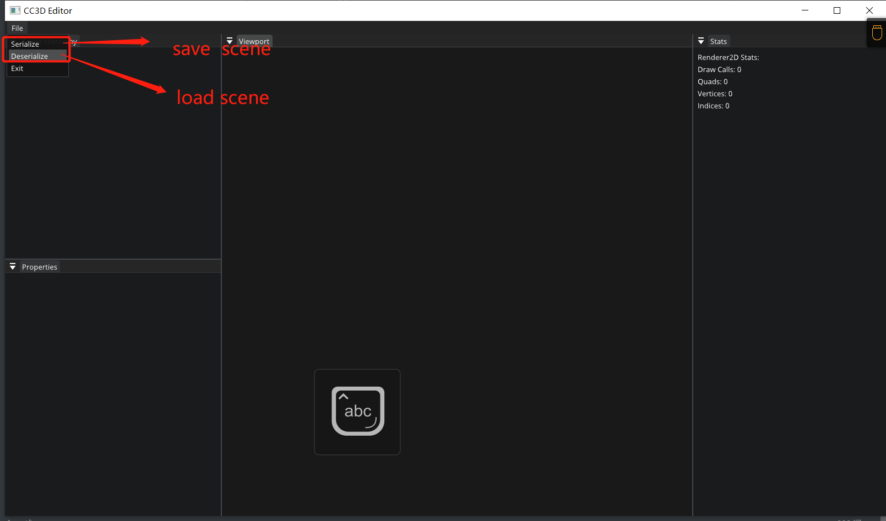
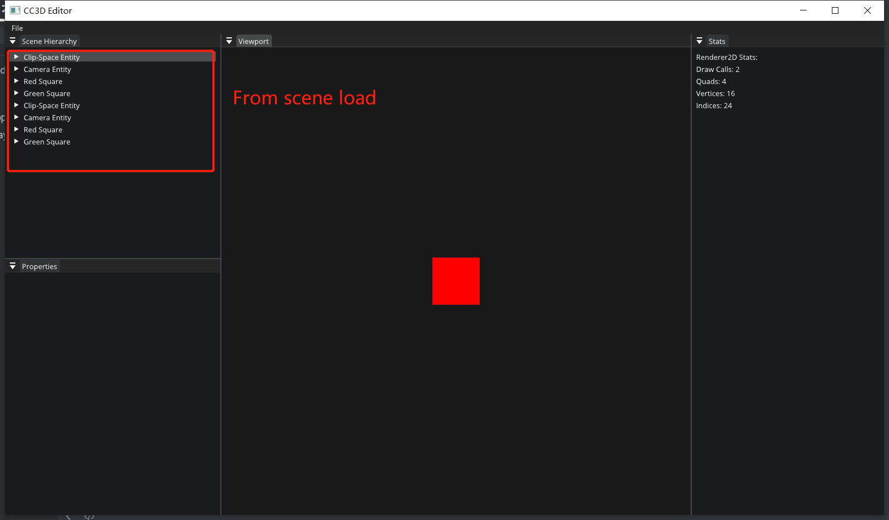

# Lec 68 Saving and Loading Scenes

tutorial : [here](https://www.youtube.com/watch?v=IEiOP7Y-Mbc&list=PLlrATfBNZ98dC-V-N3m0Go4deliWHPFwT&index=91)

code version : [here](https://github.com/Graphic-researcher/Crosa-Conty-3D/commit/b2150717303e96d5c60f142f82309726821f6ec1)

## Scene Scope

```c++
class Scene
{
    //...code...

    private:
    //...code...
    friend class SceneSerializer;
};
```


## Scene Serializer Scope 

```c++
class SceneSerializer
{
    public:
    SceneSerializer(const Ref<Scene>& scene);

    void Serialize(const std::string& filepath);
    void SerializeRuntime(const std::string& filepath);

    bool Deserialize(const std::string& filepath);
    bool DeserializeRuntime(const std::string& filepath);
    private:
    Ref<Scene> m_Scene;
};
namespace YAML {

    template<>
    struct convert<glm::vec3>
    {
        static Node encode(const glm::vec3& rhs)
        {
            Node node;
            node.push_back(rhs.x);
            node.push_back(rhs.y);
            node.push_back(rhs.z);
            return node;
        }

        static bool decode(const Node& node, glm::vec3& rhs)
        {
            if (!node.IsSequence() || node.size() != 3)
                return false;

            rhs.x = node[0].as<float>();
            rhs.y = node[1].as<float>();
            rhs.z = node[2].as<float>();
            return true;
        }
    };

    template<>
    struct convert<glm::vec4>
    {
        static Node encode(const glm::vec4& rhs)
        {
            Node node;
            node.push_back(rhs.x);
            node.push_back(rhs.y);
            node.push_back(rhs.z);
            node.push_back(rhs.w);
            return node;
        }

        static bool decode(const Node& node, glm::vec4& rhs)
        {
            if (!node.IsSequence() || node.size() != 4)
                return false;

            rhs.x = node[0].as<float>();
            rhs.y = node[1].as<float>();
            rhs.z = node[2].as<float>();
            rhs.w = node[3].as<float>();
            return true;
        }
    };

}
YAML::Emitter& operator<<(YAML::Emitter& out, const glm::vec3& v)
{
    out << YAML::Flow;
    out << YAML::BeginSeq << v.x << v.y << v.z << YAML::EndSeq;
    return out;
}

YAML::Emitter& operator<<(YAML::Emitter& out, const glm::vec4& v)
{
    out << YAML::Flow;
    out << YAML::BeginSeq << v.x << v.y << v.z << v.w << YAML::EndSeq;
    return out;
}

SceneSerializer::SceneSerializer(const Ref<Scene>& scene)
    : m_Scene(scene)
    {
    }

static void SerializeEntity(YAML::Emitter& out, Entity entity)
{
    out << YAML::BeginMap; // Entity
    out << YAML::Key << "Entity" << YAML::Value << "12837192831273"; // TODO: Entity ID goes here

    if (entity.HasComponent<TagComponent>())
    {
        out << YAML::Key << "TagComponent";
        out << YAML::BeginMap; // TagComponent

        auto& tag = entity.GetComponent<TagComponent>().Tag;
        out << YAML::Key << "Tag" << YAML::Value << tag;

        out << YAML::EndMap; // TagComponent
    }

    if (entity.HasComponent<TransformComponent>())
    {
        out << YAML::Key << "TransformComponent";
        out << YAML::BeginMap; // TransformComponent

        auto& tc = entity.GetComponent<TransformComponent>();
        out << YAML::Key << "Translation" << YAML::Value << tc.Translation;
        out << YAML::Key << "Rotation" << YAML::Value << tc.Rotation;
        out << YAML::Key << "Scale" << YAML::Value << tc.Scale;

        out << YAML::EndMap; // TransformComponent
    }

    if (entity.HasComponent<CameraComponent>())
    {
        out << YAML::Key << "CameraComponent";
        out << YAML::BeginMap; // CameraComponent

        auto& cameraComponent = entity.GetComponent<CameraComponent>();
        auto& camera = cameraComponent.Camera;

        out << YAML::Key << "Camera" << YAML::Value;
        out << YAML::BeginMap; // Camera
        out << YAML::Key << "ProjectionType" << YAML::Value << (int)camera.GetProjectionType();
        out << YAML::Key << "PerspectiveFOV" << YAML::Value << camera.GetPerspectiveVerticalFOV();
        out << YAML::Key << "PerspectiveNear" << YAML::Value << camera.GetPerspectiveNearClip();
        out << YAML::Key << "PerspectiveFar" << YAML::Value << camera.GetPerspectiveFarClip();
        out << YAML::Key << "OrthographicSize" << YAML::Value << camera.GetOrthographicSize();
        out << YAML::Key << "OrthographicNear" << YAML::Value << camera.GetOrthographicNearClip();
        out << YAML::Key << "OrthographicFar" << YAML::Value << camera.GetOrthographicFarClip();
        out << YAML::EndMap; // Camera

        out << YAML::Key << "Primary" << YAML::Value << cameraComponent.Primary;
        out << YAML::Key << "FixedAspectRatio" << YAML::Value << cameraComponent.FixedAspectRatio;

        out << YAML::EndMap; // CameraComponent
    }

    if (entity.HasComponent<SpriteRendererComponent>())
    {
        out << YAML::Key << "SpriteRendererComponent";
        out << YAML::BeginMap; // SpriteRendererComponent

        auto& spriteRendererComponent = entity.GetComponent<SpriteRendererComponent>();
        out << YAML::Key << "Color" << YAML::Value << spriteRendererComponent.Color;

        out << YAML::EndMap; // SpriteRendererComponent
    }

    out << YAML::EndMap; // Entity
}

void SceneSerializer::Serialize(const std::string& filepath)
{
    YAML::Emitter out;
    out << YAML::BeginMap;
    out << YAML::Key << "Scene" << YAML::Value << "Untitled";
    out << YAML::Key << "Entities" << YAML::Value << YAML::BeginSeq;
    m_Scene->m_Registry.each([&](auto entityID)
                             {
                                 Entity entity = { entityID, m_Scene.get() };
                                 if (!entity)
                                     return;

                                 SerializeEntity(out, entity);
                             });
    out << YAML::EndSeq;
    out << YAML::EndMap;

    std::ofstream fout(filepath);
    fout << out.c_str();
}

void SceneSerializer::SerializeRuntime(const std::string& filepath)
{
}

bool SceneSerializer::Deserialize(const std::string& filepath)
{
    std::ifstream stream(filepath);
    std::stringstream strStream;
    strStream << stream.rdbuf();

    YAML::Node data = YAML::Load(strStream.str());
    if (!data["Scene"])
        return false;

    std::string sceneName = data["Scene"].as<std::string>();
    CC3D_CORE_TRACE("Deserializing scene '{0}'", sceneName);

    auto entities = data["Entities"];
    if (entities)
    {
        for (auto entity : entities)
        {
            uint64_t uuid = entity["Entity"].as<uint64_t>(); // TODO

            std::string name;
            auto tagComponent = entity["TagComponent"];
            if (tagComponent)
                name = tagComponent["Tag"].as<std::string>();

            CC3D_CORE_TRACE("Deserialized entity with ID = {0}, name = {1}", uuid, name);

            Entity deserializedEntity = m_Scene->CreateEntity(name);

            auto transformComponent = entity["TransformComponent"];
            if (transformComponent)
            {
                // Entities always have transforms
                auto& tc = deserializedEntity.GetComponent<TransformComponent>();
                tc.Translation = transformComponent["Translation"].as<glm::vec3>();
                tc.Rotation = transformComponent["Rotation"].as<glm::vec3>();
                tc.Scale = transformComponent["Scale"].as<glm::vec3>();
            }

            auto cameraComponent = entity["CameraComponent"];
            if (cameraComponent)
            {
                auto& cc = deserializedEntity.AddComponent<CameraComponent>();

                auto cameraProps = cameraComponent["Camera"];
                cc.Camera.SetProjectionType((SceneCamera::ProjectionType)cameraProps["ProjectionType"].as<int>());

                cc.Camera.SetPerspectiveVerticalFOV(cameraProps["PerspectiveFOV"].as<float>());
                cc.Camera.SetPerspectiveNearClip(cameraProps["PerspectiveNear"].as<float>());
                cc.Camera.SetPerspectiveFarClip(cameraProps["PerspectiveFar"].as<float>());

                cc.Camera.SetOrthographicSize(cameraProps["OrthographicSize"].as<float>());
                cc.Camera.SetOrthographicNearClip(cameraProps["OrthographicNear"].as<float>());
                cc.Camera.SetOrthographicFarClip(cameraProps["OrthographicFar"].as<float>());

                cc.Primary = cameraComponent["Primary"].as<bool>();
                cc.FixedAspectRatio = cameraComponent["FixedAspectRatio"].as<bool>();
            }

            auto spriteRendererComponent = entity["SpriteRendererComponent"];
            if (spriteRendererComponent)
            {
                auto& src = deserializedEntity.AddComponent<SpriteRendererComponent>();
                src.Color = spriteRendererComponent["Color"].as<glm::vec4>();
            }
        }
    }

    return true;
}

bool SceneSerializer::DeserializeRuntime(const std::string& filepath)
{
    return false;
}

```

## CC3D Input Editor Layer Scope 

```c++
void EditorLayer::OnImGuiRender()
{
    if (ImGui::BeginMenuBar())
    {
        if (ImGui::BeginMenu("File"))
        {
            if (ImGui::MenuItem("Serialize"))
            {
                SceneSerializer serializer(m_ActiveScene);
                serializer.Serialize("assets/scene/example2.cc3d");//save
            }

            if (ImGui::MenuItem("Deserialize"))
            {
                SceneSerializer serializer(m_ActiveScene);
                serializer.Deserialize("assets/scene/example2.cc3d");//load
            }

            if (ImGui::MenuItem("Exit")) Application::Get().Close();
            ImGui::EndMenu();
        }

        ImGui::EndMenuBar();
    }
}
```

## Build and Result



Save Scene Format:

```yaml
Scene: Untitled
Entities:
  - Entity: 12837192831273
    TagComponent:
      Tag: Green Square
    TransformComponent:
      Translation: [0, 0, 0]
      Rotation: [0, 0, 0]
      Scale: [1, 1, 1]
    SpriteRendererComponent:
      Color: [0, 1, 0, 1]
  - Entity: 12837192831273
    TagComponent:
      Tag: Red Square
    TransformComponent:
      Translation: [0, 0, 0]
      Rotation: [0, 0, 0]
      Scale: [1, 1, 1]
    SpriteRendererComponent:
      Color: [1, 0, 0, 1]
  - Entity: 12837192831273
    TagComponent:
      Tag: Camera Entity
    TransformComponent:
      Translation: [0, 0, 0]
      Rotation: [0, 0, 0]
      Scale: [1, 1, 1]
    CameraComponent:
      Camera:
        ProjectionType: 1
        PerspectiveFOV: 0.785398185
        PerspectiveNear: 0.00999999978
        PerspectiveFar: 1000
        OrthographicSize: 10
        OrthographicNear: -1
        OrthographicFar: 1
      Primary: true
      FixedAspectRatio: false
  - Entity: 12837192831273
    TagComponent:
      Tag: Clip-Space Entity
    TransformComponent:
      Translation: [0, 0, 0]
      Rotation: [0, 0, 0]
      Scale: [1, 1, 1]
    CameraComponent:
      Camera:
        ProjectionType: 1
        PerspectiveFOV: 0.785398185
        PerspectiveNear: 0.00999999978
        PerspectiveFar: 1000
        OrthographicSize: 10
        OrthographicNear: -1
        OrthographicFar: 1
      Primary: false
      FixedAspectRatio: false
  - Entity: 12837192831273
    TagComponent:
      Tag: Green Square
    TransformComponent:
      Translation: [0, 0, 0]
      Rotation: [0, 0, 0]
      Scale: [1, 1, 1]
    SpriteRendererComponent:
      Color: [0, 1, 0, 1]
  - Entity: 12837192831273
    TagComponent:
      Tag: Red Square
    TransformComponent:
      Translation: [0, 0, 0]
      Rotation: [0, 0, 0]
      Scale: [1, 1, 1]
    SpriteRendererComponent:
      Color: [1, 0, 0, 1]
  - Entity: 12837192831273
    TagComponent:
      Tag: Camera Entity
    TransformComponent:
      Translation: [0, 0, 0]
      Rotation: [0, 0, 0]
      Scale: [1, 1, 1]
    CameraComponent:
      Camera:
        ProjectionType: 1
        PerspectiveFOV: 0.785398185
        PerspectiveNear: 0.00999999978
        PerspectiveFar: 1000
        OrthographicSize: 10
        OrthographicNear: -1
        OrthographicFar: 1
      Primary: true
      FixedAspectRatio: false
  - Entity: 12837192831273
    TagComponent:
      Tag: Clip-Space Entity
    TransformComponent:
      Translation: [0, 0, 0]
      Rotation: [0, 0, 0]
      Scale: [1, 1, 1]
    CameraComponent:
      Camera:
        ProjectionType: 1
        PerspectiveFOV: 0.785398185
        PerspectiveNear: 0.00999999978
        PerspectiveFar: 1000
        OrthographicSize: 10
        OrthographicNear: -1
        OrthographicFar: 1
      Primary: false
      FixedAspectRatio: false
```

