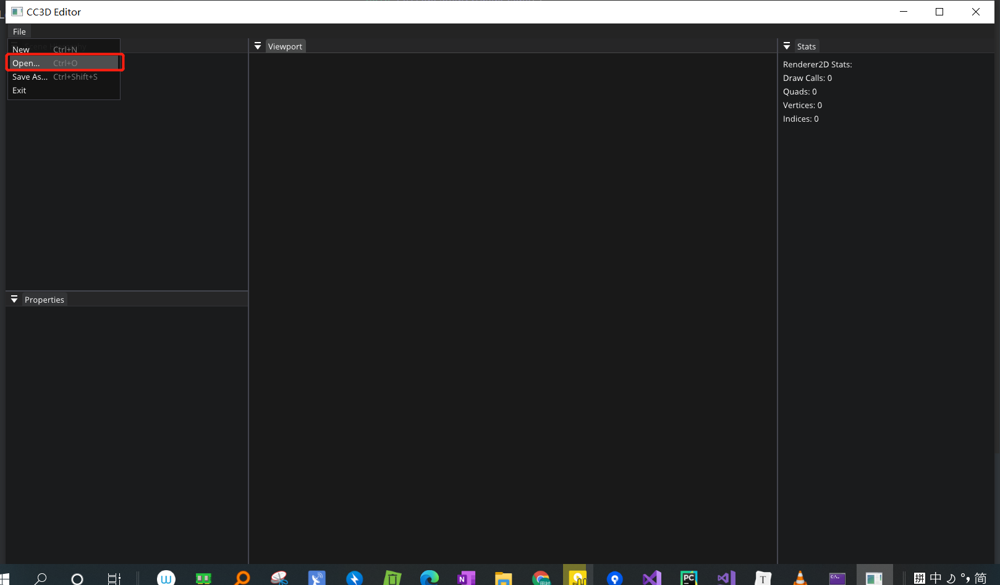
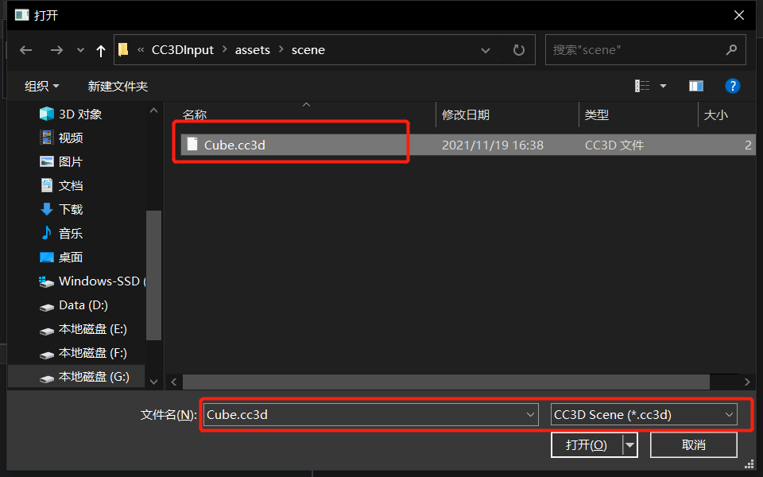
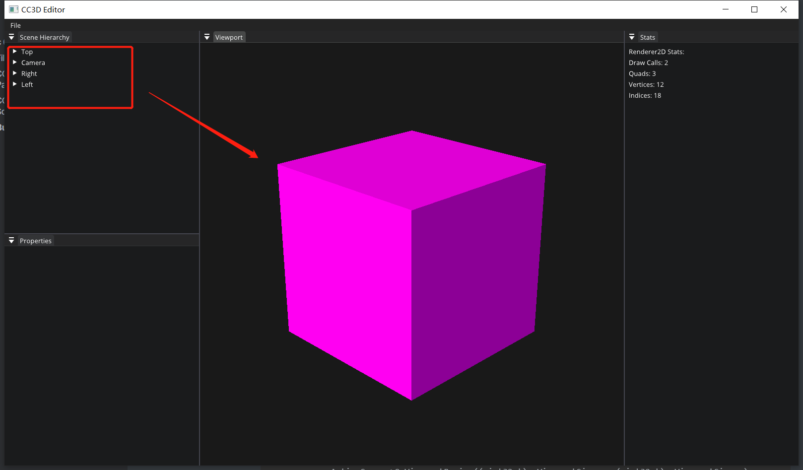
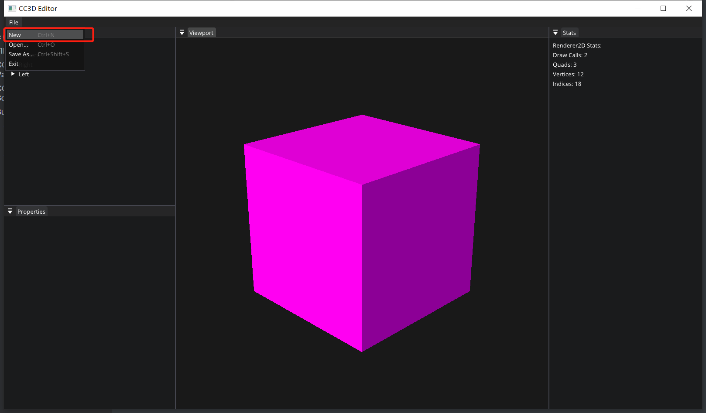
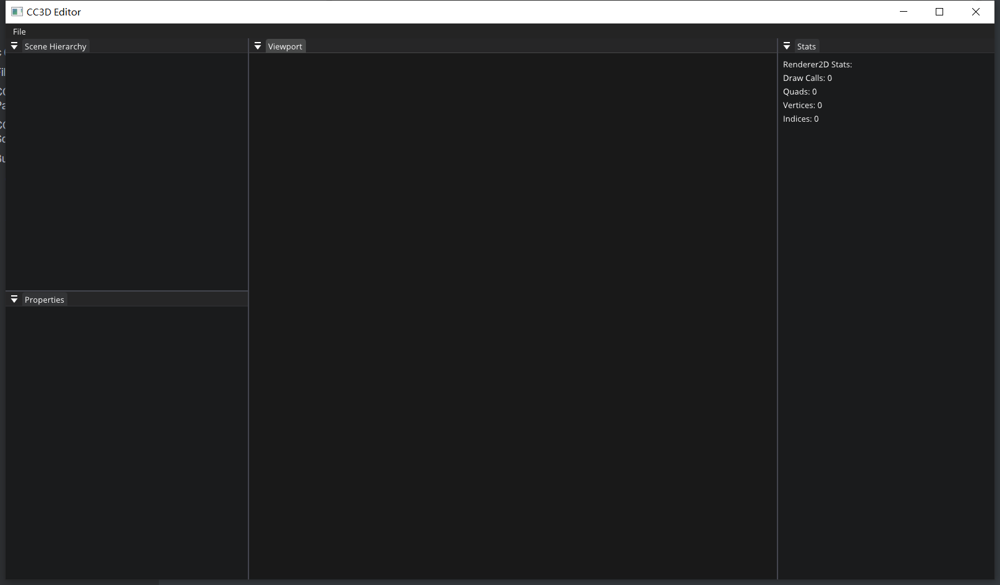

# Lec 69 Open Save File Dialogs

tutorial : [here](https://www.youtube.com/watch?v=zn7N7zHgCcs&list=PLlrATfBNZ98dC-V-N3m0Go4deliWHPFwT&index=92)

code version : [here](https://github.com/Graphic-researcher/Crosa-Conty-3D/commit/7fcf0ac51dc3880914f6a9ee35253bbce5af3807)

## FileDialogs Scope

```c++

class FileDialogs
{
    public:
    // These return empty strings if cancelled
    static std::string OpenFile(const char* filter);
    static std::string SaveFile(const char* filter);
};
std::string FileDialogs::OpenFile(const char* filter)
{
    OPENFILENAMEA ofn;
    CHAR szFile[260] = { 0 };
    ZeroMemory(&ofn, sizeof(OPENFILENAME));
    ofn.lStructSize = sizeof(OPENFILENAME);
    ofn.hwndOwner = glfwGetWin32Window((GLFWwindow*)Application::Get().GetWindow().GetNativeWindow());
    ofn.lpstrFile = szFile;
    ofn.nMaxFile = sizeof(szFile);
    ofn.lpstrFilter = filter;
    ofn.nFilterIndex = 1;
    ofn.Flags = OFN_PATHMUSTEXIST | OFN_FILEMUSTEXIST | OFN_NOCHANGEDIR;
    if (GetOpenFileNameA(&ofn) == TRUE)
    {
        return ofn.lpstrFile;
    }
    return std::string();
}

std::string FileDialogs::SaveFile(const char* filter)
{
    OPENFILENAMEA ofn;
    CHAR szFile[260] = { 0 };
    ZeroMemory(&ofn, sizeof(OPENFILENAME));
    ofn.lStructSize = sizeof(OPENFILENAME);
    ofn.hwndOwner = glfwGetWin32Window((GLFWwindow*)Application::Get().GetWindow().GetNativeWindow());
    ofn.lpstrFile = szFile;
    ofn.nMaxFile = sizeof(szFile);
    ofn.lpstrFilter = filter;
    ofn.nFilterIndex = 1;
    ofn.Flags = OFN_PATHMUSTEXIST | OFN_FILEMUSTEXIST | OFN_NOCHANGEDIR;
    if (GetSaveFileNameA(&ofn) == TRUE)
    {
        return ofn.lpstrFile;
    }
    return std::string();
}
```

## CC3D Input Scene Hierarchy Panel Scope

Clear scene context to avoid null pointer reference problem

```c++
void SceneHierarchyPanel::SetContext(const Ref<Scene>& context)
{
    m_Context = context;
    m_SelectionContext = {};
}
```

## CC3D Input Editor Layer Scope

```c++
void EditorLayer::OnImGuiRender()
{
    //...code...
    if (ImGui::BeginMenuBar())
    {
        if (ImGui::BeginMenu("File"))
        {
            // Disabling fullscreen would allow the window to be moved to the front of other windows, 
            // which we can't undo at the moment without finer window depth/z control.
            //ImGui::MenuItem("Fullscreen", NULL, &opt_fullscreen_persistant);
            if (ImGui::MenuItem("New", "Ctrl+N"))
                NewScene();

            if (ImGui::MenuItem("Open...", "Ctrl+O"))
                OpenScene();

            if (ImGui::MenuItem("Save As...", "Ctrl+Shift+S"))
                SaveSceneAs();

            if (ImGui::MenuItem("Exit")) Application::Get().Close();
            ImGui::EndMenu();
        }

        ImGui::EndMenuBar();
    }
    //...code...
}
void EditorLayer::OnEvent(Event& e)
{
    m_CameraController.OnEvent(e);
    EventDispatcher dispatcher(e);
    dispatcher.Dispatch<KeyPressedEvent>(CC3D_BIND_EVENT_FN(EditorLayer::OnKeyPressed));
}

bool EditorLayer::OnKeyPressed(KeyPressedEvent& e)
{
    // Shortcuts
    if (e.GetRepeatCount() > 0)
        return false;

    bool control = Input::IsKeyPressed(Key::LeftControl) || Input::IsKeyPressed(Key::RightControl);
    bool shift = Input::IsKeyPressed(Key::LeftShift) || Input::IsKeyPressed(Key::RightShift);
    switch (e.GetKeyCode())
    {
        case Key::N:
            {
                if (control)
                    NewScene();

                break;
            }
        case Key::O:
            {
                if (control)
                    OpenScene();

                break;
            }
        case Key::S:
            {
                if (control && shift)
                    SaveSceneAs();

                break;
            }
    }
}

void EditorLayer::NewScene()
{
    m_ActiveScene = CreateRef<Scene>();
    m_ActiveScene->OnViewportResize((uint32_t)m_ViewportSize.x, (uint32_t)m_ViewportSize.y);
    m_SceneHierarchyPanel.SetContext(m_ActiveScene);
}

void EditorLayer::OpenScene()
{
    std::string filepath = FileDialogs::OpenFile("CC3D Scene (*.cc3d)\0*.cc3d\0");
    if (!filepath.empty())
    {
        m_ActiveScene = CreateRef<Scene>();
        m_ActiveScene->OnViewportResize((uint32_t)m_ViewportSize.x, (uint32_t)m_ViewportSize.y);
        m_SceneHierarchyPanel.SetContext(m_ActiveScene);

        SceneSerializer serializer(m_ActiveScene);
        serializer.Deserialize(filepath);
    }
}

void EditorLayer::SaveSceneAs()
{
    std::string filepath = FileDialogs::SaveFile("CC3D Scene (*.cc3d)\0*.cc3d\0");
    if (!filepath.empty())
    {
        SceneSerializer serializer(m_ActiveScene);
        serializer.Serialize(filepath);
    }
}
```

## Build and Result

### open a scene







### new scene





### save scene

Edit the color of our pink cube:


Save it as "GreenCube.cc3d":


