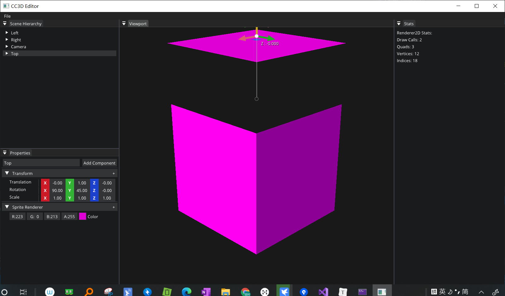
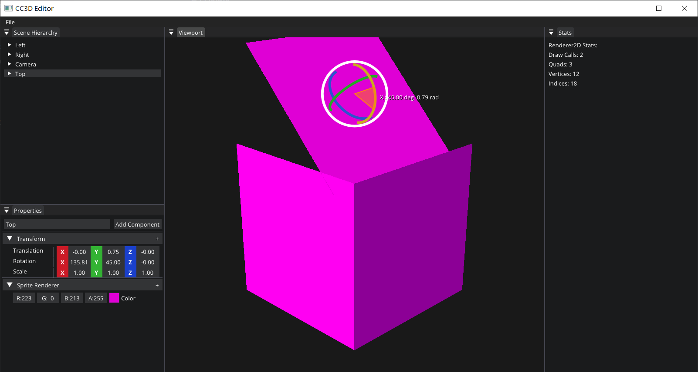
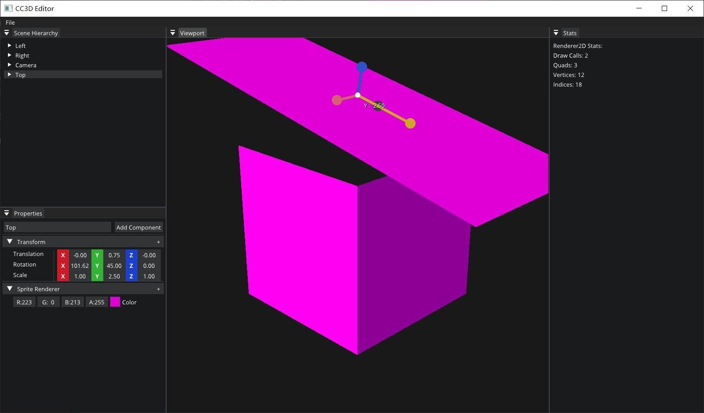

# Lec 70 Transfomation Gizmos

tutorial : [here](https://www.youtube.com/watch?v=Pegb5CZuibU&list=PLlrATfBNZ98dC-V-N3m0Go4deliWHPFwT&index=93)

code version : [here](https://github.com/Graphic-researcher/Crosa-Conty-3D/commit/352aba5031169cd8f869eda0f42ef39ed0cd379d)

## Imgui Layer Scope

```c++
void ImGuiLayer::Begin()
{
    CC3D_PROFILE_FUNCTION();

    ImGui_ImplOpenGL3_NewFrame();
    ImGui_ImplGlfw_NewFrame();
    ImGui::NewFrame();
    //ImGuizmo:
    ImGuizmo::BeginFrame();

}
```

## Math Scope

```c++
bool DecomposeTransform(const glm::mat4& transform, glm::vec3& translation, glm::vec3& rotation, glm::vec3& scale)
{
    // From glm::decompose in matrix_decompose.inl

    using namespace glm;
    using T = float;

    mat4 LocalMatrix(transform);

    // Normalize the matrix.
    if (epsilonEqual(LocalMatrix[3][3], static_cast<float>(0), epsilon<T>()))
        return false;

    // First, isolate perspective.  This is the messiest.
    if (
        epsilonNotEqual(LocalMatrix[0][3], static_cast<T>(0), epsilon<T>()) ||
        epsilonNotEqual(LocalMatrix[1][3], static_cast<T>(0), epsilon<T>()) ||
        epsilonNotEqual(LocalMatrix[2][3], static_cast<T>(0), epsilon<T>()))
    {
        // Clear the perspective partition
        LocalMatrix[0][3] = LocalMatrix[1][3] = LocalMatrix[2][3] = static_cast<T>(0);
        LocalMatrix[3][3] = static_cast<T>(1);
    }

    // Next take care of translation (easy).
    translation = vec3(LocalMatrix[3]);
    LocalMatrix[3] = vec4(0, 0, 0, LocalMatrix[3].w);

    vec3 Row[3], Pdum3;

    // Now get scale and shear.
    for (length_t i = 0; i < 3; ++i)
        for (length_t j = 0; j < 3; ++j)
            Row[i][j] = LocalMatrix[i][j];

    // Compute X scale factor and normalize first row.
    scale.x = length(Row[0]);
    Row[0] = detail::scale(Row[0], static_cast<T>(1));
    scale.y = length(Row[1]);
    Row[1] = detail::scale(Row[1], static_cast<T>(1));
    scale.z = length(Row[2]);
    Row[2] = detail::scale(Row[2], static_cast<T>(1));

    // At this point, the matrix (in rows[]) is orthonormal.
    // Check for a coordinate system flip.  If the determinant
    // is -1, then negate the matrix and the scaling factors.
    #if 0
    Pdum3 = cross(Row[1], Row[2]); // v3Cross(row[1], row[2], Pdum3);
    if (dot(Row[0], Pdum3) < 0)
    {
        for (length_t i = 0; i < 3; i++)
        {
            scale[i] *= static_cast<T>(-1);
            Row[i] *= static_cast<T>(-1);
        }
    }
    #endif

    rotation.y = asin(-Row[0][2]);
    if (cos(rotation.y) != 0) {
        rotation.x = atan2(Row[1][2], Row[2][2]);
        rotation.z = atan2(Row[0][1], Row[0][0]);
    }
    else {
        rotation.x = atan2(-Row[2][0], Row[1][1]);
        rotation.z = 0;
    }


    return true;
}
```

## Component Scope

```c++
struct TransformComponent
{
	//...member

    glm::mat4 GetTransform() const
    {
        // #define GLM_ENABLE_EXPERIMENTAL
        //#include <glm/gtx/quaternion.hpp>
        glm::mat4 rotation = glm::toMat4(glm::quat(Rotation));

        return glm::translate(glm::mat4(1.0f), Translation)
            * rotation
            * glm::scale(glm::mat4(1.0f), Scale);
    }
};
```

## Scene Scope

```c++
Entity Scene::GetPrimaryCameraEntity()
{
    auto view = m_Registry.view<CameraComponent>();
    for (auto entity : view)
    {
        const auto& camera = view.get<CameraComponent>(entity);
        if (camera.Primary)
            return Entity{ entity, this };
    }
    return {};
}
```

## CC3D Input Scene Hierarchy Scope

```c++
Entity GetSelectedEntity() const { return m_SelectionContext; }
```

## CC3D Input Editor Layer Scope

```c++
int m_GizmoType = -1;//activate the gizmo
void EditorLayer::OnImGuiRender()
{
    //...code...

    //You can operate (get event) when hover the view port
    Application::Get().GetImGuiLayer()->BlockEvents(!m_ViewportFocused && !m_ViewportHovered);

    //...code...

    // Gizmos
    Entity selectedEntity = m_SceneHierarchyPanel.GetSelectedEntity();
    if (selectedEntity && m_GizmoType != -1)
    {
        ImGuizmo::SetOrthographic(false);
        ImGuizmo::SetDrawlist();

        float windowWidth = (float)ImGui::GetWindowWidth();
        float windowHeight = (float)ImGui::GetWindowHeight();
        ImGuizmo::SetRect(ImGui::GetWindowPos().x, ImGui::GetWindowPos().y, windowWidth, windowHeight);

        // Camera
        auto cameraEntity = m_ActiveScene->GetPrimaryCameraEntity();
        const auto& camera = cameraEntity.GetComponent<CameraComponent>().Camera;
        const glm::mat4& cameraProjection = camera.GetProjection();
        glm::mat4 cameraView = glm::inverse(cameraEntity.GetComponent<TransformComponent>().GetTransform());

        // Entity transform
        auto& tc = selectedEntity.GetComponent<TransformComponent>();
        glm::mat4 transform = tc.GetTransform();

        // Snapping
        bool snap = Input::IsKeyPressed(Key::LeftControl);
        float snapValue = 0.5f; // Snap to 0.5m for translation/scale
        // Snap to 45 degrees for rotation
        if (m_GizmoType == ImGuizmo::OPERATION::ROTATE)
            snapValue = 45.0f;

        float snapValues[3] = { snapValue, snapValue, snapValue };

        ImGuizmo::Manipulate(glm::value_ptr(cameraView), glm::value_ptr(cameraProjection),
                             (ImGuizmo::OPERATION)m_GizmoType, ImGuizmo::LOCAL, glm::value_ptr(transform),
                             nullptr, snap ? snapValues : nullptr);

        if (ImGuizmo::IsUsing())
        {
            glm::vec3 translation, rotation, scale;
            Math::DecomposeTransform(transform, translation, rotation, scale);

            glm::vec3 deltaRotation = rotation - tc.Rotation;
            tc.Translation = translation;
            tc.Rotation += deltaRotation;
            tc.Scale = scale;
        }
    }
    //...code...  
}
bool EditorLayer::OnKeyPressed(KeyPressedEvent& e)
{
    // Shortcuts
    if (e.GetRepeatCount() > 0)
        return false;

    bool control = Input::IsKeyPressed(Key::LeftControl) || Input::IsKeyPressed(Key::RightControl);
    bool shift = Input::IsKeyPressed(Key::LeftShift) || Input::IsKeyPressed(Key::RightShift);
    switch (e.GetKeyCode())
    {
		//file operation
            //...
            // Gizmos
        case Key::Q:
            m_GizmoType = -1;
            break;
        case Key::W:
            m_GizmoType = ImGuizmo::OPERATION::TRANSLATE;
            break;
        case Key::E:
            m_GizmoType = ImGuizmo::OPERATION::ROTATE;
            break;
        case Key::R:
            m_GizmoType = ImGuizmo::OPERATION::SCALE;
            break;
    }
}
```

## Build and Result

Press Q cancel gizmo operation

W : Translate

E : Rotate

R : Scale 







