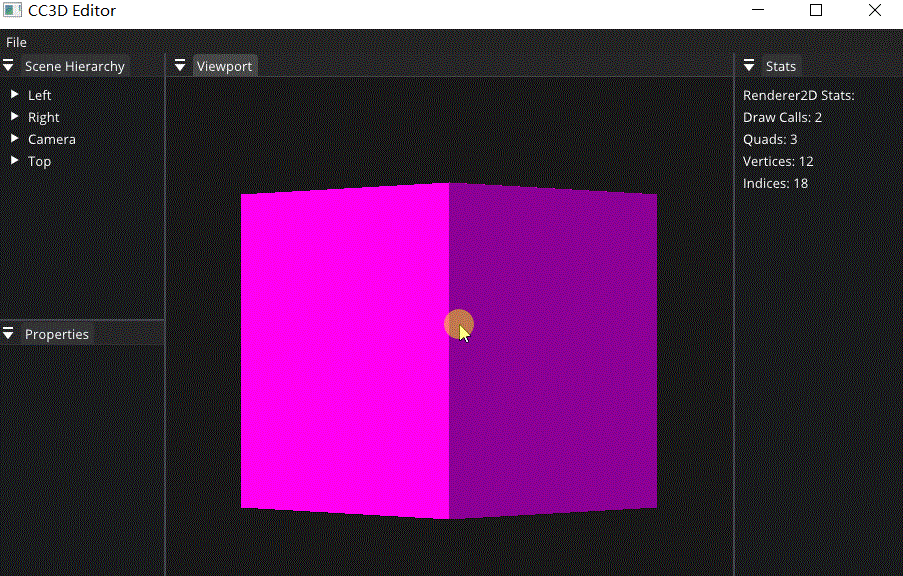

# Lec 71 Editor Camera

tutorial : [here](https://www.youtube.com/watch?v=8zVtRpBTwe0&list=PLlrATfBNZ98dC-V-N3m0Go4deliWHPFwT&index=94)

code version : [here](https://github.com/Graphic-researcher/Crosa-Conty-3D/commit/7866944d541e8327c054a32f32e34b6d8913492e)

## Editor Camera Scope

```c++
class EditorCamera : public Camera
{
    public:
    EditorCamera() = default;
    EditorCamera(float fov, float aspectRatio, float nearClip, float farClip);

    void OnUpdate(Timestep ts);
    void OnEvent(Event& e);

    inline float GetDistance() const { return m_Distance; }
    inline void SetDistance(float distance) { m_Distance = distance; }

    inline void SetViewportSize(float width, float height) { m_ViewportWidth = width; m_ViewportHeight = height; UpdateProjection(); }

    const glm::mat4& GetViewMatrix() const { return m_ViewMatrix; }
    glm::mat4 GetViewProjection() const { return m_Projection * m_ViewMatrix; }

    glm::vec3 GetUpDirection() const;
    glm::vec3 GetRightDirection() const;
    glm::vec3 GetForwardDirection() const;
    const glm::vec3& GetPosition() const { return m_Position; }
    glm::quat GetOrientation() const;

    float GetPitch() const { return m_Pitch; }
    float GetYaw() const { return m_Yaw; }
    private:
    void UpdateProjection();
    void UpdateView();

    bool OnMouseScroll(MouseScrolledEvent& e);

    void MousePan(const glm::vec2& delta);
    void MouseRotate(const glm::vec2& delta);
    void MouseZoom(float delta);

    glm::vec3 CalculatePosition() const;

    std::pair<float, float> PanSpeed() const;
    float RotationSpeed() const;
    float ZoomSpeed() const;
    private:
    float m_FOV = 45.0f, m_AspectRatio = 1.778f, m_NearClip = 0.1f, m_FarClip = 1000.0f;

    glm::mat4 m_ViewMatrix;
    glm::vec3 m_Position = { 0.0f, 0.0f, 0.0f };
    glm::vec3 m_FocalPoint = { 0.0f, 0.0f, 0.0f };

    glm::vec2 m_InitialMousePosition = { 0.0f, 0.0f };

    float m_Distance = 10.0f;
    float m_Pitch = 0.0f, m_Yaw = 0.0f;

    float m_ViewportWidth = 1280, m_ViewportHeight = 720;
};
EditorCamera::EditorCamera(float fov, float aspectRatio, float nearClip, float farClip)
    : m_FOV(fov), m_AspectRatio(aspectRatio), m_NearClip(nearClip), m_FarClip(farClip), Camera(glm::perspective(glm::radians(fov), aspectRatio, nearClip, farClip))
    {
        UpdateView();
    }

void EditorCamera::UpdateProjection()
{
    m_AspectRatio = m_ViewportWidth / m_ViewportHeight;
    m_Projection = glm::perspective(glm::radians(m_FOV), m_AspectRatio, m_NearClip, m_FarClip);
}

void EditorCamera::UpdateView()
{
    // m_Yaw = m_Pitch = 0.0f; // Lock the camera's rotation
    m_Position = CalculatePosition();

    glm::quat orientation = GetOrientation();
    m_ViewMatrix = glm::translate(glm::mat4(1.0f), m_Position) * glm::toMat4(orientation);
    m_ViewMatrix = glm::inverse(m_ViewMatrix);
}

std::pair<float, float> EditorCamera::PanSpeed() const
{
    float x = std::min(m_ViewportWidth / 1000.0f, 2.4f); // max = 2.4f
    float xFactor = 0.0366f * (x * x) - 0.1778f * x + 0.3021f;

    float y = std::min(m_ViewportHeight / 1000.0f, 2.4f); // max = 2.4f
    float yFactor = 0.0366f * (y * y) - 0.1778f * y + 0.3021f;

    return { xFactor, yFactor };
}

float EditorCamera::RotationSpeed() const
{
    return 0.8f;
}

float EditorCamera::ZoomSpeed() const
{
    float distance = m_Distance * 0.2f;
    distance = std::max(distance, 0.0f);
    float speed = distance * distance;
    speed = std::min(speed, 100.0f); // max speed = 100
    return speed;
}

void EditorCamera::OnUpdate(Timestep ts)
{
    if (Input::IsKeyPressed(Key::LeftAlt))
    {
        const glm::vec2& mouse{ Input::GetMouseX(), Input::GetMouseY() };
        glm::vec2 delta = (mouse - m_InitialMousePosition) * 0.003f;
        m_InitialMousePosition = mouse;

        if (Input::IsMouseButtonPressed(Mouse::ButtonMiddle))
            MousePan(delta);
        else if (Input::IsMouseButtonPressed(Mouse::ButtonLeft))
            MouseRotate(delta);
        else if (Input::IsMouseButtonPressed(Mouse::ButtonRight))
            MouseZoom(delta.y);
    }

    UpdateView();
}

void EditorCamera::OnEvent(Event& e)
{
    EventDispatcher dispatcher(e);
    dispatcher.Dispatch<MouseScrolledEvent>(CC3D_BIND_EVENT_FN(EditorCamera::OnMouseScroll));
}

bool EditorCamera::OnMouseScroll(MouseScrolledEvent& e)
{
    float delta = e.GetYOffset() * 0.1f;
    MouseZoom(delta);
    UpdateView();
    return false;
}

void EditorCamera::MousePan(const glm::vec2& delta)
{
    auto [xSpeed, ySpeed] = PanSpeed();
    m_FocalPoint += -GetRightDirection() * delta.x * xSpeed * m_Distance;
    m_FocalPoint += GetUpDirection() * delta.y * ySpeed * m_Distance;
}

void EditorCamera::MouseRotate(const glm::vec2& delta)
{
    float yawSign = GetUpDirection().y < 0 ? -1.0f : 1.0f;
    m_Yaw += yawSign * delta.x * RotationSpeed();
    m_Pitch += delta.y * RotationSpeed();
}

void EditorCamera::MouseZoom(float delta)
{
    m_Distance -= delta * ZoomSpeed();
    if (m_Distance < 1.0f)
    {
        m_FocalPoint += GetForwardDirection();
        m_Distance = 1.0f;
    }
}

glm::vec3 EditorCamera::GetUpDirection() const
{
    return glm::rotate(GetOrientation(), glm::vec3(0.0f, 1.0f, 0.0f));
}

glm::vec3 EditorCamera::GetRightDirection() const
{
    return glm::rotate(GetOrientation(), glm::vec3(1.0f, 0.0f, 0.0f));
}

glm::vec3 EditorCamera::GetForwardDirection() const
{
    return glm::rotate(GetOrientation(), glm::vec3(0.0f, 0.0f, -1.0f));
}

glm::vec3 EditorCamera::CalculatePosition() const
{
    return m_FocalPoint - GetForwardDirection() * m_Distance;
}

glm::quat EditorCamera::GetOrientation() const
{
    return glm::quat(glm::vec3(-m_Pitch, -m_Yaw, 0.0f));
}

```

## Renderer 2D Scope

```c++
void Renderer2D::BeginScene(const EditorCamera& camera)
{
    CC3D_PROFILE_FUNCTION();

    glm::mat4 viewProj = camera.GetViewProjection();

    s_Data.TextureShader->Bind();
    s_Data.TextureShader->SetMat4("u_ViewProjection", viewProj);

    StartBatch();
}
```

## Scene Scope

```c++

void Scene::OnUpdateRuntime(Timestep ts)
{
    //For Scene Camera
    //...code
}
void Scene::OnUpdateEditor(Timestep ts, EditorCamera& camera)
{
    Renderer2D::BeginScene(camera);

    auto group = m_Registry.group<TransformComponent>(entt::get<SpriteRendererComponent>);
    for (auto entity : group)
    {
        auto [transform, sprite] = group.get<TransformComponent, SpriteRendererComponent>(entity);

        Renderer2D::DrawQuad(transform.GetTransform(), sprite.Color);
    }

    Renderer2D::EndScene();
}
```

## CC3D Input Editor Layer Scope

```c++
void EditorLayer::OnAttach()
{
    //...
    //initializing
    m_EditorCamera = EditorCamera(10.0f, 1.1f, 0.1f, 1000.0f);
    //...
}
void EditorLayer::OnUpdate(Timestep ts)
{
    // Resize
    if (FramebufferSpecification spec = m_Framebuffer->GetSpecification();
        m_ViewportSize.x > 0.0f && m_ViewportSize.y > 0.0f && // zero sized framebuffer is invalid
        (spec.Width != m_ViewportSize.x || spec.Height != m_ViewportSize.y))
    {
        m_Framebuffer->Resize((uint32_t)m_ViewportSize.x, (uint32_t)m_ViewportSize.y);
        m_CameraController.OnResize(m_ViewportSize.x, m_ViewportSize.y);
        //EditorCamera
        m_EditorCamera.SetViewportSize(m_ViewportSize.x, m_ViewportSize.y);
        m_ActiveScene->OnViewportResize((uint32_t)m_ViewportSize.x, (uint32_t)m_ViewportSize.y);
    }
    // Update   
    //...
    m_EditorCamera.OnUpdate(ts);
    //...
    // Update scene
    m_ActiveScene->OnUpdateEditor(ts, m_EditorCamera);
    ///Waiting for run time update implementation
    //m_ActiveScene->OnUpdateRuntime(ts);

    //...
}
void EditorLayer::OnImGuiRender()
{
    //...

    // Gizmos
    // Runtime camera from entity
    // auto cameraEntity = m_ActiveScene->GetPrimaryCameraEntity();
    // const auto& camera = cameraEntity.GetComponent<CameraComponent>().Camera;
    // const glm::mat4& cameraProjection = camera.GetProjection();
    // glm::mat4 cameraView = glm::inverse(cameraEntity.GetComponent<TransformComponent>().GetTransform());

    // Editor camera
    const glm::mat4& cameraProjection = m_EditorCamera.GetProjection();
    glm::mat4 cameraView = m_EditorCamera.GetViewMatrix();

    //...
}
void EditorLayer::OnEvent(Event& e)
{
    m_CameraController.OnEvent(e);
    m_EditorCamera.OnEvent(e);

	//...
}
```

## Build and Result

