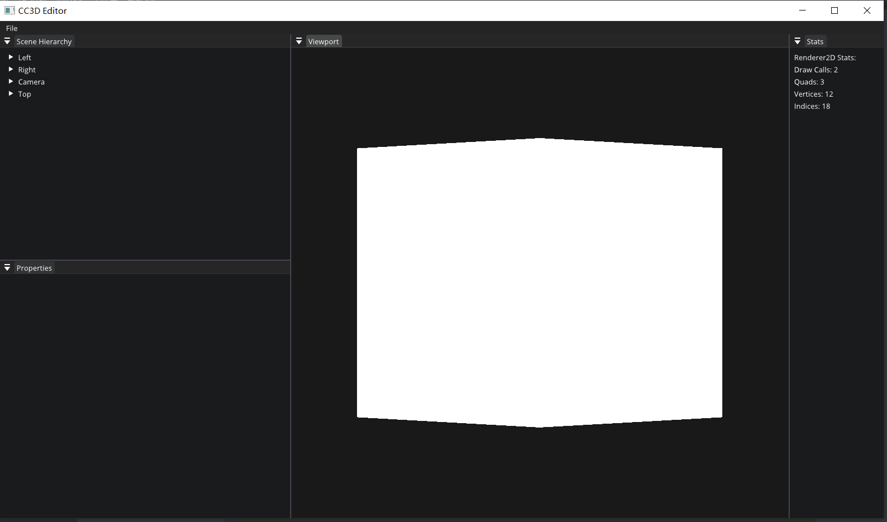
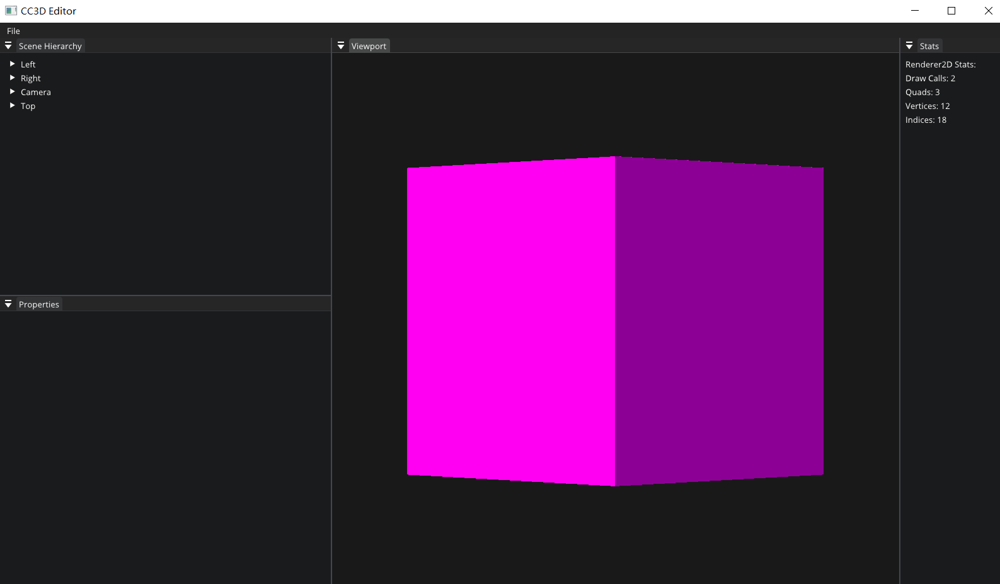

# Lec 72 Multiple Render Targets and Frame

tutorial : [here](https://www.youtube.com/watch?v=f-GbHye1VFQ&list=PLlrATfBNZ98dC-V-N3m0Go4deliWHPFwT&index=95)

code version : [here](https://github.com/Graphic-researcher/Crosa-Conty-3D/commit/f4cd9016724304492649aaad63b46bb871f3771d)

## Frame Buffer Scope

### Frame Buffer Class

```c++
enum class FramebufferTextureFormat
{
    None = 0,

    // Color
    RGBA8,

    // Depth/stencil
    DEPTH24STENCIL8,

    // Defaults
    Depth = DEPTH24STENCIL8
};

struct FramebufferTextureSpecification
{
    FramebufferTextureSpecification() = default;
    FramebufferTextureSpecification(FramebufferTextureFormat format)
        : TextureFormat(format) {}

    FramebufferTextureFormat TextureFormat = FramebufferTextureFormat::None;
    // TODO: filtering/wrap
};

struct FramebufferAttachmentSpecification
{
    FramebufferAttachmentSpecification() = default;
    FramebufferAttachmentSpecification(std::initializer_list<FramebufferTextureSpecification> attachments)
        : Attachments(attachments) {}

    std::vector<FramebufferTextureSpecification> Attachments;
};
struct FramebufferSpecification
{
    uint32_t Width = 0, Height = 0;
    FramebufferAttachmentSpecification Attachments;
    uint32_t Samples = 1;
    bool SwapChainTarget = false;
};
class Framebuffer
{
    public:
	//...code
	///for mutiple framebuffer we have index now
    virtual uint32_t GetColorAttachmentRendererID(uint32_t index = 0) const = 0;
};
```

### OpenGL Frame Buffer Class

```c++
class OpenGLFramebuffer : public Framebuffer
{
    public:
    //...code...

    virtual uint32_t GetColorAttachmentRendererID(uint32_t index = 0) const override
    {
        ///CC3D_CORE_ASSERT(index < m_ColorAttachments.size());
        return m_ColorAttachments[index];
    }

    private:
    //...code

    std::vector<FramebufferTextureSpecification> m_ColorAttachmentSpecifications;
    FramebufferTextureSpecification m_DepthAttachmentSpecification = FramebufferTextureFormat::None;
    std::vector<uint32_t> m_ColorAttachments;
};
namespace Utils {

    static GLenum TextureTarget(bool multisampled)
    {
        return multisampled ? GL_TEXTURE_2D_MULTISAMPLE : GL_TEXTURE_2D;
    }

    static void CreateTextures(bool multisampled, uint32_t* outID, uint32_t count)
    {
        glCreateTextures(TextureTarget(multisampled), count, outID);
    }

    static void BindTexture(bool multisampled, uint32_t id)
    {
        glBindTexture(TextureTarget(multisampled), id);
    }

    static void AttachColorTexture(uint32_t id, int samples, GLenum format, uint32_t width, uint32_t height, int index)
    {
        bool multisampled = samples > 1;
        if (multisampled)
        {
            glTexImage2DMultisample(GL_TEXTURE_2D_MULTISAMPLE, samples, format, width, height, GL_FALSE);
        }
        else
        {
            glTexImage2D(GL_TEXTURE_2D, 0, format, width, height, 0, GL_RGBA, GL_UNSIGNED_BYTE, nullptr);

            glTexParameteri(GL_TEXTURE_2D, GL_TEXTURE_MIN_FILTER, GL_LINEAR);
            glTexParameteri(GL_TEXTURE_2D, GL_TEXTURE_MAG_FILTER, GL_LINEAR);
            glTexParameteri(GL_TEXTURE_2D, GL_TEXTURE_WRAP_R, GL_CLAMP_TO_EDGE);
            glTexParameteri(GL_TEXTURE_2D, GL_TEXTURE_WRAP_S, GL_CLAMP_TO_EDGE);
            glTexParameteri(GL_TEXTURE_2D, GL_TEXTURE_WRAP_T, GL_CLAMP_TO_EDGE);
        }

        glFramebufferTexture2D(GL_FRAMEBUFFER, GL_COLOR_ATTACHMENT0 + index, TextureTarget(multisampled), id, 0);
    }

    static void AttachDepthTexture(uint32_t id, int samples, GLenum format, GLenum attachmentType, uint32_t width, uint32_t height)
    {
        bool multisampled = samples > 1;
        if (multisampled)
        {
            glTexImage2DMultisample(GL_TEXTURE_2D_MULTISAMPLE, samples, format, width, height, GL_FALSE);
        }
        else
        {
            glTexStorage2D(GL_TEXTURE_2D, 1, format, width, height);

            glTexParameteri(GL_TEXTURE_2D, GL_TEXTURE_MIN_FILTER, GL_LINEAR);
            glTexParameteri(GL_TEXTURE_2D, GL_TEXTURE_MAG_FILTER, GL_LINEAR);
            glTexParameteri(GL_TEXTURE_2D, GL_TEXTURE_WRAP_R, GL_CLAMP_TO_EDGE);
            glTexParameteri(GL_TEXTURE_2D, GL_TEXTURE_WRAP_S, GL_CLAMP_TO_EDGE);
            glTexParameteri(GL_TEXTURE_2D, GL_TEXTURE_WRAP_T, GL_CLAMP_TO_EDGE);
        }

        glFramebufferTexture2D(GL_FRAMEBUFFER, attachmentType, TextureTarget(multisampled), id, 0);
    }

    static bool IsDepthFormat(FramebufferTextureFormat format)
    {
        switch (format)
        {
            case FramebufferTextureFormat::DEPTH24STENCIL8:  return true;
        }

        return false;
    }
}
OpenGLFramebuffer::OpenGLFramebuffer(const FramebufferSpecification& spec)
    : m_Specification(spec)
    {
        for (auto spec : m_Specification.Attachments.Attachments)
        {
            if (!Utils::IsDepthFormat(spec.TextureFormat))
                m_ColorAttachmentSpecifications.emplace_back(spec);
            else
                m_DepthAttachmentSpecification = spec;
        }

        Invalidate();
    }
OpenGLFramebuffer::OpenGLFramebuffer(const FramebufferSpecification& spec)
    : m_Specification(spec)
    {
        for (auto spec : m_Specification.Attachments.Attachments)
        {
            if (!Utils::IsDepthFormat(spec.TextureFormat))
                m_ColorAttachmentSpecifications.emplace_back(spec);
            else
                m_DepthAttachmentSpecification = spec;
        }

        Invalidate();
    }
void OpenGLFramebuffer::Invalidate()
{
    if (m_RendererID)
    {
        glDeleteFramebuffers(1, &m_RendererID);
        glDeleteTextures(m_ColorAttachments.size(), m_ColorAttachments.data());
        glDeleteTextures(1, &m_DepthAttachment);

        m_ColorAttachments.clear();
        m_DepthAttachment = 0;
    }

    glCreateFramebuffers(1, &m_RendererID);
    glBindFramebuffer(GL_FRAMEBUFFER, m_RendererID);

    bool multisample = m_Specification.Samples > 1;

    // Attachments
    if (m_ColorAttachmentSpecifications.size())
    {
        m_ColorAttachments.resize(m_ColorAttachmentSpecifications.size());
        Utils::CreateTextures(multisample, m_ColorAttachments.data(), m_ColorAttachments.size());

        for (size_t i = 0; i < m_ColorAttachments.size(); i++)
        {
            Utils::BindTexture(multisample, m_ColorAttachments[i]);
            switch (m_ColorAttachmentSpecifications[i].TextureFormat)
            {
                case FramebufferTextureFormat::RGBA8:
                    Utils::AttachColorTexture(m_ColorAttachments[i], m_Specification.Samples, GL_RGBA8, m_Specification.Width, m_Specification.Height, i);
                    break;
            }
        }
    }

    if (m_DepthAttachmentSpecification.TextureFormat != FramebufferTextureFormat::None)
    {
        Utils::CreateTextures(multisample, &m_DepthAttachment, 1);
        Utils::BindTexture(multisample, m_DepthAttachment);
        switch (m_DepthAttachmentSpecification.TextureFormat)
        {
            case FramebufferTextureFormat::DEPTH24STENCIL8:
                Utils::AttachDepthTexture(m_DepthAttachment, m_Specification.Samples, GL_DEPTH24_STENCIL8, GL_DEPTH_STENCIL_ATTACHMENT, m_Specification.Width, m_Specification.Height);
                break;
        }
    }

    if (m_ColorAttachments.size() > 1)
    {
        //CC3D_CORE_ASSERT(m_ColorAttachments.size() <= 4);
        GLenum buffers[4] = { GL_COLOR_ATTACHMENT0, GL_COLOR_ATTACHMENT1, GL_COLOR_ATTACHMENT2, GL_COLOR_ATTACHMENT3 };
        glDrawBuffers(m_ColorAttachments.size(), buffers);
    }
    else if (m_ColorAttachments.empty())
    {
        // Only depth-pass
        glDrawBuffer(GL_NONE);
    }

    CC3D_CORE_ASSERT(glCheckFramebufferStatus(GL_FRAMEBUFFER) == GL_FRAMEBUFFER_COMPLETE, "Framebuffer is incomplete!");

    glBindFramebuffer(GL_FRAMEBUFFER, 0);
}
```

## CC3D Input Editor Layer Scope

```c++
void EditorLayer::OnAttach()
{
    //...code
    //we attach two framebuffer
    fbSpec.Attachments = { FramebufferTextureFormat::RGBA8,FramebufferTextureFormat::RGBA8, FramebufferTextureFormat::Depth };
    //...code
}
void EditorLayer::OnImGuiRender()
{
    //...code
    //we can choose which frame buffer we attach to view port
    int index = 0;//index = 1
    uint32_t textureID = m_Framebuffer->GetColorAttachmentRendererID(index);
    //...code
}
```

## Texture.glsl

```glsl
//in fragment
//...
layout(location = 0) out vec4 color;
layout(location = 1) out vec4 color1;
void main()
{
    //...
   	color = texColor;
	color1 = vec4(1.0); 
}
```

## Build and Result

```c++
uint32_t textureID = m_Framebuffer->GetColorAttachmentRendererID(0);
```



```c++
uint32_t textureID = m_Framebuffer->GetColorAttachmentRendererID(1);
```

