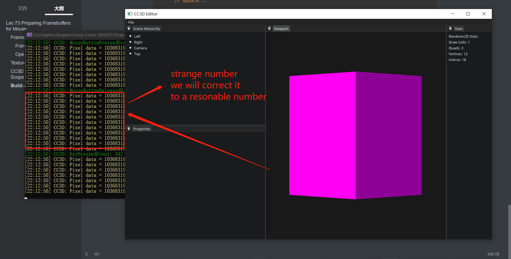
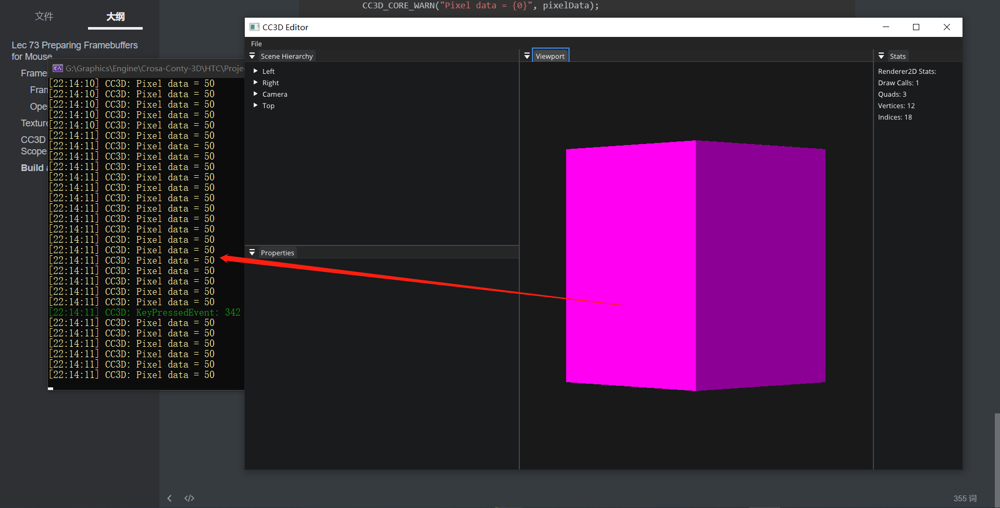

# Lec 73 Preparing Framebuffers for Mouse 

tutorial : [here](https://www.youtube.com/watch?v=wYVaIOUhz6s&list=PLlrATfBNZ98dC-V-N3m0Go4deliWHPFwT&index=96)

code version : [here](https://github.com/Graphic-researcher/Crosa-Conty-3D/commit/0a19f1469ce343a74a4b2530febf56fdc7da3a6c)

## Frame Buffer Scope

### Frame Buffer Class

```c++
enum class FramebufferTextureFormat
{
    None = 0,

    // Color
    RGBA8,
    RED_INTEGER,

	//...
};
virtual int ReadPixel(uint32_t attachmentIndex, int x, int y) = 0;
```

### OpenGL Frame Buffer Class

```c++
static void AttachColorTexture(uint32_t id, int samples, GLenum internalFormat, GLenum format, uint32_t width, uint32_t height, int index)
{
    bool multisampled = samples > 1;
    if (multisampled)
    {
        glTexImage2DMultisample(GL_TEXTURE_2D_MULTISAMPLE, samples, internalFormat, width, height, GL_FALSE);
    }
    else
    {
        glTexImage2D(GL_TEXTURE_2D, 0, internalFormat, width, height, 0, format, GL_UNSIGNED_BYTE, nullptr);

        //...
    }
    //...
}
void OpenGLFramebuffer::Invalidate()
{
    //...
    // Attachments
    if (m_ColorAttachmentSpecifications.size())
    {
        m_ColorAttachments.resize(m_ColorAttachmentSpecifications.size());
        Utils::CreateTextures(multisample, m_ColorAttachments.data(), m_ColorAttachments.size());

        for (size_t i = 0; i < m_ColorAttachments.size(); i++)
        {
            Utils::BindTexture(multisample, m_ColorAttachments[i]);
            switch (m_ColorAttachmentSpecifications[i].TextureFormat)
            {
                case FramebufferTextureFormat::RGBA8:
                    Utils::AttachColorTexture(m_ColorAttachments[i], m_Specification.Samples, GL_RGBA8, GL_RGBA, m_Specification.Width, m_Specification.Height, i);
                    break;
                case FramebufferTextureFormat::RED_INTEGER:
                    Utils::AttachColorTexture(m_ColorAttachments[i], m_Specification.Samples, GL_R32I, GL_RED_INTEGER, m_Specification.Width, m_Specification.Height, i);
                    break;
            }//switch
        }//for
    }//if (m_ColorAttachmentSpecifications.size())
    //...
}
int OpenGLFramebuffer::ReadPixel(uint32_t attachmentIndex, int x, int y)
{
    glReadBuffer(GL_COLOR_ATTACHMENT0 + attachmentIndex);
    int pixelData;
    glReadPixels(x, y, 1, 1, GL_RED_INTEGER, GL_INT, &pixelData);
    return pixelData;
}
```

## Texture Shader

```glsl
#type fragment
#version 450

layout(location = 0) out vec4 color;
layout(location = 1) out int color1;

//...

void main()
{
    vec4 texColor = v_Color;
    switch(int(v_TexIndex))
    {
		//...
    }
    color = texColor;
    color1 = 50;
}

```

## CC3D Input Editor Layer Scope

```c++
glm::vec2 m_ViewportBounds[2];
void EditorLayer::OnUpdate(Timestep ts)
{
    CC3D_PROFILE_FUNCTION();

    // Resize...
	
    // Update...

    // Render...

    // Update scene
	//...

    auto [mx, my] = ImGui::GetMousePos();
    mx -= m_ViewportBounds[0].x;
    my -= m_ViewportBounds[0].y;
    glm::vec2 viewportSize = m_ViewportBounds[1] - m_ViewportBounds[0];
    my = viewportSize.y - my;
    int mouseX = (int)mx;
    int mouseY = (int)my;

    if (mouseX >= 0 && mouseY >= 0 && mouseX < (int)viewportSize.x && mouseY < (int)viewportSize.y)
    {
        int pixelData = m_Framebuffer->ReadPixel(1, mouseX, mouseY);
        CC3D_CORE_WARN("Pixel data = {0}", pixelData);
    }

    m_Framebuffer->Unbind();
}
```

## Build and Result



