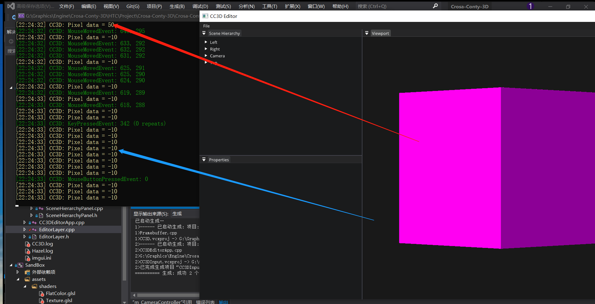

# Lec 74 Clearing Framebuffer Texture Attachment

tutorial : [here](https://www.youtube.com/watch?v=LPhBiIvDOs0&list=PLlrATfBNZ98dC-V-N3m0Go4deliWHPFwT&index=97)

code version : [here](https://github.com/Graphic-researcher/Crosa-Conty-3D/commit/1cacc349280dfa27bfd011a2a45eff0bd2026a9b)

## Frame Buffer Scope

### Frame Buffer Class

```c++
virtual void ClearAttachment(uint32_t attachmentIndex, int value) = 0;
```

### OpenGL Frame Buffer Class

```c++
namespace Utils {
    static GLenum CC3DFBTextureFormatToGL(FramebufferTextureFormat format)
    {
        switch (format)
        {
            case FramebufferTextureFormat::RGBA8:       return GL_RGBA8;
            case FramebufferTextureFormat::RED_INTEGER: return GL_RED_INTEGER;
        }
        return 0;
    }
}
void OpenGLFramebuffer::ClearAttachment(uint32_t attachmentIndex, int value)
{
    auto& spec = m_ColorAttachmentSpecifications[attachmentIndex];
    glClearTexImage(m_ColorAttachments[attachmentIndex], 0,
                    Utils::CC3DFBTextureFormatToGL(spec.TextureFormat), GL_INT, &value);
}
```

## CC3D Input Editor Layer Scope

```c++
void EditorLayer::OnUpdate(Timestep ts)
{
    //...
    // Clear our entity ID attachment to -10
    m_Framebuffer->ClearAttachment(1, -10);
    //...
}
```

## Build and Result

