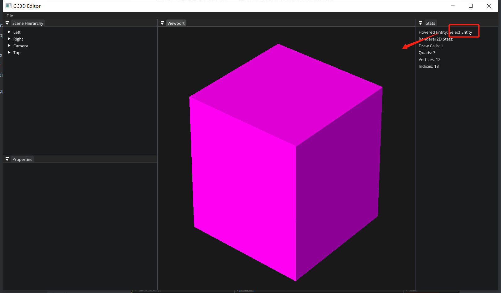
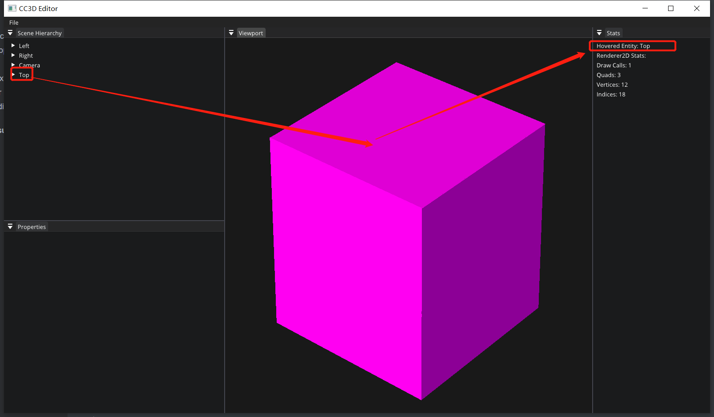

# Lec 75 Mouse Picking

tutorial : [here](https://www.youtube.com/watch?v=GKERbQ7Sqyg&list=PLlrATfBNZ98dC-V-N3m0Go4deliWHPFwT&index=98)

code version : [here](https://github.com/Graphic-researcher/Crosa-Conty-3D/commit/7e4d766ee0096e1a03308d8d20f31e00884a21bc)

## Render 2D Scope

```c++
struct QuadVertex
{
    //...
    // Editor-only
    int EntityID;
};
void Renderer2D::Init()
{
    //...
    s_Data.QuadVertexBuffer->SetLayout({
        //...
        { ShaderDataType::Int,    "a_EntityID"     },
    });
    //...
}
void Renderer2D::DrawQuad(const glm::mat4& transform, const glm::vec4& color, int entityID)
{
    //...
    for (size_t i = 0; i < quadVertexCount; i++)
    {
        //...
        s_Data.QuadVertexBufferPtr->EntityID = entityID;
        s_Data.QuadVertexBufferPtr++;
    }
    //...
}
void Renderer2D::DrawQuad(const glm::mat4& transform, const Ref<Texture2D>& texture, float tilingFactor, const glm::vec4& tintColor, int entityID)
{
    //...
    for (size_t i = 0; i < quadVertexCount; i++)
    {
        //...
        s_Data.QuadVertexBufferPtr->EntityID = entityID;
        s_Data.QuadVertexBufferPtr++;
    }
    //...
}
void Renderer2D::DrawSprite(const glm::mat4& transform, SpriteRendererComponent& src, int entityID)
{
    DrawQuad(transform, src.Color, entityID);
}
```

## Scene Scope

```c++
void Scene::OnUpdateRuntime(Timestep ts)
{
    //...
    if (mainCamera)
    {
        Renderer2D::BeginScene(*mainCamera, cameraTransform);
        auto group = m_Registry.group<TransformComponent>(entt::get<SpriteRendererComponent>);
        for (auto entity : group)
        {
            auto [transform, sprite] = group.get<TransformComponent, SpriteRendererComponent>(entity);
            Renderer2D::DrawSprite(transform.GetTransform(), sprite, (int)entity);
        }
        Renderer2D::EndScene();
    }///if (mainCamera)
    //...
}
void Scene::OnUpdateEditor(Timestep ts, EditorCamera& camera)
{
    Renderer2D::BeginScene(camera);

    auto group = m_Registry.group<TransformComponent>(entt::get<SpriteRendererComponent>);
    for (auto entity : group)
    {
        auto [transform, sprite] = group.get<TransformComponent, SpriteRendererComponent>(entity);

        Renderer2D::DrawSprite(transform.GetTransform(), sprite, (int)entity);
    }

    Renderer2D::EndScene();
}
```

## OpenGL Vertex Array Scope

```c++
void OpenGLVertexArray::AddVertexBuffer(const Ref<VertexBuffer>& vertexBuffer)
{
    //...
    for (const auto& element : layout)
    {
        switch (element.Type)
        {
            case ShaderDataType::Float:
            case ShaderDataType::Float2:
            case ShaderDataType::Float3:
            case ShaderDataType::Float4:
                {
                    glEnableVertexAttribArray(m_VertexBufferIndex);
                    glVertexAttribPointer(m_VertexBufferIndex,
                                          element.GetComponentCount(),
                                          ShaderDataTypeToOpenGLBaseType(element.Type),
                                          element.Normalized ? GL_TRUE : GL_FALSE,
                                          layout.GetStride(),
                                          (const void*)element.Offset);
                    m_VertexBufferIndex++;
                    break;
                }
            case ShaderDataType::Int:
            case ShaderDataType::Int2:
            case ShaderDataType::Int3:
            case ShaderDataType::Int4:
            case ShaderDataType::Bool:
                {
                    glEnableVertexAttribArray(m_VertexBufferIndex);
                    glVertexAttribIPointer(m_VertexBufferIndex,
                                           element.GetComponentCount(),
                                           ShaderDataTypeToOpenGLBaseType(element.Type),
                                           layout.GetStride(),
                                           (const void*)element.Offset);
                    m_VertexBufferIndex++;
                    break;
                }
            case ShaderDataType::Mat3:
            case ShaderDataType::Mat4:
				//...
        }
    }
    //...
}
```

## Texture shader 

```glsl
//vertex
layout(location = 5) in int a_EntityID;
out flat int v_EntityID;
void main()
{
	//...
    v_EntityID = a_EntityID;
}
//frag
in flat int v_EntityID;
void main()
{
    //...
    color1 = v_EntityID;
}
```

## CC3D Input Editor Layer Scope

```c++
Entity m_HoveredEntity;
void EditorLayer::OnUpdate(Timestep ts)
{
    //...
    if (mouseX >= 0 && mouseY >= 0 && mouseX < (int)viewportSize.x && mouseY < (int)viewportSize.y)
    {
        int pixelData = m_Framebuffer->ReadPixel(1, mouseX, mouseY);
        m_HoveredEntity = pixelData == -10 ? Entity() : Entity((entt::entity)pixelData, m_ActiveScene.get());
        CC3D_CORE_WARN("Pixel data = {0}", pixelData);
    }
    //...
}
void EditorLayer::OnImGuiRender()
{
    //...
    ImGui::Begin("Stats");
	//for select entity
    std::string name = "Select Entity";
    if (m_HoveredEntity)
        name = m_HoveredEntity.GetComponent<TagComponent>().Tag;
    ImGui::Text("Hovered Entity: %s", name.c_str());
    //...
    ImGui::End();
    //...
    ImGui::Begin("Viewport");
	//From Hazel's PR:Fixed wrong viewport bounds when viewport tab bar is visible
    auto viewportMinRegion = ImGui::GetWindowContentRegionMin();
    auto viewportMaxRegion = ImGui::GetWindowContentRegionMax();
    auto viewportOffset = ImGui::GetWindowPos();
    m_ViewportBounds[0] = { viewportMinRegion.x + viewportOffset.x, viewportMinRegion.y + viewportOffset.y };
    m_ViewportBounds[1] = { viewportMaxRegion.x + viewportOffset.x, viewportMaxRegion.y + viewportOffset.y };

    m_ViewportFocused = ImGui::IsWindowFocused();
    m_ViewportHovered = ImGui::IsWindowHovered();
    Application::Get().GetImGuiLayer()->BlockEvents(!m_ViewportFocused && !m_ViewportHovered);

    ImVec2 viewportPanelSize = ImGui::GetContentRegionAvail();
    if (m_ViewportSize != *((glm::vec2*)&viewportPanelSize) && viewportPanelSize.x > 0 && viewportPanelSize.y > 0)
    {
        m_Framebuffer->Resize((uint32_t)viewportPanelSize.x, (uint32_t)viewportPanelSize.y);
        m_ViewportSize = { viewportPanelSize.x, viewportPanelSize.y };

        m_CameraController.OnResize(viewportPanelSize.x, viewportPanelSize.y);
    }
    uint32_t textureID = m_Framebuffer->GetColorAttachmentRendererID();
    ImGui::Image(reinterpret_cast<void*>(textureID), ImVec2{ m_ViewportSize.x, m_ViewportSize.y }, ImVec2{ 0, 1 }, ImVec2{ 1, 0 });

    // Gizmos
    Entity selectedEntity = m_SceneHierarchyPanel.GetSelectedEntity();
    if (selectedEntity && m_GizmoType != -1)
    {
		//...
        ImGuizmo::SetRect(m_ViewportBounds[0].x, m_ViewportBounds[0].y, m_ViewportBounds[1].x - m_ViewportBounds[0].x, m_ViewportBounds[1].y - m_ViewportBounds[0].y);
        //...
    }
}
```

## Build and Result





