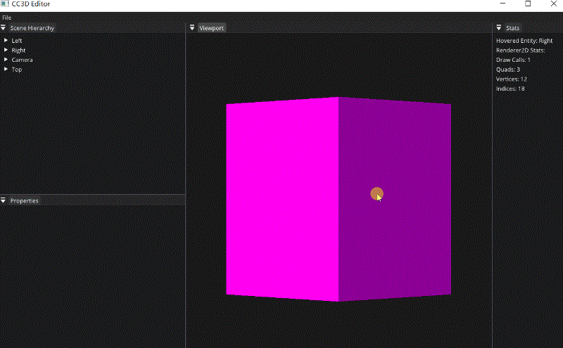

# Lec76 Clicking to Select

tutorial : [here](https://www.youtube.com/watch?v=CU9v3uUgRaE&list=PLlrATfBNZ98dC-V-N3m0Go4deliWHPFwT&index=99)

code version : [here](https://github.com/Graphic-researcher/Crosa-Conty-3D/commit/a3d3793b20649b7af6715d6ea4b95fa3da6c2c3f)

## CC3D Input Scope

### Scene Hierarchy Panel 

```c++
void SceneHierarchyPanel::SetSelectedEntity(Entity entity)
{
    m_SelectionContext = entity;
}
```

### Editor Layer

```c++
void EditorLayer::OnEvent(Event& e)
{
    //...
    dispatcher.Dispatch<MouseButtonPressedEvent>(CC3D_BIND_EVENT_FN(EditorLayer::OnMouseButtonPressed));
}
bool EditorLayer::OnMouseButtonPressed(MouseButtonPressedEvent& e)
{
    if (e.GetMouseButton() == Mouse::ButtonLeft)
    {
        if (m_ViewportHovered && !ImGuizmo::IsOver() && !Input::IsKeyPressed(Key::LeftAlt))
            m_SceneHierarchyPanel.SetSelectedEntity(m_HoveredEntity);
    }
    return false;
}
```

## Build and Result

