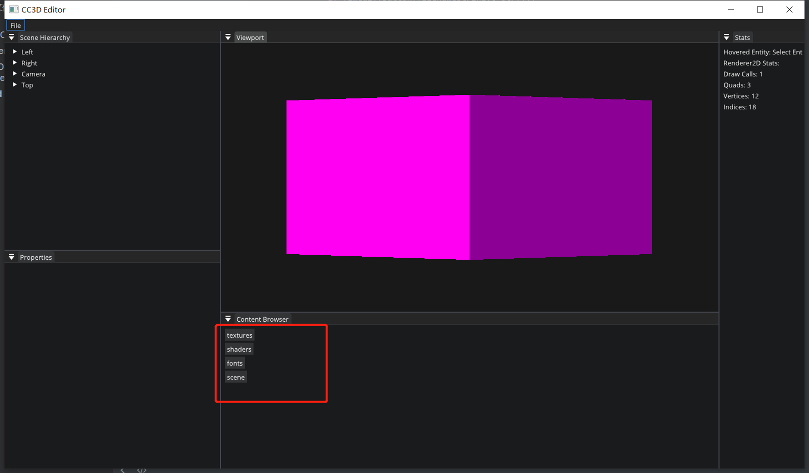

# Lec 78 Content Browser

tutorial : [here](https://www.youtube.com/watch?v=aBuPmOGC7hU&list=PLlrATfBNZ98dC-V-N3m0Go4deliWHPFwT&index=101)

code version : [here](https://github.com/Graphic-researcher/Crosa-Conty-3D/commit/bb49cb7701f7650acc514bd7464eb88bfbe2cce7)

## Content Browser Panel Scope

```c++
class ContentBrowserPanel
{
    public:
    ContentBrowserPanel();

    void OnImGuiRender();
    private:
    std::filesystem::path m_CurrentDirectory;
};
// Once we have projects, change this
static const std::filesystem::path s_AssetPath = "assets";

ContentBrowserPanel::ContentBrowserPanel()
    : m_CurrentDirectory(s_AssetPath)
    {
    }

void ContentBrowserPanel::OnImGuiRender()
{
    ImGui::Begin("Content Browser");

    if (m_CurrentDirectory != std::filesystem::path(s_AssetPath))
    {
        if (ImGui::Button("<-"))
        {
            m_CurrentDirectory = m_CurrentDirectory.parent_path();
        }
    }

    for (auto& directoryEntry : std::filesystem::directory_iterator(m_CurrentDirectory))
    {
        const auto& path = directoryEntry.path();
        auto relativePath = std::filesystem::relative(path, s_AssetPath);
        std::string filenameString = relativePath.filename().string();
        if (directoryEntry.is_directory())
        {
            if (ImGui::Button(filenameString.c_str()))
            {
                m_CurrentDirectory /= path.filename();
            }
        }
        else
        {
            if (ImGui::Button(filenameString.c_str()))
            {
            }
        }
    }
    ImGui::End();
}
```

## CC3D Input Editor Layer Scope

```c++
ContentBrowserPanel m_ContentBrowserPanel;
void EditorLayer::OnImGuiRender()
{
    //...
    m_ContentBrowserPanel.OnImGuiRender();
    //...
}
```

## Build and Result




