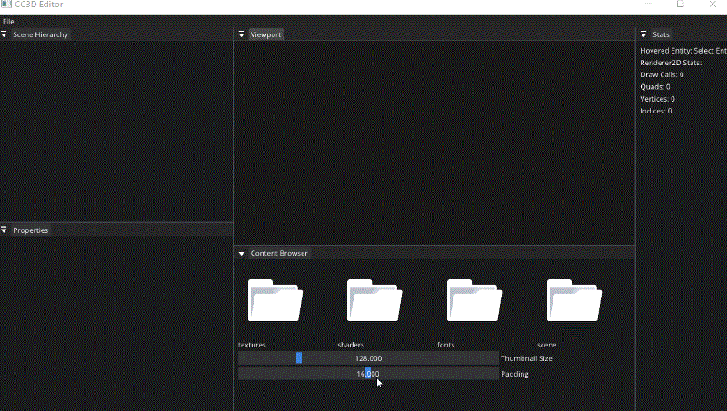

# Lec 79 Content Browser Panel - ImGui Drag Drop 

tutorial : [here](https://www.youtube.com/watch?v=yjVSs1HtAng&list=PLlrATfBNZ98dC-V-N3m0Go4deliWHPFwT&index=102)

code version : [here](https://github.com/Graphic-researcher/Crosa-Conty-3D/commit/3575c8f110b9b74afa4c9f321157050dc8e71a02)

## CC3D Input Scope

### Content Browser Panel 

```c++
// Once we have projects, change this
extern const std::filesystem::path g_AssetPath = "assets";//global
Ref<Texture2D> m_DirectoryIcon;
Ref<Texture2D> m_FileIcon;
ContentBrowserPanel::ContentBrowserPanel()
    : m_CurrentDirectory(g_AssetPath)
    {
        m_DirectoryIcon = Texture2D::Create("Resources/Icons/ContentBrowser/DirectoryIcon.png");
        m_FileIcon = Texture2D::Create("Resources/Icons/ContentBrowser/FileIcon.png");
    }
void ContentBrowserPanel::OnImGuiRender()
{
    //...
    static float thumbnailSize = 128.0f;
    float cellSize = thumbnailSize + padding;

    float panelWidth = ImGui::GetContentRegionAvail().x;
    int columnCount = (int)(panelWidth / cellSize);
    if (columnCount < 1)
        columnCount = 1;

    ImGui::Columns(columnCount, 0, false);
    //...
    for (auto& directoryEntry : std::filesystem::directory_iterator(m_CurrentDirectory))
    {
        const auto& path = directoryEntry.path();
        auto relativePath = std::filesystem::relative(path, g_AssetPath);
        std::string filenameString = relativePath.filename().string();
        ImGui::PushID(filenameString.c_str());
        Ref<Texture2D> icon = directoryEntry.is_directory() ? m_DirectoryIcon : m_FileIcon;
        ImGui::PushStyleColor(ImGuiCol_Button, ImVec4(0, 0, 0, 0));
        ImGui::ImageButton((ImTextureID)icon->GetRendererID(), { thumbnailSize, thumbnailSize }, { 0, 1 }, { 1, 0 });

        if (ImGui::BeginDragDropSource())
        {
            const wchar_t* itemPath = relativePath.c_str();
            ImGui::SetDragDropPayload("CONTENT_BROWSER_ITEM", itemPath, (wcslen(itemPath) + 1) * sizeof(wchar_t));
            ImGui::EndDragDropSource();
        }

        ImGui::PopStyleColor();

        if (ImGui::IsItemHovered() && ImGui::IsMouseDoubleClicked(ImGuiMouseButton_Left))
        {
            if (directoryEntry.is_directory())
                m_CurrentDirectory /= path.filename();

        }
        ImGui::TextWrapped(filenameString.c_str());

        ImGui::NextColumn();

        ImGui::PopID();
    }//for
    ImGui::Columns(1);

    ImGui::SliderFloat("Thumbnail Size", &thumbnailSize, 16, 512);
    ImGui::SliderFloat("Padding", &padding, 0, 32);

    // TODO: status bar
    ImGui::End();
}
```

### Editor Layer

```c++
extern const std::filesystem::path g_AssetPath;//global
void EditorLayer::OnImGuiRender()
{
    //...
    if (ImGui::BeginDragDropTarget())
    {
        if (const ImGuiPayload* payload = ImGui::AcceptDragDropPayload("CONTENT_BROWSER_ITEM"))
        {
            const wchar_t* path = (const wchar_t*)payload->Data;
            OpenScene(std::filesystem::path(g_AssetPath) / path);
        }
        ImGui::EndDragDropTarget();
    }
    //...
}
```

## Build and Run

