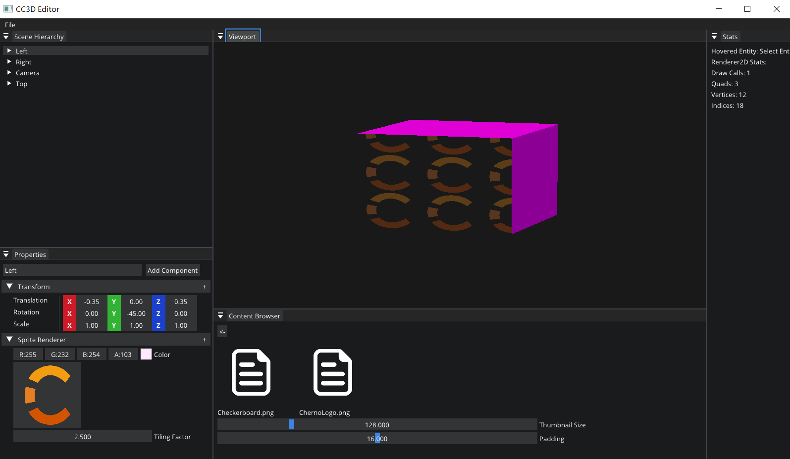

# Lec80 Textures for Entities

tutorial : [here](https://www.youtube.com/watch?v=woSa-ZMJl-Q&list=PLlrATfBNZ98dC-V-N3m0Go4deliWHPFwT&index=103)

code version : [here](https://github.com/Graphic-researcher/Crosa-Conty-3D/commit/55c6f185985ff1c24bdbfb436ffa4af32c70686a)

## Render 2D Scope

```c++
void Renderer2D::DrawSprite(const glm::mat4& transform, SpriteRendererComponent& src, int entityID)
{
    if (src.Texture)
        DrawQuad(transform, src.Texture, src.TilingFactor, src.Color, entityID);
    else
        DrawQuad(transform, src.Color, entityID);
}
```

## Component Scope

```c++
struct SpriteRendererComponent
{
    glm::vec4 Color{ 1.0f, 1.0f, 1.0f, 1.0f };
    Ref<Texture2D> Texture;
    float TilingFactor = 1.0f;

    //...
};
```

## CC3D Input Scene Hierarchy Panel Scope

```c++
extern const std::filesystem::path g_AssetPath;
DrawComponent<SpriteRendererComponent>("Sprite Renderer", entity, [](auto& component)
{
	static float thumbnailSize = 128.0f;

	ImGui::ColorEdit4("Color", glm::value_ptr(component.Color));
	if (nullptr != component.Texture)
	{
		ImGui::ImageButton((ImTextureID)component.Texture->GetRendererID(), { thumbnailSize, thumbnailSize }, { 0, 1 }, { 1, 0 });
	}
	else
	{
		ImGui::Button("Texture", ImVec2(100.0f, 0.0f));
	}

	if (ImGui::BeginDragDropTarget())
	{
		if (const ImGuiPayload* payload = ImGui::AcceptDragDropPayload("CONTENT_BROWSER_ITEM"))
		{
			const wchar_t* path = (const wchar_t*)payload->Data;
			std::filesystem::path texturePath = std::filesystem::path(g_AssetPath) / path;
			component.Texture = Texture2D::Create(texturePath.string());

		}
		ImGui::EndDragDropTarget();
	}

	ImGui::DragFloat("Tiling Factor", &component.TilingFactor, 0.1f, 0.0f, 100.0f);

});
```

## Build and Result




