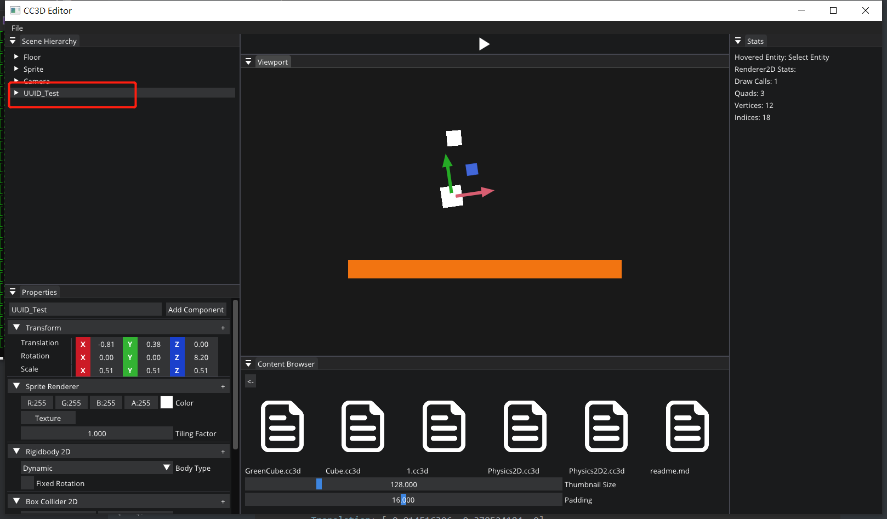

# Lec 83 Universally Unique Identifiers (UUID_GUID)

tutorial : [here](https://www.youtube.com/watch?v=O_0nUE4S8T8&list=PLlrATfBNZ98dC-V-N3m0Go4deliWHPFwT&index=107)

code version : [here](https://github.com/Graphic-researcher/Crosa-Conty-3D/commit/8840467db8c00862e900096ac400b2764f30180b)

## UUID Scope

```c++
class UUID
{
    public:
    UUID();
    UUID(uint64_t uuid);
    UUID(const UUID&) = default;
    operator uint64_t() const { return m_UUID; }
    private:
    uint64_t m_UUID;
};

#include <xhash>
namespace std {
    template<>
    struct hash<CC3D::UUID>
    {
        std::size_t operator()(const CC3D::UUID& uuid) const
        {
            return hash<uint64_t>()((uint64_t)uuid);
        }
    };
}
static std::random_device s_RandomDevice;
static std::mt19937_64 s_Engine(s_RandomDevice());
static std::uniform_int_distribution<uint64_t> s_UniformDistribution;

UUID::UUID()
    : m_UUID(s_UniformDistribution(s_Engine))
    {
    }

UUID::UUID(uint64_t uuid)
    : m_UUID(uuid)
    {
    }
```

## Component Scope

```c++
struct IDComponent
{
    UUID ID;

    IDComponent() = default;
    IDComponent(const IDComponent&) = default;
};
// Forward declaration 
class ScriptableEntity;
```

## Entity Scope

```c++
UUID GetUUID() { return GetComponent<IDComponent>().ID; }
```

## Scene Scope

```c++
Entity Scene::CreateEntity(const std::string& name)
{
    return CreateEntityWithUUID(UUID(), name);
}

Entity Scene::CreateEntityWithUUID(UUID uuid, const std::string& name)
{
    Entity entity = { m_Registry.create(), this };
    entity.AddComponent<IDComponent>(uuid);
    entity.AddComponent<TransformComponent>();
    auto& tag = entity.AddComponent<TagComponent>();
    tag.Tag = name.empty() ? "Entity" : name;
    return entity;
}
template<>
void Scene::OnComponentAdded<IDComponent>(Entity entity, IDComponent& component)
{
}
```

## Scene Serializer Scope

```c++
static void SerializeEntity(YAML::Emitter& out, Entity entity)
{
    out << YAML::Key << "Entity" << YAML::Value << entity.GetUUID();
    out << YAML::BeginMap; // Entity
    out << YAML::Key << "Entity" << YAML::Value << entity.GetUUID();
    //...
}
bool SceneSerializer::Deserialize(const std::string& filepath)
{
    //...
    if (entities)
    {
        for (auto entity : entities)
        {
            uint64_t uuid = entity["Entity"].as<uint64_t>();
            //...
            Entity deserializedEntity = m_Scene->CreateEntityWithUUID(uuid, name); 
            //...
        }
    }
    return true;
}
```

## Build and Result



Our new entity (UUID_Test) was given a random ID:

```yaml
Scene: Untitled
Entities:
  - Entity: 6503953238168349932
    TagComponent:
      Tag: UUID_Test
    TransformComponent:
      Translation: [-0.814516306, 0.378524184, 0]
      Rotation: [0, 0, 0.143164173]
      Scale: [0.509999871, 0.509999871, 0.50999999]
    SpriteRendererComponent:
      Color: [1, 1, 1, 1]
    Rigidbody2DComponent:
      BodyType: Dynamic
      FixedRotation: false
    BoxCollider2DComponent:
      Offset: [0, 0]
      Size: [0.5, 0.5]
      Density: 1
      Friction: 0.5
      Restitution: 0.899999976
      RestitutionThreshold: 0.5
  - Entity: 12837192831273
    TagComponent:
      Tag: Camera
    TransformComponent:
      Translation: [0, 0, 4.99711323]
      Rotation: [0, 0, 0]
      Scale: [1, 1, 1]
    CameraComponent:
      Camera:
        ProjectionType: 0
        PerspectiveFOV: 0.785398185
        PerspectiveNear: 0.00999999978
        PerspectiveFar: 1000
        OrthographicSize: 10
        OrthographicNear: -1
        OrthographicFar: 1
      Primary: true
      FixedAspectRatio: false
  - Entity: 12837192831273
    TagComponent:
      Tag: Sprite
    TransformComponent:
      Translation: [-0.757355928, 1.81021488, 0.0225147791]
      Rotation: [0, 0, 0.0863992497]
      Scale: [0.361159921, 0.375567764, 0.848135769]
    SpriteRendererComponent:
      Color: [1, 1, 1, 1]
    Rigidbody2DComponent:
      BodyType: Dynamic
      FixedRotation: false
    BoxCollider2DComponent:
      Offset: [0, 0]
      Size: [0.5, 0.5]
      Density: 0.879999995
      Friction: 0.100000001
      Restitution: 0.819999993
      RestitutionThreshold: 0.5
  - Entity: 12837192831273
    TagComponent:
      Tag: Floor
    TransformComponent:
      Translation: [0, -1.41280007, 0]
      Rotation: [0, 0, 0]
      Scale: [6.7419672, 0.460678041, 1]
    SpriteRendererComponent:
      Color: [0.949806929, 0.455301404, 0.0660097376, 1]
    Rigidbody2DComponent:
      BodyType: Static
      FixedRotation: false
    BoxCollider2DComponent:
      Offset: [0, 0]
      Size: [0.5, 0.5]
      Density: 1
      Friction: 0.5
      Restitution: 0
      RestitutionThreshold: 0.5
```

