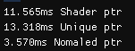
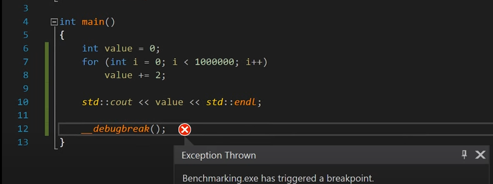
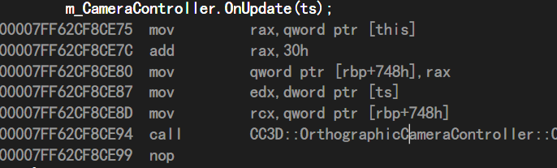
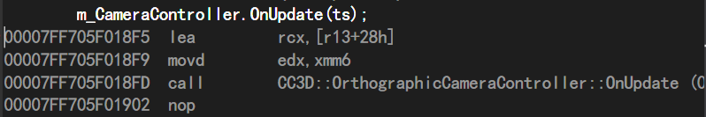

# C++

## visual studio error

LNK + number: link error

C + number: compile error

.exe file has to have entry point(like main() func)

linking stage is to find the function have been used

## lvalues and rvalues in C++


## Smart Pointer

normal pointer is faster than smart pointer(debug)



```c++
{
    PROFILE_SCOPE("Shader ptr");
    std::array<std::shared_ptr<int>, 10000> sharedptrs;
    for (int i = 0; i < sharedptrs.size(); i++)
        sharedptrs[i] = std::shared_ptr<int>(new int);
}
{
    PROFILE_SCOPE("Unique ptr");
    std::array<std::shared_ptr<int>, 10000> Uniqueptrs;
    for (int i = 0; i < Uniqueptrs.size(); i++)
        Uniqueptrs[i] = std::shared_ptr<int>(new int);
}
{
    PROFILE_SCOPE("Nomaled ptr");
    std::array<int*, 10000> ptrs;
    for (int i = 0; i < ptrs.size(); i++)
        ptrs[i] = new int;
    for (int i = 0; i < ptrs.size(); i++)
        delete ptrs[i];
}
```


## OpenGL memory operate

git cimmit link：7029ac84，Added Texture memory example in Renderer2D.cpp

ps: rgba is reverse in memory

like 0xff0000ff is red <span style="color:red">♦</span>

0xff00ff00 is green <span style="color:green">♦</span>

```c++
s_Data->WhiteTexture = Texture2D::Create(2, 2);// create new texture(2*2)
uint64_t whiteTextureData[2] = { 0xffffffff00000000,0x00000000ffffffff };// Texture data include 4 pixel
s_Data->WhiteTexture->SetData(&whiteTextureData, sizeof(whiteTextureData));
						|
                        |
                        |
void OpenGLTexture2D::SetData(void* data, uint32_t size)
{
	uint32_t bpp = m_DataFormat == GL_RGBA ? 4 : 3;
	CC3D_CORE_ASSERT(size == m_Width * m_Height * bpp, "Data must be entire texture!");
	glTextureSubImage2D(m_RendererID, 0, 0, 0, m_Width, m_Height, m_DataFormat, GL_UNSIGNED_BYTE, data);// Read texture data from data's address
}
```

##  Windows only trick

```c++
__debugbreak();//  make program stop in debug model
```



Release is faster because assembly language which create c++ language is optimized.

Debug



Release



## Difference between const and constexpr

**const** doesn't distinguish between Compilation-Period constants and run-time constants

**constexpr** is limited to compilation-period constants

```c++
template<typename T>
	using Scope = std::unique_ptr<T>;
	template<typename T, typename ... Args>
	constexpr Scope<T> CreateScope(Args&& ... args)
	{
		return std::make_unique<T>(std::forward<Args>(args)...);
	}
	/*constexpr std::unique_ptr<T> CreateScope(Args&& ... args)
	{
		return std::make_unique<T>(std::forward<Args>(args)...);
	}*/
```


## #define usage 

''##'' mains link former and later

''#'' mains variable 'type' change to **string**

```c++
#define EVENT_CLASS_TYPE(type) static EventType GetStaticType(){return EventType::##type;}\ 
								virtual EventType GetEventType() const override {return GetStaticType();}\
								virtual const char* GetName() const override{return #type;}
```

## UseFul std library

[`std::chrono` library](https://en.cppreference.com/w/cpp/chrono)

The `chrono` library defines three main types as well as utility functions and common typedefs.

- clocks
- time points
- durations

## unclear git commit 

  670e86fe：Change bind target inside OpenGLIndexBuffer constructor

 e8b2ad93：Made Input a true singleton

60cf553b：Basic ref-counting system to terminate glfw

